# Falcor 实时渲染框架 — 中文技术文档

> 本文档为 NVIDIA Falcor 8.0 实时渲染框架的全目录中文技术文档。

## 项目简介

Falcor 是 NVIDIA 开发的实时渲染研究框架，支持 DirectX 12 和 Vulkan 图形 API。框架旨在提升渲染算法研究和原型开发的效率，提供了从底层 GPU 抽象到高层渲染管线的完整工具链。

**核心特性：**
- GPU 抽象层：统一的 DirectX 12 / Vulkan 接口封装
- 光线追踪：完整的硬件加速光线追踪支持
- 渲染图系统：基于有向无环图的模块化渲染管线
- 无偏路径追踪器：研究级全局光照实现
- RTX SDK 集成：DLSS、RTXDI、NRD 等 NVIDIA RTX 技术
- Python 脚本支持：运行时渲染管线配置与自动化
- 可微渲染：支持渲染梯度计算与反向传播

## 全局架构图

```mermaid
graph TB
    subgraph Applications["应用层"]
        Mogwai["Mogwai<br/>渲染器应用"]
        Samples["示例程序"]
        Tools["工具集"]
    end

    subgraph RenderPasses["渲染通道插件层 (30+)"]
        PT["PathTracer<br/>路径追踪"]
        GB["GBuffer<br/>几何缓冲"]
        DLSS["DLSSPass<br/>深度学习超采样"]
        NRD["NRDPass<br/>实时降噪"]
        RTXDI_P["RTXDIPass<br/>实时直接光照"]
        TM["ToneMapper<br/>色调映射"]
        Others["SVGFPass / TAA / ...<br/>其他通道"]
    end

    subgraph FalcorCore["Falcor 核心框架"]
        RG["RenderGraph<br/>渲染图系统"]

        subgraph Rendering["渲染子系统"]
            Lights_R["Lights<br/>光照计算"]
            Materials_R["Materials<br/>材质系统"]
            RTXDI_R["RTXDI<br/>直接光照采样"]
            Volumes_R["Volumes<br/>体积渲染"]
        end

        subgraph SceneSys["场景子系统"]
            SceneGraph["Scene<br/>场景图管理"]
            Material_S["Material<br/>材质定义"]
            Camera_S["Camera<br/>相机系统"]
            Animation_S["Animation<br/>动画系统"]
            SDF_S["SDFs<br/>有符号距离场"]
        end

        subgraph UtilsSys["工具库"]
            MathU["Math<br/>数学库"]
            SamplingU["Sampling<br/>采样"]
            ImageU["Image<br/>图像 I/O"]
            DebugU["Debug<br/>调试工具"]
            ScriptingU["Scripting<br/>脚本绑定"]
        end

        DiffRender["DiffRendering<br/>可微渲染"]

        subgraph CoreSys["Core 基础设施"]
            API["API<br/>GPU 抽象层"]
            Program["Program<br/>着色器管理"]
            State_C["State<br/>管线状态"]
            Pass_C["Pass<br/>通道基类"]
            Platform["Platform<br/>平台抽象"]
        end
    end

    subgraph External["外部依赖"]
        Slang["Slang 编译器"]
        DXR["DirectX 12 / Vulkan"]
        NVAPI_E["NVAPI"]
        CUDA_E["CUDA / OptiX"]
    end

    Applications --> RenderPasses
    RenderPasses --> RG
    RG --> Rendering
    RG --> SceneSys
    Rendering --> SceneSys
    Rendering --> UtilsSys
    SceneSys --> UtilsSys
    SceneSys --> CoreSys
    DiffRender --> Rendering
    DiffRender --> SceneSys
    UtilsSys --> CoreSys
    CoreSys --> External
```

## 目录导航

### 源码目录 (`Source/`)

| 目录 | 说明 | 文档链接 |
|------|------|----------|
| **Falcor/** | 核心框架库 | [查看](Source/Falcor/README.md) |
| Falcor/Core/ | 基础设施：GPU 抽象、着色器、平台 | [查看](Source/Falcor/Core/README.md) |
| Falcor/Utils/ | 工具库：数学、采样、图像、脚本 | [查看](Source/Falcor/Utils/README.md) |
| Falcor/Scene/ | 场景图：模型、材质、相机、动画 | [查看](Source/Falcor/Scene/README.md) |
| Falcor/Rendering/ | 渲染算法：光照、材质、体积 | [查看](Source/Falcor/Rendering/README.md) |
| Falcor/RenderGraph/ | 渲染图系统 | [查看](Source/Falcor/RenderGraph/README.md) |
| Falcor/DiffRendering/ | 可微渲染 | [查看](Source/Falcor/DiffRendering/README.md) |
| Falcor/RenderPasses/ | 内置渲染通道接口 | [查看](Source/Falcor/RenderPasses/README.md) |
| Falcor/Testing/ | 测试框架 | [查看](Source/Falcor/Testing/README.md) |
| **RenderPasses/** | 渲染通道插件集合 (30+) | [查看](Source/RenderPasses/README.md) |
| **Mogwai/** | 渲染器主应用 | [查看](Source/Mogwai/README.md) |
| **Samples/** | 示例应用程序 | [查看](Source/Samples/README.md) |
| **Tools/** | 开发工具 | [查看](Source/Tools/README.md) |
| **Modules/** | 可选模块 (USD 支持等) | [查看](Source/Modules/USDUtils/README.md) |
| **plugins/** | 场景导入器插件 | [查看](Source/plugins/importers/README.md) |

### 非源码目录

| 目录 | 说明 | 文档链接 |
|------|------|----------|
| external/ | 外部依赖库 | [查看](external/README.md) |
| scripts/ | Python 渲染脚本 | [查看](scripts/README.md) |
| tools/ | 开发辅助工具 | [查看](tools/README.md) |
| cmake/ | CMake 构建模块 | [查看](cmake/README.md) |
| build_scripts/ | 部署与构建脚本 | [查看](build_scripts/README.md) |
| data/ | 框架资源文件 | [查看](data/README.md) |
| tests/ | 测试基础设施 | [查看](tests/README.md) |

## 项目统计

| 指标 | 数量 |
|------|------|
| 源文件总数 | ~1142 |
| 目录总数 | ~136 |
| 渲染通道插件 | 30+ |
| 支持图形 API | DirectX 12, Vulkan |
| 着色器语言 | Slang (HLSL 兼容) |

## 术语表

| 英文 | 中文 | 说明 |
|------|------|------|
| Render Pass | 渲染通道 | 渲染图中的处理节点 |
| Shader | 着色器 | GPU 程序 |
| Buffer | 缓冲区 | GPU 内存资源 |
| Texture | 纹理 | 图像资源 |
| Scene Graph | 场景图 | 场景对象层次结构 |
| Ray Tracing | 光线追踪 | 基于光线的渲染技术 |
| Path Tracing | 路径追踪 | 无偏全局光照算法 |
| Denoising | 降噪 | 减少渲染噪声 |
| Differentiable Rendering | 可微渲染 | 可计算梯度的渲染 |
| SDF | 有符号距离场 | 隐式几何表示 |
| BSDF | 双向散射分布函数 | 材质光学属性模型 |
| Render Graph | 渲染图 | 通道连接的有向无环图 |
| Pipeline State | 管线状态 | GPU 渲染管线配置 |
| Framebuffer | 帧缓冲 | 渲染目标集合 |
| Acceleration Structure | 加速结构 | 光线追踪空间索引 |
| Descriptor | 描述符 | GPU 资源绑定句柄 |
