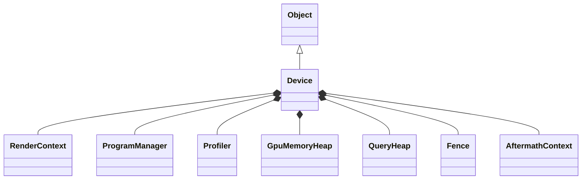

# Device 源码文档

> 路径: `Source/Falcor/Core/API/Device.h` / `Device.cpp`
> 类型: C++ 头文件 + 实现
> 模块: Core/API

## 功能概述

Device 类是 Falcor 渲染框架的核心类，代表一个 GPU 设备。它负责设备初始化、资源创建（缓冲区、纹理、采样器、Fence、管线状态对象等）、命令队列管理、帧同步以及延迟资源释放。支持 D3D12 和 Vulkan 两种图形 API 后端。

## 类与接口

### `AdapterLUID` / `AdapterInfo`（结构体）
- **职责**: 描述 GPU 适配器信息（名称、厂商 ID、设备 ID、LUID）

### `Device`
- **继承**: `Object`
- **职责**: 图形设备管理的核心类

#### 内部枚举与结构体
| 类型 | 说明 |
|------|------|
| `Type` | 设备类型（Default、D3D12、Vulkan） |
| `Desc` | 设备描述符（类型、GPU 索引、调试层、Aftermath、着色器缓存等） |
| `Info` | 设备信息（适配器名称、LUID、API 名称） |
| `Limits` | 设备限制（最大计算调度线程组、最大采样器数量） |
| `SupportedFeatures` | 支持的特性标志（光线追踪、重心坐标、保守光栅化、ROV、SER 等） |

#### 关键资源创建方法
| 方法签名 | 说明 |
|----------|------|
| `ref<Buffer> createBuffer(...)` | 创建原始缓冲区 |
| `ref<Buffer> createTypedBuffer(...)` | 创建类型化缓冲区 |
| `ref<Buffer> createStructuredBuffer(...)` | 创建结构化缓冲区 |
| `ref<Texture> createTexture1D/2D/3D/Cube/2DMS(...)` | 创建各类纹理 |
| `ref<Sampler> createSampler(...)` | 创建采样器 |
| `ref<Fence> createFence(...)` | 创建 Fence 同步对象 |
| `ref<ComputeStateObject> createComputeStateObject(...)` | 创建计算管线状态对象 |
| `ref<GraphicsStateObject> createGraphicsStateObject(...)` | 创建图形管线状态对象 |
| `ref<RtStateObject> createRtStateObject(...)` | 创建光线追踪管线状态对象 |

#### 关键管理方法
| 方法签名 | 说明 |
|----------|------|
| `void endFrame()` | 结束帧：提交命令、切换瞬态资源堆、执行延迟释放 |
| `void wait()` | 刷新管线并阻塞等待 GPU 完成 |
| `RenderContext* getRenderContext() const` | 获取默认渲染上下文 |
| `NativeHandle getNativeHandle(uint32_t index) const` | 获取原生句柄 |
| `bool isFeatureSupported(SupportedFeatures) const` | 查询特性支持 |
| `static std::vector<AdapterInfo> getGPUs(Type)` | 获取可用 GPU 列表 |
| `static bool enableAgilitySDK()` | 尝试启用 D3D12 Agility SDK |

#### 关键成员
| 成员 | 类型 | 说明 |
|------|------|------|
| `mGfxDevice` | `ComPtr<gfx::IDevice>` | GFX 设备接口 |
| `mGfxCommandQueue` | `ComPtr<gfx::ICommandQueue>` | GFX 命令队列 |
| `mpRenderContext` | `unique_ptr<RenderContext>` | 默认渲染上下文 |
| `mpProgramManager` | `unique_ptr<ProgramManager>` | 程序管理器 |
| `mpProfiler` | `unique_ptr<Profiler>` | 性能分析器 |
| `mpUploadHeap` / `mpReadBackHeap` | `ref<GpuMemoryHeap>` | 上传/回读内存堆 |
| `mpFrameFence` | `ref<Fence>` | 帧同步 Fence |

## 架构图

## 实现细节

- 支持 3 个飞行帧 (`kInFlightFrameCount = 3`)
- 延迟资源释放机制：资源析构时入队，帧结束时检查 Fence 值释放
- D3D12 Agility SDK 支持两种加载方式：应用标记或 D3D12SDKConfiguration API
- 光线追踪验证通过 NVAPI 启用/禁用

## 依赖关系
### 本文件引用
- `Types.h`, `Handles.h`, `NativeHandle.h`, `Formats.h`, `QueryHeap.h`
- `LowLevelContextData.h`, `RenderContext.h`, `GpuMemoryHeap.h`

### 被以下文件引用
- 几乎所有 Core/API 文件都直接或间接依赖 Device
