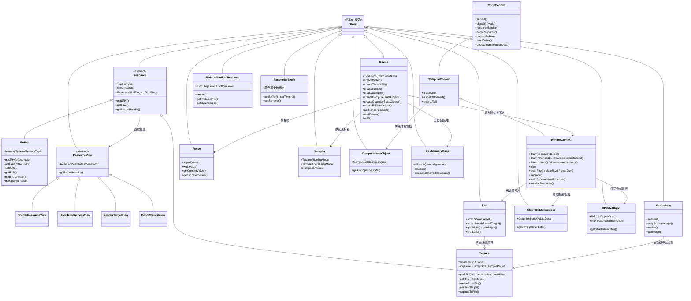

# GPU 抽象层 (API)

> 路径: `Source/Falcor/Core/API/`

## 功能概述

`Core/API/` 是 Falcor 渲染框架中最底层、最核心的模块，负责对 GPU 图形 API（D3D12 和 Vulkan）进行完整的抽象封装。该模块通过 Slang-GFX 中间层统一了两种后端的差异，使上层代码无需关心具体使用的是哪种图形 API。整个 Falcor 框架的几乎所有功能都直接或间接依赖于本模块提供的设备管理、资源创建与命令提交能力。

本模块的核心职责包括：GPU 设备的创建与管理（`Device`）、GPU 资源的生命周期管理（`Resource`/`Buffer`/`Texture`）、命令录制与提交的上下文层级体系（`CopyContext` -> `ComputeContext` -> `RenderContext`）、渲染管线状态对象的封装（`GraphicsStateObject`/`ComputeStateObject`/`RtStateObject`）、GPU 同步原语（`Fence`/`FencedPool`）以及帧缓冲（`Fbo`）、交换链（`Swapchain`）等显示相关功能。

此外，本模块还提供了完善的光线追踪支持，包括加速结构（`RtAccelerationStructure`）的构建与管理、光线追踪管线状态对象（`RtStateObject`）以及着色器表（`ShaderTable`）的管理。模块还包含资源格式定义（`Formats`）、资源视图（`ResourceViews`）、采样器（`Sampler`）、参数块（`ParameterBlock`）、GPU 内存堆管理（`GpuMemoryHeap`）、GPU 计时器（`GpuTimer`）、NVIDIA Aftermath 崩溃诊断集成等众多底层基础设施。子目录 `Shared/` 中包含 D3D12 特有的描述符堆与根签名实现。

## 架构图

## 文件清单

### 核心设备与资源

| 文件 | 类型 | 说明 |
|------|------|------|
| `Device.h/.cpp` | 核心 | GPU 设备抽象，支持 D3D12/Vulkan 后端；负责资源创建、管线状态对象创建、帧管理、设备能力查询 |
| `Resource.h/.cpp` | 核心 | GPU 资源基类，定义 `Type`（Buffer/Texture1D/2D/3D/Cube/2DMS）和 `State` 枚举，管理资源视图缓存与状态跟踪 |
| `Buffer.h/.cpp` | 核心 | 缓冲区资源，支持原始(Raw)/类型化(Typed)/结构化(Structured)三种模式，支持 CPU 映射（map/unmap）与数据上传 |
| `Texture.h/.cpp` | 核心 | 纹理资源，支持 1D/2D/3D/Cube/2DMS 类型，可从文件加载、生成 mipmap、导出到文件、查询子资源布局 |
| `ResourceViews.h/.cpp` | 核心 | 资源视图层级：`ResourceView`（基类）-> `ShaderResourceView`/`UnorderedAccessView`/`RenderTargetView`/`DepthStencilView` |
| `Sampler.h/.cpp` | 核心 | 纹理采样器状态封装，支持过滤模式、寻址模式、LOD 控制、比较函数、缩减模式等 |

### 命令上下文层级

| 文件 | 类型 | 说明 |
|------|------|------|
| `CopyContext.h/.cpp` | 核心 | 拷贝命令上下文（最底层），支持资源屏障、缓冲区/纹理拷贝与更新、栅栏信号/等待、CUDA 互操作 |
| `ComputeContext.h/.cpp` | 核心 | 计算命令上下文，继承自 `CopyContext`；支持 `dispatch()`、间接调度、UAV 清除 |
| `RenderContext.h/.cpp` | 核心 | 渲染命令上下文（最高层），继承自 `ComputeContext`；支持绘制调用（Draw/DrawIndexed/间接绘制）、blit、FBO 清除、光追调度、加速结构构建 |
| `BlitContext.h/.cpp` | 辅助 | Blit 操作的内部上下文，封装全屏 pass 所需的采样器和参数缓冲区 |
| `LowLevelContextData.h/.cpp` | 底层 | 底层命令缓冲区管理，封装命令队列、命令缓冲区、各类命令编码器（Resource/Compute/Render/RayTracing） |

### 管线状态对象

| 文件 | 类型 | 说明 |
|------|------|------|
| `GraphicsStateObject.h/.cpp` | 核心 | 图形管线状态对象，聚合顶点布局、着色器程序、光栅化/深度模板/混合状态、FBO 描述等 |
| `ComputeStateObject.h/.cpp` | 核心 | 计算管线状态对象，封装计算着色器程序内核；支持 D3D12 根签名覆盖 |
| `RtStateObject.h/.cpp` | 核心 | 光线追踪管线状态对象，封装光追程序内核、最大递归深度、管线标志 |

### 固定功能状态

| 文件 | 类型 | 说明 |
|------|------|------|
| `BlendState.h/.cpp` | 状态 | 混合状态配置，定义混合操作（Add/Subtract/Min/Max）、混合因子、逐渲染目标混合 |
| `RasterizerState.h/.cpp` | 状态 | 光栅化状态配置，定义剔除模式（None/Front/Back）、填充模式（Solid/Wireframe）、深度偏移等 |
| `DepthStencilState.h/.cpp` | 状态 | 深度模板状态配置，定义深度测试、模板测试操作（正面/背面） |

### 同步与内存管理

| 文件 | 类型 | 说明 |
|------|------|------|
| `Fence.h/.cpp` | 核心 | GPU 栅栏同步原语，支持主机/设备信号与等待，支持自动递增值，支持共享栅栏 |
| `FencedPool.h` | 模板 | 基于栅栏的对象池模板，自动回收 GPU 完成使用的对象（如命令分配器） |
| `GpuMemoryHeap.h/.cpp` | 核心 | GPU 内存堆管理，页式分配器，用于临时上传/回读缓冲区；支持延迟释放 |
| `QueryHeap.h/.cpp` | 核心 | GPU 查询堆，支持时间戳（Timestamp）、遮挡（Occlusion）、管线统计（PipelineStats）查询 |
| `GpuTimer.h/.cpp` | 工具 | GPU 计时器，封装 begin/end/resolve 流程，返回 GPU 执行时间（毫秒） |

### 帧缓冲与显示

| 文件 | 类型 | 说明 |
|------|------|------|
| `FBO.h/.cpp` | 核心 | 帧缓冲对象（Framebuffer Object），管理颜色/深度模板附件纹理绑定，支持 2D/Cubemap 创建，支持自定义采样位置 |
| `Swapchain.h/.cpp` | 核心 | 交换链管理，负责后备缓冲区创建、呈现（present）、窗口大小调整、全屏切换 |

### 顶点输入

| 文件 | 类型 | 说明 |
|------|------|------|
| `VAO.h/.cpp` | 核心 | 顶点数组对象，聚合顶点缓冲区、索引缓冲区、顶点布局与图元拓扑 |
| `VertexLayout.h/.cpp` | 核心 | 顶点缓冲区布局描述，定义每个元素的格式、偏移、输入类别（逐顶点/逐实例） |

### 光线追踪

| 文件 | 类型 | 说明 |
|------|------|------|
| `Raytracing.h` | 定义 | 光线追踪基础类型定义：管线标志（`RtPipelineFlags`）、AABB、射线标志（`RayFlags`） |
| `RtAccelerationStructure.h/.cpp` | 核心 | 光线追踪加速结构（BLAS/TLAS），定义几何描述（三角形/程序化AABB）、实例描述、构建输入与预构建信息 |
| `RtAccelerationStructurePostBuildInfoPool.h/.cpp` | 辅助 | 加速结构构建后信息查询池，用于查询压缩大小等信息 |
| `ShaderTable.h` | 核心 | 光线追踪着色器表，定义 RayGen/Miss/HitGroup 条目的 GPU 内存布局 |

### 着色器参数绑定

| 文件 | 类型 | 说明 |
|------|------|------|
| `ParameterBlock.h/.cpp` | 核心 | 参数块，对应着色器代码中的类型，管理常量缓冲区、纹理、缓冲区、采样器、加速结构的绑定 |
| `ShaderResourceType.h` | 定义 | 着色器资源类型定义 |

### 格式与类型

| 文件 | 类型 | 说明 |
|------|------|------|
| `Formats.h/.cpp` | 基础 | 资源格式枚举（`ResourceFormat`）与绑定标志（`ResourceBindFlags`），包含通道标志、格式属性查询函数 |
| `NativeFormats.h` | 映射 | 原生 API 格式到 Falcor 格式的映射 |
| `Types.h/.cpp` | 基础 | 基础类型定义：着色器模型（`ShaderModel` SM6.0-6.7）、着色器类型（`ShaderType`）、数据类型（`DataType`）、比较函数（`ComparisonFunc`） |
| `IndirectCommands.h` | 定义 | 间接命令参数结构体：`DispatchArguments`、`DrawArguments`、`DrawIndexedArguments` |

### 句柄与互操作

| 文件 | 类型 | 说明 |
|------|------|------|
| `Handles.h` | 定义 | GFX API 类型句柄的前向声明与类型别名 |
| `NativeHandle.h` | 封装 | 原生 API 句柄包装器，统一 D3D12 和 Vulkan 的原生句柄访问 |
| `NativeHandleTraits.h` | 特性 | 原生句柄类型萃取，编译时区分 D3D12/Vulkan 句柄类型 |
| `fwd.h` | 前向声明 | 本模块所有主要类的前向声明 |

### GFX 后端适配

| 文件 | 类型 | 说明 |
|------|------|------|
| `GFXAPI.h/.cpp` | 适配 | Slang-GFX 后端 API 初始化与设备类型选择逻辑 |
| `GFXHelpers.h/.cpp` | 辅助 | GFX API 辅助函数，Falcor 类型与 GFX 类型之间的转换 |

### NVIDIA 扩展与诊断

| 文件 | 类型 | 说明 |
|------|------|------|
| `Aftermath.h/.cpp` | 诊断 | NVIDIA NSight Aftermath GPU 崩溃转储集成，支持命令列表标记、资源追踪、着色器调试信息 |
| `NvApiExDesc.h` | 扩展 | NVAPI 扩展描述符，用于 NVIDIA 专有功能（如光线追踪验证） |

### Python 绑定

| 文件 | 类型 | 说明 |
|------|------|------|
| `PythonHelpers.h/.cpp` | 绑定 | Python 脚本绑定辅助函数，将 API 层类型暴露给 Python 接口 |

### 着色器文件

| 文件 | 类型 | 说明 |
|------|------|------|
| `BlitReduction.3d.slang` | 着色器 | Blit 操作的 Slang 着色器，实现纹理采样拷贝，支持多重采样解析和分量变换（Complex Blit） |

### 子目录：Shared/ (D3D12 专用)

| 文件 | 类型 | 说明 |
|------|------|------|
| `Shared/D3D12DescriptorHeap.h/.cpp` | D3D12 | D3D12 描述符堆管理，GPU/CPU 描述符的底层分配 |
| `Shared/D3D12DescriptorPool.h/.cpp` | D3D12 | D3D12 描述符池，基于描述符堆的高级分配策略 |
| `Shared/D3D12DescriptorSet.h/.cpp` | D3D12 | D3D12 描述符集合，一组相关描述符的绑定单元 |
| `Shared/D3D12DescriptorSetLayout.h` | D3D12 | 描述符集合布局定义 |
| `Shared/D3D12DescriptorData.h` | D3D12 | 描述符数据结构定义 |
| `Shared/D3D12ConstantBufferView.h/.cpp` | D3D12 | D3D12 常量缓冲区视图（CBV）管理 |
| `Shared/D3D12RootSignature.h/.cpp` | D3D12 | D3D12 根签名封装，定义着色器参数的 GPU 绑定布局 |
| `Shared/D3D12Handles.h` | D3D12 | D3D12 原生句柄类型定义 |
| `Shared/MockedD3D12StagingBuffer.h/.cpp` | D3D12 | 模拟 D3D12 暂存缓冲区，用于非 D3D12 后端的兼容层 |

## 依赖关系

### 本模块依赖
- `Core/Object.h` - 引用计数基类 (`Object`, `ref<T>`, `BreakableReference<T>`)
- `Core/Macros.h` - 框架宏定义 (`FALCOR_API`, `FALCOR_OBJECT`, `FALCOR_ENUM_CLASS_OPERATORS` 等)
- `Core/Enum.h` - 枚举注册与序列化基础设施
- `Core/Error.h` - 错误处理 (`FALCOR_THROW`, `FALCOR_ASSERT`)
- `Core/Program/ProgramVersion.h` - 着色器程序内核 (`ProgramKernels`)，被管线状态对象引用
- `Core/Program/ProgramReflection.h` - 程序反射信息，被 `ParameterBlock` 和 `ResourceViews` 使用
- `Core/Program/ShaderVar.h` - 着色器变量访问接口
- `Utils/Math/Vector.h` - 数学向量类型 (`float2`, `float3`, `float4`, `uint3` 等)
- `Utils/Math/Matrix.h` - 矩阵类型 (`float4x4`)，被加速结构实例描述使用
- `Utils/Image/Bitmap.h` - 图像文件加载/保存，被 `Texture` 使用
- `Utils/UI/Gui.h` - UI 辅助，被 `ParameterBlock` 使用
- **Slang-GFX** (`<slang-gfx.h>`) - 底层图形 API 抽象后端
- **Slang** (`<slang.h>`) - 着色器编译器全局会话

### 被以下模块依赖
- `Core/State/` - 图形/计算状态管理（`GraphicsState`、`ComputeState`）
- `Core/Pass/` - 渲染 Pass 基础类（`FullScreenPass`、`ComputePass`）
- `Core/Program/` - 着色器程序（`Program`、`ProgramVars`）需要设备和参数块
- `Core/Platform/` - 窗口系统集成需要交换链
- `Scene/` - 场景管理（网格缓冲区、纹理、加速结构）
- `Rendering/` - 所有渲染技术实现（路径追踪、GBuffer 等）
- `RenderGraph/` - 渲染图系统（资源分配、Pass 执行）
- `Utils/` - 纹理工具、调试可视化等
- **几乎所有 Falcor 上层模块都直接或间接依赖本模块**

## 关键类与接口

### Device -- GPU 设备

`Device` 是整个 API 层的入口点，负责初始化 GPU 硬件并提供资源创建工厂方法。

- **设备类型**: 支持 `D3D12` 和 `Vulkan` 两种后端，通过 `Device::Desc::type` 选择
- **资源创建**: 提供 `createBuffer()`、`createTexture1D/2D/3D/Cube/2DMS()`、`createSampler()`、`createFence()` 等工厂方法
- **管线状态**: 提供 `createComputeStateObject()`、`createGraphicsStateObject()`、`createRtStateObject()` 创建管线状态对象
- **帧管理**: `endFrame()` 关闭当前命令缓冲区、切换临时资源堆、执行延迟资源释放；`wait()` 阻塞等待 GPU 完成
- **能力查询**: `isFeatureSupported()` 查询光追、保守光栅化、Wave 操作等硬件特性；`getSupportedShaderModel()` 返回最高支持的着色器模型
- **内存管理**: 拥有上传堆（`mpUploadHeap`）和回读堆（`mpReadBackHeap`），以及时间戳查询堆
- **帧内资源**: 维护 3 个 `ITransientResourceHeap` 实现多帧飞行（triple buffering）

### Resource / Buffer / Texture -- GPU 资源

`Resource` 是所有 GPU 资源的抽象基类，`Buffer` 和 `Texture` 是其两个具体子类。

- **Buffer 三种模式**:
  - 原始缓冲区: 按字节访问的通用缓冲区
  - 类型化缓冲区 (`isTyped()`): 具有固定 `ResourceFormat`（如 `R32Float`）的缓冲区
  - 结构化缓冲区 (`isStructured()`): 具有固定结构体大小的缓冲区，可选 UAV 计数器
- **MemoryType**: `DeviceLocal`（GPU 本地）、`Upload`（CPU 可写/上传）、`ReadBack`（CPU 可读/回读）
- **Texture**: 支持 1D/2D/3D/Cube/2DMS 类型，支持 mipmap 链、数组切片、多重采样；可从文件加载、生成 mipmap、导出到图像文件
- **资源状态跟踪**: 每个资源维护全局状态或逐子资源状态，由 `CopyContext` 在需要时自动插入屏障

### CopyContext / ComputeContext / RenderContext -- 命令上下文

三级继承的命令上下文体系是 GPU 命令录制与提交的核心。

- **CopyContext**: 最底层，提供资源拷贝（`copyResource`/`copyBufferRegion`/`copySubresource`）、数据更新（`updateBuffer`/`updateSubresourceData`）、资源屏障（`resourceBarrier`/`uavBarrier`）、栅栏操作（`signal`/`wait`）
- **ComputeContext**: 继承自 `CopyContext`，增加计算调度（`dispatch`/`dispatchIndirect`）和 UAV 清除
- **RenderContext**: 最高层，继承自 `ComputeContext`，增加全部绘制调用（draw/drawIndexed/间接绘制/实例化）、blit 操作、FBO 清除、光线追踪调度（`raytrace`）、加速结构构建（`buildAccelerationStructure`）、多重采样解析（`resolveResource`）

### Fence -- GPU 栅栏

`Fence` 用于 CPU-GPU 和 GPU-GPU 同步。基于单调递增的 64 位信号值：
- `signal(value)`: 从主机端信号栅栏
- `wait(value)`: 阻塞主机直到 GPU 到达指定值
- 通过 `CopyContext::signal/wait` 实现命令队列级别的 GPU 端信号与等待
- 支持共享栅栏（`shared`），用于跨进程或 CUDA 互操作

### Fbo / Swapchain -- 帧缓冲与显示

- **Fbo**: 管理颜色附件和深度模板附件的绑定，支持多渲染目标、mipmap 级别选择、数组切片选择、自定义采样位置
- **Swapchain**: 管理窗口呈现所需的后备缓冲区，支持 VSync、窗口大小调整、全屏切换

### RtAccelerationStructure -- 光线追踪加速结构

封装 BLAS（Bottom-Level）和 TLAS（Top-Level）加速结构的构建与管理：
- `RtGeometryDesc`: 描述三角形几何或程序化 AABB 几何
- `RtInstanceDesc`: 描述 TLAS 中的实例（变换矩阵、实例 ID、掩码等）
- `getPrebuildInfo()`: 查询加速结构构建所需的内存大小
- 通过 `RenderContext::buildAccelerationStructure()` 执行 GPU 端构建

### ParameterBlock -- 着色器参数块

对应着色器代码中的类型定义，管理所有着色器参数的绑定：
- 绑定常量缓冲区数据、纹理（SRV）、缓冲区（SRV/UAV）、采样器、加速结构等
- 通过 `ShaderVar` 接口提供类型安全的参数设置
- 支持嵌套参数块结构
