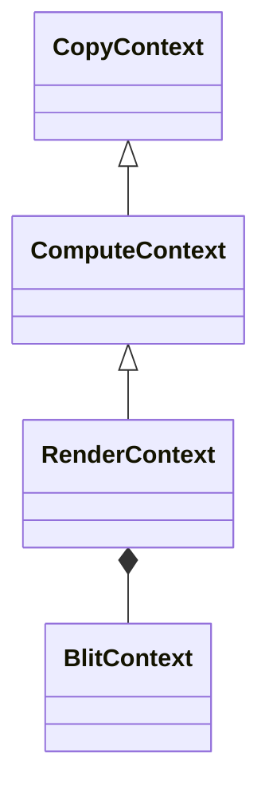

# RenderContext 源码文档

> 路径: `Source/Falcor/Core/API/RenderContext.h` / `RenderContext.cpp`
> 类型: C++ 头文件 + 实现
> 模块: Core/API

## 功能概述

RenderContext 是完整的渲染上下文，继承自 ComputeContext，在计算和复制功能之上增加了图形渲染命令（绘制、Blit、帧缓冲清除）以及光线追踪和加速结构操作。它是 Falcor 中发出 GPU 命令的主要接口。

## 类与接口

### `RenderContext`
- **继承**: `ComputeContext`
- **职责**: 完整的图形+计算+复制命令接口

#### 内部枚举
| 枚举 | 说明 |
|------|------|
| `StateBindFlags` | 控制绘制前绑定哪些状态（Vars、Topology、Vao、Fbo、Viewports、Scissors、PipelineState、SamplePositions） |
| `RtAccelerationStructureCopyMode` | 加速结构复制模式（Clone、Compact） |

#### 关键方法 — 清除操作
| 方法签名 | 说明 |
|----------|------|
| `void clearFbo(const Fbo*, const float4&, float, uint8_t, FboAttachmentType)` | 清除帧缓冲 |
| `void clearRtv(const RenderTargetView*, const float4&)` | 清除渲染目标视图 |
| `void clearDsv(const DepthStencilView*, float, uint8_t, bool, bool)` | 清除深度-模板视图 |
| `void clearTexture(Texture*, const float4&)` | 清除纹理 |

#### 关键方法 — 绘制操作
| 方法签名 | 说明 |
|----------|------|
| `void draw(...)` | 有序绘制 |
| `void drawInstanced(...)` | 实例化绘制 |
| `void drawIndexed(...)` | 索引绘制 |
| `void drawIndexedInstanced(...)` | 索引实例化绘制 |
| `void drawIndirect(...)` | 间接绘制 |
| `void drawIndexedIndirect(...)` | 间接索引绘制 |

#### 关键方法 — Blit 和其他
| 方法签名 | 说明 |
|----------|------|
| `void blit(SRV, RTV, srcRect, dstRect, filter)` | 简单 Blit 操作 |
| `void blit(SRV, RTV, ..., componentsReduction, componentsTransform)` | 复杂 Blit（通道重映射） |
| `void raytrace(Program*, RtProgramVars*, width, height, depth)` | 执行光线追踪 |
| `void buildAccelerationStructure(...)` | 构建加速结构 |
| `void copyAccelerationStructure(...)` | 复制加速结构 |
| `void resolveResource(...)` | 解析多重采样资源 |

## 架构图

## 依赖关系
### 本文件引用
- `ComputeContext.h`, `FBO.h`, `Sampler.h`, `Texture.h`
- `RtAccelerationStructure.h`, `RtAccelerationStructurePostBuildInfoPool.h`

### 被以下文件引用
- `Device.h`（持有默认 RenderContext）
