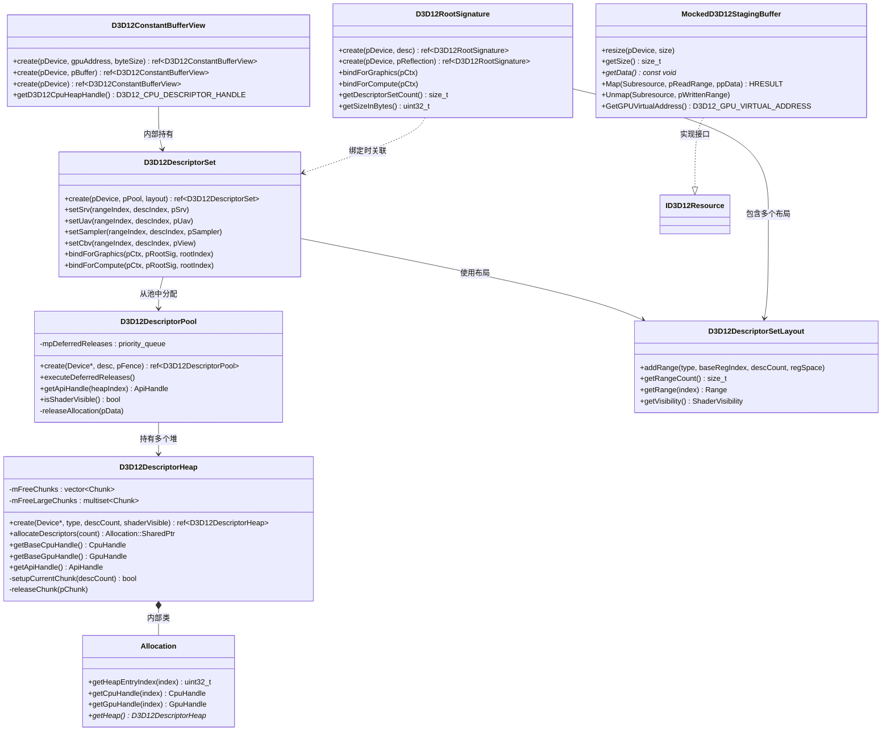

# D3D12 共享图形 API 层 (Shared)

> 路径: `Source/Falcor/Core/API/Shared/`

## 功能概述

本模块是 Falcor 渲染框架中 D3D12 图形 API 共享基础设施层，提供了对 Direct3D 12 描述符管理系统和根签名机制的完整封装。该模块是 Falcor 与底层 D3D12 硬件交互的核心桥梁，负责管理着色器资源的绑定和访问方式。

模块围绕 D3D12 的描述符 (Descriptor) 体系构建了一套分层管理架构：从底层的描述符堆 (`D3D12DescriptorHeap`) 提供原始内存分配，到中间层的描述符池 (`D3D12DescriptorPool`) 实现类型化的资源管理和延迟释放，再到上层的描述符集 (`D3D12DescriptorSet`) 提供面向用户的 SRV/UAV/CBV/Sampler 绑定接口。这种分层设计既隔离了底层 API 的复杂性，又保证了描述符分配的高效性。

根签名 (`D3D12RootSignature`) 组件定义了管线状态中资源的绑定布局，支持描述符表、根描述符和根常量三种参数类型，并可从程序反射信息自动构建。此外，模块还包含一个模拟暂存缓冲区 (`MockedD3D12StagingBuffer`)，用于在不进行 GPU 回读的情况下获取常量缓冲区数据，这是为 DDGI（动态漫反射全局光照）等特殊场景设计的临时方案。

所有类均采用基于 chunk 的内存分配策略和基于 Fence 的延迟释放机制，确保在 GPU 异步执行环境下的安全资源生命周期管理。

## 架构图

## 文件清单

| 文件 | 类型 | 说明 |
|------|------|------|
| `D3D12Handles.h` | 头文件 | 定义 D3D12 COM 智能指针宏及 `ID3DBlob`、`ID3D12DescriptorHeap`、`ID3D12RootSignature` 的智能指针类型 |
| `D3D12DescriptorHeap.h` | 头文件 | 描述符堆类声明，提供基于 chunk 的描述符内存分配器，支持 CPU/GPU 句柄访问 |
| `D3D12DescriptorHeap.cpp` | 实现 | 描述符堆的创建、chunk 分配/回收、空闲列表管理逻辑 |
| `D3D12DescriptorData.h` | 头文件 | 定义 `DescriptorPoolApiData` 和 `DescriptorSetApiData` 内部数据结构 |
| `D3D12DescriptorPool.h` | 头文件 | 描述符池类声明，管理多种类型描述符堆并提供基于 Fence 的延迟释放 |
| `D3D12DescriptorPool.cpp` | 实现 | 描述符池的创建、Falcor 类型到 D3D12 堆类型的映射、延迟释放队列处理 |
| `D3D12DescriptorSetLayout.h` | 头文件 | 描述符集布局类和 `ShaderVisibility` 枚举定义，描述描述符范围和着色器可见性 |
| `D3D12DescriptorSet.h` | 头文件 | 描述符集类声明，提供 SRV/UAV/CBV/Sampler 设置接口和图形/计算管线绑定 |
| `D3D12DescriptorSet.cpp` | 实现 | 描述符集创建、资源视图设置、描述符表到 GPU 堆的拷贝与绑定操作 |
| `D3D12ConstantBufferView.h` | 头文件 | 常量缓冲区视图类声明，为需要原生 D3D12 描述符集 API 的应用提供 CBV 封装 |
| `D3D12ConstantBufferView.cpp` | 实现 | CBV 的创建（支持 GPU 地址、缓冲区对象和空视图三种方式） |
| `D3D12RootSignature.h` | 头文件 | 根签名类声明，定义管线资源绑定布局，支持描述符表、根描述符和根常量 |
| `D3D12RootSignature.cpp` | 实现 | 根签名的序列化创建、从程序反射自动构建、图形/计算管线绑定 |
| `MockedD3D12StagingBuffer.h` | 头文件 | 模拟 `ID3D12Resource` 接口的暂存缓冲区，用于 DDGI 等场景的 CPU 端数据中转 |
| `MockedD3D12StagingBuffer.cpp` | 实现 | Map/Unmap 操作将 CPU 内存写入同步到 GPU 缓冲区 |

## 依赖关系

### 本模块依赖
- `Core/Object.h` -- 基础对象引用计数系统 (`Object`, `ref<T>`)
- `Core/Macros.h` -- 框架宏定义 (`FALCOR_API`, `FALCOR_OBJECT`, `FALCOR_ASSERT`)
- `Core/Error.h` -- 错误处理 (`FALCOR_THROW`, `FALCOR_CHECK`)
- `Core/API/Buffer.h` -- 缓冲区资源抽象
- `Core/API/Fence.h` -- GPU 同步围栏，用于延迟释放
- `Core/API/Device.h` -- GPU 设备抽象，获取原生 D3D12 设备句柄
- `Core/API/CopyContext.h` -- 命令缓冲区上下文，用于描述符绑定
- `Core/API/GFXAPI.h` -- GFX 抽象层接口（瞬态资源堆等）
- `Core/API/ShaderResourceType.h` -- 着色器资源类型枚举
- `Core/API/NativeHandleTraits.h` -- 原生句柄类型转换
- `Core/API/Types.h` -- 基础类型定义（`ShaderType` 等）
- `Core/Program/ProgramReflection.h` -- 程序反射信息，用于自动构建根签名
- `Utils/Math/Common.h` -- 数学工具函数（`isPowerOf2`）
- D3D12 系统头文件 (`d3d12.h`, `comdef.h`)

### 被以下模块依赖
- `Core/API/` -- 上层 API 抽象层通过描述符集和根签名绑定着色器资源
- `Core/Program/` -- 程序管理模块通过反射信息创建根签名
- 使用 DDGI 的渲染通道 -- 通过 `MockedD3D12StagingBuffer` 进行常量缓冲区数据中转
- 需要原生 D3D12 描述符操作的应用层代码 -- 通过 `D3D12ConstantBufferView` 和 `D3D12DescriptorSet`

## 关键类与接口

### `D3D12DescriptorHeap`
描述符堆是最底层的内存管理单元，直接封装 `ID3D12DescriptorHeap`。采用基于 chunk 的分配策略，每个 chunk 包含 64 个描述符（`kDescPerChunk = 64`）。内部维护两个空闲列表：标准大小的 `mFreeChunks`（单 chunk）和大块的 `mFreeLargeChunks`（多 chunk，使用 `multiset` 按容量排序以快速查找最佳匹配）。`Allocation` 内部类代表一次分配结果，析构时自动归还 chunk。

### `D3D12DescriptorPool`
描述符池是描述符堆的上层管理器，根据资源类型（CBV/SRV/UAV、RTV、DSV、Sampler）自动创建对应的 D3D12 堆。通过 `Desc` 构建器模式配置各类型的描述符数量和着色器可见性。关键特性是基于 `Fence` 的延迟释放机制——描述符释放不是立即执行，而是等待 GPU 完成使用后才真正回收，通过优先队列按 fence 值排序管理。

### `D3D12DescriptorSetLayout`
描述符集布局是一个轻量级值类型，定义描述符集中各范围的资源类型、寄存器索引、描述符数量和寄存器空间。配合 `ShaderVisibility` 枚举（支持按着色器阶段的位掩码组合）控制描述符对各着色器阶段的可见性。

### `D3D12DescriptorSet`
描述符集是面向用户的核心接口，聚合了一组同类型描述符范围。支持两种绑定模式：`ExplicitBind`（显式调用 `bindForGraphics`/`bindForCompute`）和 `RootSignatureOffset`（通过根签名偏移隐式访问）。绑定时，描述符从 CPU 堆拷贝到 GFX 瞬态 GPU 堆中，确保着色器可见。提供 `setSrv`、`setUav`、`setSampler`、`setCbv` 等类型安全的设置方法，内部带有类型校验。

### `D3D12RootSignature`
根签名定义了管线状态中所有资源的绑定布局。根参数按固定顺序排列：描述符表 -> 根描述符 -> 根常量。支持两种创建方式：通过 `Desc` 手动构建，或通过 `ProgramReflection` 自动遍历 `ParameterBlock` 层级生成。根签名大小受 D3D12 限制（最大 64 DWORD），创建时会进行校验。使用 D3D12 1.1 版本的根签名格式。

### `D3D12ConstantBufferView`
常量缓冲区视图为不通过 GFX 抽象层的应用提供原生 D3D12 CBV 支持。支持从 GPU 地址+大小、`Buffer` 对象或空视图三种方式创建，内部通过 `D3D12DescriptorSet` 管理底层描述符。

### `MockedD3D12StagingBuffer`
模拟的 D3D12 暂存缓冲区，实现 `ID3D12Resource` COM 接口。设计目的是为 DDGI SDK 提供一个可在 CPU 端写入、同时拥有 GPU 资源地址的特殊缓冲区。`Map` 操作返回 CPU 内存指针，`Unmap` 时将数据同步到 GPU 缓冲区，`GetGPUVirtualAddress` 返回 GPU 端地址。这是一个临时方案，待 DDGI SDK 提供更好接口后可移除。
