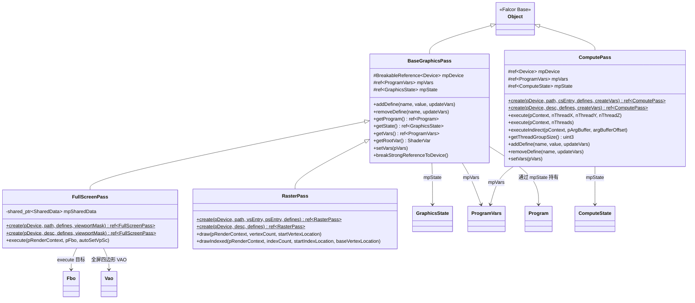

# Pass -- 渲染通道基础类

> 路径: `Source/Falcor/Core/Pass/`

## 功能概述

本目录提供了 Falcor 框架中**渲染通道 (Render Pass)** 的基础抽象层，封装了 GPU 着色器程序的创建、状态管理和执行调度。所有高层渲染通道均基于此处的类构建。目录包含三种核心渲染通道类型：

- **ComputePass (计算通道)** -- 封装计算着色器 (Compute Shader) 的调度执行，支持直接分派和间接分派，自动根据线程组大小计算分组数量。
- **FullScreenPass (全屏通道)** -- 用于全屏后处理效果，内部维护一个覆盖全屏的四边形 (TriangleStrip) 顶点缓冲区，自动禁用深度测试，支持多视口 (Multi-Projection) 渲染。
- **RasterPass (光栅化通道)** -- 通用光栅化渲染通道，支持顺序绘制 (`draw`) 和索引绘制 (`drawIndexed`)，适用于需要自定义几何体的图形管线。

此外，**BaseGraphicsPass** 作为 `FullScreenPass` 和 `RasterPass` 的公共基类，统一管理 `GraphicsState`、`Program` 和 `ProgramVars` 的生命周期。

## 架构图

## 文件清单

| 文件名 | 类型 | 说明 |
|---|---|---|
| `BaseGraphicsPass.h` | 头文件 | 图形渲染通道基类 `BaseGraphicsPass` 的声明，管理 `GraphicsState`、`Program` 和 `ProgramVars` |
| `BaseGraphicsPass.cpp` | 实现 | `BaseGraphicsPass` 构造函数、宏定义操作 (`addDefine`/`removeDefine`) 及变量绑定实现 |
| `ComputePass.h` | 头文件 | 计算通道 `ComputePass` 的声明，提供直接/间接分派接口 |
| `ComputePass.cpp` | 实现 | `ComputePass` 的工厂方法、线程分派逻辑（自动计算线程组数）及 Python 脚本绑定 |
| `FullScreenPass.h` | 头文件 | 全屏渲染通道 `FullScreenPass` 的声明，支持多视口掩码 |
| `FullScreenPass.cpp` | 实现 | `FullScreenPass` 的全屏四边形顶点缓冲区创建、深度状态配置、共享缓存管理及渲染执行 |
| `FullScreenPass.vs.slang` | 顶点着色器 | 全屏通道默认顶点着色器，传递位置和纹理坐标，支持 `_VIEWPORT_MASK` 条件编译 |
| `FullScreenPass.gs.slang` | 几何着色器 | 多视口几何着色器，根据 `_VIEWPORT_MASK` 将三角形复制到多个渲染目标层 |
| `RasterPass.h` | 头文件 | 光栅化渲染通道 `RasterPass` 的声明，提供 `draw` 和 `drawIndexed` 接口 |
| `RasterPass.cpp` | 实现 | `RasterPass` 的工厂方法及绘制调用委托到 `RenderContext` |

## 依赖关系

### 内部依赖 (Falcor 模块)

| 依赖模块 | 路径 | 用途 |
|---|---|---|
| `Object` | `Core/Object.h` | 所有 Pass 类的引用计数基类 |
| `Device` | `Core/API/Device` | GPU 设备抽象，用于创建缓冲区和状态对象 |
| `Program` / `ProgramDesc` | `Core/Program/Program.h` | 着色器程序的编译与管理 |
| `ProgramVars` / `ShaderVar` | `Core/Program/ProgramVars.h` | 着色器变量绑定与资源传递 |
| `GraphicsState` | `Core/State/GraphicsState.h` | 图形管线状态（`BaseGraphicsPass` 及其子类使用） |
| `ComputeState` | `Core/State/ComputeState.h` | 计算管线状态（`ComputePass` 使用） |
| `RenderContext` / `ComputeContext` | `Core/API/RenderContext.h` | GPU 命令上下文，执行实际的绘制/分派调用 |
| `Buffer` / `Vao` / `Fbo` | `Core/API/` | GPU 资源对象（顶点缓冲区、顶点数组对象、帧缓冲对象） |
| `DepthStencilState` | `Core/State/` | 深度/模板状态（`FullScreenPass` 禁用深度写入） |
| `SharedCache` | `Utils/SharedCache.h` | `FullScreenPass` 中全屏四边形 VAO 的跨实例共享缓存 |
| `ScriptBindings` | `Utils/Scripting/ScriptBindings.h` | `ComputePass` 的 Python (pybind11) 脚本绑定 |

### 外部依赖

| 依赖 | 用途 |
|---|---|
| C++ 标准库 (`<string>`, `<filesystem>`, `<memory>`) | 字符串处理、文件路径、智能指针 |
| pybind11 | `ComputePass` 的 Python 脚本绑定 |

## 关键类与接口

### BaseGraphicsPass

图形渲染通道的抽象基类，继承自 `Object`。不可直接实例化。

| 方法 | 签名 | 说明 |
|---|---|---|
| `addDefine` | `void addDefine(const string& name, const string& value = "", bool updateVars = false)` | 向着色器程序添加宏定义；`updateVars=true` 时自动重建 `ProgramVars` |
| `removeDefine` | `void removeDefine(const string& name, bool updateVars = false)` | 移除着色器宏定义 |
| `getProgram` | `ref<Program> getProgram() const` | 获取当前绑定的着色器程序 |
| `getState` | `const ref<GraphicsState>& getState() const` | 获取图形管线状态对象 |
| `getVars` | `const ref<ProgramVars>& getVars() const` | 获取着色器变量绑定对象 |
| `getRootVar` | `ShaderVar getRootVar() const` | 获取根着色器变量，用于直接设置资源 |
| `setVars` | `void setVars(const ref<ProgramVars>& pVars)` | 替换着色器变量对象；传入 `nullptr` 时自动创建新对象 |

### ComputePass

独立的计算着色器通道，继承自 `Object`。通过静态工厂方法创建。

| 方法 | 签名 | 说明 |
|---|---|---|
| `create` | `static ref<ComputePass> create(ref<Device>, const path&, const string& csEntry = "main", ...)` | 从文件路径创建计算通道，默认入口点为 `"main"` |
| `create` | `static ref<ComputePass> create(ref<Device>, const ProgramDesc&, ...)` | 从程序描述创建计算通道 |
| `execute` | `void execute(ComputeContext*, uint32_t nThreadX, uint32_t nThreadY, uint32_t nThreadZ = 1)` | 执行计算分派；参数为**线程总数**（非线程组数），内部自动计算线程组数量 |
| `executeIndirect` | `void executeIndirect(ComputeContext*, const Buffer* pArgBuffer, uint64_t offset = 0)` | 使用参数缓冲区执行间接分派 |
| `getThreadGroupSize` | `uint3 getThreadGroupSize() const` | 从着色器反射信息获取线程组大小 |

### FullScreenPass

全屏后处理渲染通道，继承自 `BaseGraphicsPass`。自动管理全屏四边形几何体。

| 方法 | 签名 | 说明 |
|---|---|---|
| `create` | `static ref<FullScreenPass> create(ref<Device>, const path&, const DefineList& = {}, uint32_t viewportMask = 0)` | 从像素着色器文件创建；`viewportMask` 非零时启用多视口几何着色器 |
| `create` | `static ref<FullScreenPass> create(ref<Device>, const ProgramDesc&, const DefineList& = {}, uint32_t viewportMask = 0)` | 从程序描述创建 |
| `execute` | `void execute(RenderContext*, const ref<Fbo>& pFbo, bool autoSetVpSc = true) const` | 渲染全屏四边形到指定帧缓冲对象；`autoSetVpSc=true` 自动设置视口和裁剪矩形 |

**内部机制：**
- 使用 `SharedCache` 在同一设备的多个 `FullScreenPass` 实例间共享全屏四边形的顶点缓冲区和 VAO
- 默认禁用深度测试
- 顶点着色器 (`FullScreenPass.vs.slang`) 根据是否定义 `_VIEWPORT_MASK` 输出不同语义 (`SV_POSITION` vs `POSITION`)
- 几何着色器 (`FullScreenPass.gs.slang`) 根据 `_VIEWPORT_MASK` 位掩码将三角形复制到多个渲染目标层

### RasterPass

通用光栅化渲染通道，继承自 `BaseGraphicsPass`。适用于需要自定义几何体输入的场景。

| 方法 | 签名 | 说明 |
|---|---|---|
| `create` | `static ref<RasterPass> create(ref<Device>, const path&, const string& vsEntry, const string& psEntry, ...)` | 从文件路径创建，需指定顶点着色器和像素着色器入口点 |
| `create` | `static ref<RasterPass> create(ref<Device>, const ProgramDesc&, const DefineList& = {})` | 从程序描述创建 |
| `draw` | `void draw(RenderContext*, uint32_t vertexCount, uint32_t startVertexLocation)` | 顺序绘制调用 |
| `drawIndexed` | `void drawIndexed(RenderContext*, uint32_t indexCount, uint32_t startIndexLocation, int32_t baseVertexLocation)` | 索引绘制调用 |
