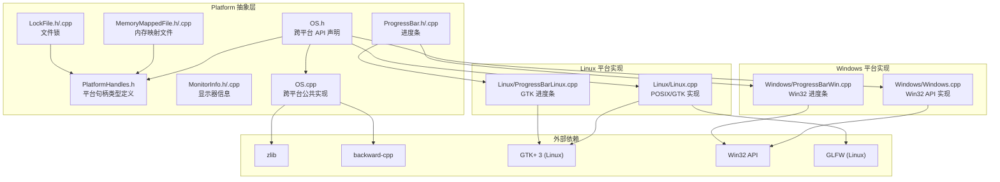

# Platform -- 平台抽象层

> 路径: `Source/Falcor/Core/Platform/`

## 功能概述

Platform 模块是 Falcor 框架的**操作系统抽象层**，为上层渲染引擎提供与平台无关的系统服务接口。该模块封装了以下核心能力：

- **操作系统服务管理** (`OSServices`)：COM 初始化/反初始化（Windows）等系统级服务的生命周期管理。
- **文件系统操作**：文件搜索、路径解析、Shader 目录管理、文件修改监控、临时文件生成、Junction（软链接）创建与删除。
- **文件对话框**：跨平台的打开文件、保存文件、选择文件夹对话框（Windows 使用 COM IFileDialog，Linux 使用 GTK）。
- **消息框**：支持标准按钮组合和自定义按钮的模态消息对话框。
- **内存映射文件** (`MemoryMappedFile`)：高性能只读文件访问，支持 Normal/SequentialScan/RandomAccess 三种访问提示模式。
- **文件锁** (`LockFile`)：跨平台的独占/共享文件锁机制（Windows 使用 `LockFileEx`，Linux 使用 `flock`）。
- **进度条** (`ProgressBar`)：独立线程运行的脉冲式进度条窗口（Windows 使用 Win32 Common Controls，Linux 使用 GTK）。
- **显示器信息** (`MonitorInfo`)：枚举所有显示器，获取分辨率、物理尺寸、PPI 等参数。
- **进程管理**：启动外部进程、检测进程状态、终止进程。
- **线程工具**：线程亲和性设置、优先级管理。
- **内存查询**：总虚拟内存、已用虚拟内存、进程 RSS（驻留集大小）。
- **调试支持**：调试器检测、调试断点、调试窗口输出、堆栈追踪。
- **共享库管理**：动态库加载/卸载/符号查找。
- **位操作工具**：`bitScanReverse`、`bitScanForward`、`popcount`。
- **文件读取与解压**：文本文件读取和 `.gz` 文件 zlib 解压。

## 架构图



## 文件清单

| 文件 | 类型 | 说明 |
|------|------|------|
| `OS.h` | 头文件 | 平台抽象层的核心公共头文件，声明了文件系统、对话框、消息框、进程管理、线程、内存查询、调试、共享库等全部跨平台 API |
| `OS.cpp` | 源文件 | 平台无关的公共实现：路径查找、Shader 目录管理、文件名工具、文件读取、zlib 解压、堆栈追踪 |
| `PlatformHandles.h` | 头文件 | 定义 `SharedLibraryHandle` 和 `WindowHandle` 的平台特定类型别名 |
| `MemoryMappedFile.h` | 头文件 | `MemoryMappedFile` 类声明，支持 `AccessHint` 枚举（Normal/SequentialScan/RandomAccess） |
| `MemoryMappedFile.cpp` | 源文件 | 内存映射文件的跨平台实现（Windows: `CreateFileMapping`/`MapViewOfFile`；Linux: `mmap64`/`madvise`） |
| `LockFile.h` | 头文件 | `LockFile` 类声明，支持 `LockType` 枚举（Exclusive/Shared） |
| `LockFile.cpp` | 源文件 | 文件锁的跨平台实现（Windows: `LockFileEx`/`UnlockFileEx`；Linux: `flock`） |
| `ProgressBar.h` | 头文件 | `ProgressBar` 类声明，管理独立线程的进度条窗口 |
| `ProgressBar.cpp` | 源文件 | ProgressBar 公共实现（空实现，平台特定代码在子目录中） |
| `MonitorInfo.h` | 头文件 | `MonitorInfo` 类声明，包含 `MonitorDesc` 结构体（identifier, resolution, physicalSize, ppi, isPrimary） |
| `MonitorInfo.cpp` | 源文件 | 显示器信息的跨平台实现（Windows: EDID/SetupAPI；Linux: GLFW） |
| `Windows/Windows.cpp` | 源文件 | Windows 平台 OS 接口全部实现：消息框（TaskDialog）、文件对话框（IFileDialog/COM）、进程管理、线程、内存、Junction、DPI 等 |
| `Windows/ProgressBarWin.cpp` | 源文件 | Windows 进度条实现，使用 Win32 Common Controls（PROGRESS_CLASS + PBS_MARQUEE） |
| `Linux/Linux.cpp` | 源文件 | Linux 平台 OS 接口全部实现：消息框/文件对话框（GTK）、进程（fork/execv）、线程（pthread）、共享库（dlopen）等 |
| `Linux/ProgressBarLinux.cpp` | 源文件 | Linux 进度条实现，使用 GTK 进度条控件（`gtk_progress_bar_pulse`） |

## 依赖关系

### 内部依赖

| 依赖模块 | 用途 |
|----------|------|
| `Core/Macros.h` | `FALCOR_API` 导出宏、`FALCOR_WINDOWS`/`FALCOR_LINUX` 平台宏、`FALCOR_ASSERT` 等 |
| `Core/Error.h` | `FALCOR_THROW`、`FALCOR_UNREACHABLE`、`FALCOR_UNIMPLEMENTED` 错误处理宏 |
| `Core/GLFW.h` | Linux 平台显示器信息和 DPI 查询 |
| `Utils/Logger.h` | `logError`、`logWarning` 日志函数 |
| `Utils/StringUtils.h` | `splitString`、`string_2_wstring`、`wstring_2_string` 字符串工具 |
| `Utils/Math/Vector.h` | `uint2`、`float2` 向量类型（MonitorInfo 使用） |

### 外部依赖

| 依赖库 | 平台 | 用途 |
|--------|------|------|
| zlib | 全平台 | `.gz` 文件解压（`decompressFile`） |
| backward-cpp | 全平台 | 堆栈追踪（`getStackTrace`） |
| Win32 API | Windows | 文件对话框、消息框、进程管理、COM 服务、内存查询、DPI、EDID 读取等 |
| GTK+ 3 | Linux | 文件对话框、消息框、进度条 |
| GLFW | Linux | 显示器枚举、DPI 缩放因子查询 |
| POSIX | Linux | `fork`/`execv`（进程）、`pthread`（线程）、`dlopen`（共享库）、`mmap`（内存映射）、`flock`（文件锁） |

## 关键类与接口

### `OSServices`

操作系统服务的启动/停止管理器。Windows 平台负责 COM 库的初始化（`CoInitializeEx`）和反初始化（`CoUninitialize`），使用引用计数确保线程安全。Linux 平台为空实现。

```cpp
class OSServices {
public:
    static void start();  // 初始化系统服务（Windows: COM）
    static void stop();   // 释放系统服务
};
```

### `MemoryMappedFile`

只读内存映射文件封装，通过操作系统虚拟内存机制高效访问大文件。不可拷贝。

```cpp
class MemoryMappedFile {
public:
    enum class AccessHint { Normal, SequentialScan, RandomAccess };

    bool open(const std::filesystem::path& path, size_t mappedSize = kWholeFile, AccessHint hint = AccessHint::Normal);
    void close();
    bool isOpen() const;
    size_t getSize() const;           // 文件总大小
    const void* getData() const;      // 映射后的内存指针
    size_t getMappedSize() const;     // 实际映射大小
    static size_t getPageSize();      // 操作系统页大小
};
```

### `LockFile`

跨平台文件锁，支持独占锁和共享锁，以及阻塞/非阻塞获取模式。不可拷贝。

```cpp
class LockFile {
public:
    enum class LockType { Exclusive, Shared };

    bool open(const std::filesystem::path& path);  // 打开/创建锁文件
    void close();
    bool isOpen() const;
    bool tryLock(LockType lockType = LockType::Exclusive);  // 非阻塞获取
    bool lock(LockType lockType = LockType::Exclusive);     // 阻塞获取
    bool unlock();
};
```

### `ProgressBar`

脉冲式进度条，在独立线程中创建 GUI 窗口显示进度动画。

```cpp
class ProgressBar {
public:
    void show(const std::string& msg);  // 显示进度条
    void close();                        // 关闭进度条
    bool isActive() const;               // 是否正在显示
};
```

### `MonitorInfo`

显示器信息查询工具类，提供所有连接显示器的详细参数。

```cpp
class MonitorInfo {
public:
    struct MonitorDesc {
        std::string identifier;   // 显示器标识符
        uint2 resolution;         // 分辨率（像素）
        float2 physicalSize;      // 物理尺寸（英寸）
        float ppi;                // 像素密度
        bool isPrimary;           // 是否为主显示器
    };

    static std::vector<MonitorDesc> getMonitorDescs();  // 获取所有显示器信息
    static void displayMonitorInfo();                    // 输出显示器信息到控制台
};
```

### 核心自由函数（`OS.h`）

| 函数 | 说明 |
|------|------|
| `msgBox(...)` | 显示模态消息框（标准按钮或自定义按钮） |
| `openFileDialog` / `saveFileDialog` / `chooseFolderDialog` | 文件/文件夹选择对话框 |
| `findFileInDirectories` / `findFileInShaderDirectories` | 在指定目录列表中查找文件 |
| `globFilesInDirectory` / `globFilesInDirectories` | 按正则表达式匹配目录中的文件 |
| `monitorFileUpdates` / `closeSharedFile` | 文件变更监控 |
| `createJunction` / `deleteJunction` | 创建/删除目录软链接 |
| `executeProcess` / `isProcessRunning` / `terminateProcess` | 外部进程管理 |
| `setThreadAffinity` / `setThreadPriority` / `getCurrentThread` | 线程控制 |
| `getTotalVirtualMemory` / `getUsedVirtualMemory` / `getCurrentRSS` / `getPeakRSS` | 内存使用查询 |
| `getExecutablePath` / `getExecutableDirectory` / `getRuntimeDirectory` / `getAppDataDirectory` | 路径查询 |
| `getEnvironmentVariable` | 读取环境变量 |
| `loadSharedLibrary` / `releaseSharedLibrary` / `getProcAddress` | 动态库操作 |
| `isDebuggerPresent` / `debugBreak` / `printToDebugWindow` / `getStackTrace` | 调试工具 |
| `readFile` / `decompressFile` | 文件读取与 gz 解压 |
| `setWindowIcon` / `getDisplayDpi` / `getDisplayScaleFactor` | 窗口与显示工具 |
| `bitScanReverse` / `bitScanForward` / `popcount` | 位操作内联工具 |
