# Program -- 着色器程序管理模块

> 路径: `Source/Falcor/Core/Program/`

## 功能概述

本模块是 Falcor 渲染框架的**着色器程序(Shader Program)管理核心**，负责着色器的完整生命周期管理，包括：

- **程序描述与创建**: 通过 `ProgramDesc` 描述着色器模块、入口点、编译选项，由 `Program` 类管理程序的多版本（不同宏定义对应不同版本）。
- **编译与链接**: `ProgramManager` 统一管理所有着色器程序的编译（基于 Slang 编译器）、热重载、全局宏定义和编译器标志。
- **反射系统**: `ProgramReflection` 及其子类提供对着色器内部结构的完整反射能力，包括类型信息、资源绑定布局、常量缓冲区结构等。
- **变量绑定**: `ProgramVars` 管理着色器参数块（Parameter Block）的绑定，`ShaderVar` 提供类指针语法访问着色器变量。
- **光线追踪支持**: `RtBindingTable` 描述光线追踪着色器（raygen/miss/hit group）的绑定映射，`RtProgramVars` 管理光追程序变量。
- **宏定义管理**: `DefineList` 和 `TypeConformanceList` 分别管理预处理宏和 Slang 类型一致性声明。

## 架构图

```mermaid
classDiagram
    direction TB

    class ProgramDesc {
        +ShaderModuleList shaderModules
        +vector~EntryPointGroup~ entryPointGroups
        +TypeConformanceList typeConformances
        +ShaderModel shaderModel
        +SlangCompilerFlags compilerFlags
        +addShaderModule()
        +addEntryPointGroup()
        +addRayGen() ShaderID
        +addMiss() ShaderID
        +addHitGroup() ShaderID
    }

    class Program {
        -ProgramDesc mDesc
        -DefineList mDefineList
        -TypeConformanceList mTypeConformanceList
        -map mProgramVersions
        +create() ref~Program~
        +createCompute() ref~Program~
        +createGraphics() ref~Program~
        +getActiveVersion() ProgramVersion
        +addDefine() / removeDefine()
        +addTypeConformance() / removeTypeConformance()
        +getReflector() ProgramReflection
        +getRtso() RtStateObject
    }

    class ProgramManager {
        -vector~Program*~ mLoadedPrograms
        -DefineList mGlobalDefineList
        -ForcedCompilerFlags mForcedCompilerFlags
        +createProgramVersion()
        +createProgramKernels()
        +reloadAllPrograms()
        +addGlobalDefines()
        +setGenerateDebugInfoEnabled()
    }

    class ProgramVersion {
        -Program* mpProgram
        -DefineList mDefines
        -ProgramReflection mpReflector
        -IComponentType mpSlangGlobalScope
        +getKernels() ProgramKernels
        +getReflector() ProgramReflection
        +getSlangSession()
    }

    class ProgramKernels {
        -UniqueEntryPointGroups mUniqueEntryPointGroups
        -IShaderProgram mGfxProgram
        +getKernel(ShaderType)
        +getReflector()
        +getGfxProgram()
    }

    class EntryPointKernel {
        -ShaderType mType
        -string mEntryPointName
        -IComponentType mLinkedSlangEntryPoint
        +getBlobData() BlobData
        +getType() ShaderType
    }

    class EntryPointGroupKernels {
        +enum Type: Compute, Rasterization, RtSingleShader, RtHitGroup
        -vector~EntryPointKernel~ mKernels
        +getKernel(ShaderType)
        +getExportName()
    }

    class ProgramReflection {
        +getDefaultParameterBlock()
        +getEntryPointGroup()
        +getEntryPointGroupCount()
    }

    class ReflectionType {
        <<abstract>>
        +getByteSize()
        +findMember()
        +unwrapArray()
    }

    class ReflectionStructType {
        +getMemberCount()
        +getMember()
        +findMember()
    }

    class ReflectionResourceType {
        +getDimensions()
        +getShaderAccess()
        +getReturnType()
    }

    class ReflectionVar {
        -string mName
        -ReflectionType mpType
        -ShaderVarOffset mOffset
        +getName()
        +getType()
        +getOffset()
    }

    class ParameterBlockReflection {
        +getElementType()
        +getResourceRangeCount()
        +getDefaultConstantBufferBindingIndex()
    }

    class ProgramVars {
        -ProgramReflection mpReflector
        +create() ref~ProgramVars~
        +getReflection()
    }

    class RtProgramVars {
        -VarsVector mRayGenVars
        -VarsVector mMissVars
        -VarsVector mHitVars
        +create() ref~RtProgramVars~
        +prepareShaderTable()
        +getShaderTable()
    }

    class ShaderVar {
        -ParameterBlock* mpBlock
        -TypedShaderVarOffset mOffset
        +operator[](name)
        +operator[](index)
        +set() / operator=()
        +setTexture() / setBuffer()
        +setSampler() / setUav()
    }

    class RtBindingTable {
        -vector~ShaderID~ mShaderTable
        +create()
        +setRayGen()
        +setMiss()
        +setHitGroup()
    }

    class DefineList {
        +add(name, value)
        +remove(name)
    }

    class TypeConformanceList {
        +add(typeName, interfaceName, id)
        +remove(typeName, interfaceName)
    }

    Program --> ProgramDesc : 描述信息
    Program --> ProgramVersion : 创建/缓存多版本
    Program --> DefineList : 宏定义
    Program --> TypeConformanceList : 类型一致性
    ProgramManager --> Program : 管理编译与重载
    ProgramManager --> ProgramVersion : 创建版本
    ProgramManager --> ProgramKernels : 创建内核
    ProgramVersion --> ProgramKernels : 按需生成
    ProgramVersion --> ProgramReflection : 持有反射信息
    ProgramKernels --> EntryPointGroupKernels : 包含多组
    EntryPointGroupKernels --> EntryPointKernel : 包含入口点
    ProgramReflection --> ParameterBlockReflection : 继承/包含
    ParameterBlockReflection --> ReflectionVar : 描述变量
    ReflectionVar --> ReflectionType : 类型信息
    ReflectionStructType --|> ReflectionType
    ReflectionResourceType --|> ReflectionType
    ProgramVars --> ProgramReflection : 反射驱动绑定
    RtProgramVars --|> ProgramVars
    RtProgramVars --> RtBindingTable : 光追绑定表
    ShaderVar --> ProgramVars : 指向参数块内部
    ProgramDesc --> TypeConformanceList : 全局与分组
```



## 文件清单

| 文件名 | 类型 | 说明 |
|--------|------|------|
| `DefineList.h` | 头文件 | 预处理宏定义列表，继承自 `std::map<string, string>`，支持链式 `add`/`remove` |
| `Program.h` | 头文件 | 核心程序类 `Program`、程序描述 `ProgramDesc`、类型一致性 `TypeConformance/TypeConformanceList`、编译标志 `SlangCompilerFlags` |
| `Program.cpp` | 源文件 | `Program` 类的实现：版本管理、宏定义增删、延迟编译链接、文件变更检测、光追状态对象创建 |
| `ProgramManager.h` | 头文件 | 程序管理器 `ProgramManager`：全局编译控制、强制编译标志、统计信息、热重载 |
| `ProgramManager.cpp` | 源文件 | `ProgramManager` 实现：Slang 编译请求创建、程序版本/内核生成、全局宏管理 |
| `ProgramReflection.h` | 头文件 | 反射系统核心：`ReflectionType` 层次结构（Struct/Array/Basic/Resource/Interface）、`ReflectionVar`、`ParameterBlockReflection`、`ProgramReflection` |
| `ProgramReflection.cpp` | 源文件 | 反射系统实现：从 Slang 反射数据构建类型树、资源范围计算、参数块布局 |
| `ProgramVars.h` | 头文件 | 程序变量 `ProgramVars`（继承自 `ParameterBlock`）和光追变量 `RtProgramVars` |
| `ProgramVars.cpp` | 源文件 | `ProgramVars` 和 `RtProgramVars` 实现：着色器表(ShaderTable)准备、变量绑定初始化 |
| `ProgramVersion.h` | 头文件 | 程序版本 `ProgramVersion`、程序内核 `ProgramKernels`、入口点内核 `EntryPointKernel`/`EntryPointGroupKernels` |
| `ProgramVersion.cpp` | 源文件 | 版本与内核实现：Slang 组件类型管理、内核按需编译、GFX 着色器程序创建 |
| `RtBindingTable.h` | 头文件 | 光线追踪绑定表 `RtBindingTable`：描述 raygen/miss/hit group 到着色器 ID 的映射 |
| `RtBindingTable.cpp` | 源文件 | `RtBindingTable` 实现：着色器表的构造与查询 |
| `ShaderVar.h` | 头文件 | 着色器变量指针 `ShaderVar`：类指针语义访问参数块内部数据，支持纹理/缓冲区/采样器绑定 |
| `ShaderVar.cpp` | 源文件 | `ShaderVar` 实现：成员导航、资源绑定操作、原始数据访问 |

## 依赖关系

### 内部依赖（Falcor 模块间）

| 依赖模块 | 用途 |
|----------|------|
| `Core/Object.h` | 引用计数基类 `Object` 和智能指针 `ref<T>` |
| `Core/Macros.h` | `FALCOR_API`、`FALCOR_OBJECT` 等导出与对象宏 |
| `Core/API/ParameterBlock.h` | `ProgramVars` 的基类，着色器参数块抽象 |
| `Core/API/Types.h` | `ShaderType`、`ShaderModel` 等枚举类型定义 |
| `Core/API/Raytracing.h` | `RtPipelineFlags` 等光追管线标志 |
| `Core/API/RtStateObject.h` | 光追状态对象，由 `Program::getRtso()` 创建 |
| `Core/API/ShaderTable.h` | GPU 着色器表，由 `RtProgramVars` 管理 |
| `Core/API/Texture.h` / `Buffer.h` / `Sampler.h` | `ShaderVar` 绑定的 GPU 资源类型 |
| `Core/API/ResourceViews.h` | SRV/UAV 视图类型 |
| `Core/API/RtAccelerationStructure.h` | 光线追踪加速结构绑定 |
| `Core/API/ShaderResourceType.h` | 着色器资源类型枚举 |
| `Core/State/StateGraph.h` | 状态图缓存（用于光追状态对象缓存） |
| `Scene/SceneIDs.h` | `GlobalGeometryID`，用于 `RtBindingTable` 的几何体标识 |
| `Utils/Math/Vector.h` | 数学向量类型 |

### 外部依赖

| 依赖库 | 用途 |
|--------|------|
| **Slang** (`slang.h`) | 着色器编译器核心，提供 `IComponentType`、`ISession`、`ISlangBlob` 等接口，驱动着色器编译与反射 |
| **GFX** (`gfx::IShaderProgram`) | 图形 API 抽象层，`ProgramKernels` 持有的底层着色器程序句柄 |

## 关键类与接口

### `ProgramDesc` -- 程序描述

着色器程序的完整描述结构体，采用 Builder 模式进行链式配置：

- **ShaderModule**: 着色器模块（对应一个编译单元），可从文件或字符串创建
- **EntryPointGroup**: 入口点分组，主要用于光追 Hit Group 的多入口点组织
- **EntryPoint**: 单个入口点，指定着色器类型（Vertex/Pixel/Compute/RayGen 等）和函数名
- 提供便捷方法：`vsEntry()`、`psEntry()`、`csEntry()`、`addRayGen()`、`addMiss()`、`addHitGroup()`

### `Program` -- 程序管理（高层抽象）

管理同一着色器的多个版本（不同宏定义产生不同版本），采用**延迟编译**策略：

- 通过 `addDefine()`/`removeDefine()` 动态修改宏定义，标记版本脏位
- `getActiveVersion()` 在首次访问时触发编译链接
- 内部缓存 `ProgramVersionKey -> ProgramVersion` 映射，避免重复编译
- 支持文件变更检测（`checkIfFilesChanged()`）实现热重载

### `ProgramManager` -- 编译管理器

设备级别的全局着色器编译管理器：

- 管理所有已加载程序的注册/注销（`registerProgramForReload`）
- 提供全局宏定义（`addGlobalDefines`）和全局编译器参数
- 强制编译标志（`ForcedCompilerFlags`）可覆盖所有程序的编译选项
- `reloadAllPrograms()` 支持运行时批量热重载
- 编译统计（`CompilationStats`）记录编译耗时和次数

### `ProgramVersion` / `ProgramKernels` / `EntryPointKernel` -- 版本与内核

三层结构实现着色器代码的按需编译：

- **ProgramVersion**: 一组特定宏定义下的程序版本，持有 Slang 全局作用域和反射信息
- **ProgramKernels**: 经过特化的可执行内核集合，包含 GFX 着色器程序句柄
- **EntryPointKernel**: 单个入口点的编译产物，延迟调用 Slang 的 `getEntryPointCode()` 获取字节码
- **EntryPointGroupKernels**: 入口点组（Compute/Rasterization/RtHitGroup 等分类）

### `ProgramReflection` 反射体系

基于 Slang 编译器反射信息构建的完整类型系统：

- **ReflectionType**（抽象基类）: 所有反射类型的基类，提供 `getByteSize()`、`findMember()` 等接口
  - **ReflectionStructType**: 结构体类型，包含命名成员列表
  - **ReflectionArrayType**: 数组类型，包含元素类型和数量
  - **ReflectionBasicType**: 基本类型（float/int/bool 及其向量/矩阵变体）
  - **ReflectionResourceType**: 资源类型（Texture/Buffer/Sampler/AccelerationStructure 等）
  - **ReflectionInterfaceType**: 接口类型（Slang 动态派发）
- **ReflectionVar**: 命名变量，包含名称、类型和偏移量
- **ParameterBlockReflection**: 参数块反射，描述资源绑定范围和布局
- **EntryPointGroupReflection**: 入口点组反射，继承自 `ParameterBlockReflection`
- **ProgramReflection**: 程序级反射，管理默认参数块和所有入口点组

### `ProgramVars` / `RtProgramVars` -- 程序变量

着色器参数绑定的高层抽象：

- **ProgramVars**: 继承自 `ParameterBlock`，基于反射信息管理 CB、纹理、采样器等资源绑定
- **RtProgramVars**: 光追专用变量，管理 raygen/miss/hit 三类着色器变量和 GPU ShaderTable

### `ShaderVar` -- 着色器变量指针

类指针语义的轻量级结构体，用于方便地访问和设置参数块内的数据：

```cpp
// 使用示例
ShaderVar var = pVars->getRootVar();
var["gScene"]["camera"]["viewMat"] = viewMatrix;   // 设置 uniform 变量
var["gTexture"].setTexture(pMyTexture);              // 绑定纹理
var["gSampler"].setSampler(pMySampler);              // 绑定采样器
```

- 支持通过名称（`operator[](string_view)`）或索引（`operator[](size_t)`）导航
- 支持赋值操作符直接设置基本类型值
- 提供 `findMember()` / `hasMember()` 进行安全的可选成员查询
- 内部持有非拥有指针，属于临时使用对象，不应长期持有

### `RtBindingTable` -- 光线追踪绑定表

描述光线追踪着色器到几何体的映射关系：

- 一维表结构：`[1 raygen] + [N miss] + [rayTypeCount * geometryCount hit groups]`
- 通过 `setRayGen()`、`setMiss()`、`setHitGroup()` 配置着色器 ID
- `ShaderID` 对应 `ProgramDesc` 中入口点组的索引

### `DefineList` / `TypeConformanceList` -- 配置列表

- **DefineList**: 继承 `std::map<string, string>`，管理预处理宏，支持链式 `add()`/`remove()`
- **TypeConformanceList**: 继承 `std::map<TypeConformance, uint32_t>`，管理 Slang 类型一致性声明（用于动态派发的接口-实现映射）
