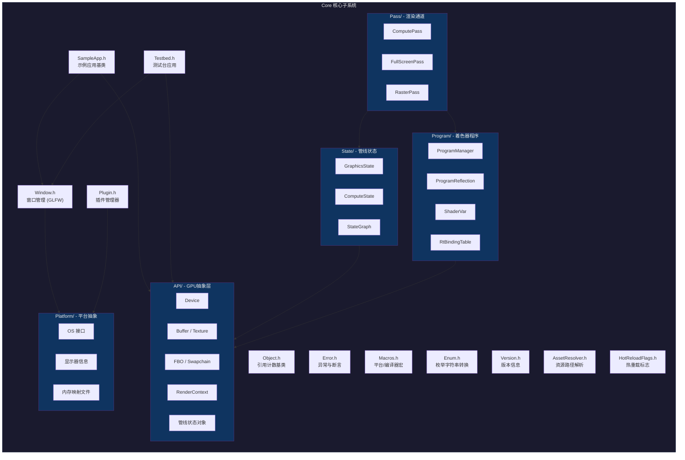

# Core - Falcor 核心子系统

> 路径: `Source/Falcor/Core/`

## 功能概述

`Core` 是 Falcor 渲染框架的核心子系统，提供了框架运行所需的全部底层基础设施。该子系统涵盖以下关键职责：

- **GPU抽象层**：通过 `API/` 子目录封装 D3D12/GFX 等图形 API，提供与后端无关的 GPU 资源管理（缓冲区、纹理、帧缓冲对象、交换链等）。
- **着色器与程序管理**：通过 `Program/` 子目录管理着色器程序的编译、反射、变量绑定及光线追踪绑定表。
- **管线状态**：通过 `State/` 子目录封装图形管线和计算管线的状态对象，支持状态图优化。
- **渲染通道**：通过 `Pass/` 子目录提供计算通道（ComputePass）、全屏通道（FullScreenPass）和光栅化通道（RasterPass）等高层渲染抽象。
- **平台抽象**：通过 `Platform/` 子目录封装 Windows/Linux 操作系统相关功能（文件系统、共享库加载、进度条、显示器信息等）。
- **应用程序框架**：提供 `SampleApp`、`Testbed` 等应用程序基类，支持窗口创建、事件处理、主循环管理。
- **对象系统**：自定义引用计数对象系统（`Object` + `ref<T>`），比 `std::shared_ptr` 更高效，支持对象生命周期追踪与调试。
- **插件系统**：运行时动态加载共享库插件，支持类型注册与实例化。

## 架构图



## 文件清单

以下为 `Core/` 根目录下的文件（不含子目录内文件）：

| 文件 | 类型 | 说明 |
|------|------|------|
| `Object.h` / `.cpp` | 对象系统 | 引用计数基类 `Object` 和智能指针模板 `ref<T>`，支持对象生命周期追踪和引用追踪调试。提供 `BreakableReference` 用于打破循环引用。 |
| `ObjectPython.h` | 对象系统 | `Object` 的 Python 绑定辅助头文件 |
| `Error.h` / `.cpp` | 错误处理 | 异常体系（`Exception`、`RuntimeError`、`AssertionError`）、断言宏（`FALCOR_ASSERT`）、错误报告工具（`FALCOR_THROW`、`FALCOR_CHECK`）。支持堆栈追踪附加和调试器断点。 |
| `Macros.h` | 基础宏 | 编译器检测（MSVC/Clang/GCC）、平台检测（Windows/Linux）、DLL 导出/导入宏（`FALCOR_API`）、D3D12 Agility SDK 支持、`FALCOR_ENUM_CLASS_OPERATORS` 位标志运算宏。 |
| `Enum.h` | 枚举工具 | 枚举值与字符串的双向转换工具，通过 `FALCOR_ENUM_INFO` / `FALCOR_ENUM_REGISTER` 宏注册枚举信息，支持 `enumToString`、`stringToEnum`、标志枚举的列表转换，并提供 `fmt::formatter` 集成。 |
| `SampleApp.h` / `.cpp` | 应用框架 | 示例应用基类 `SampleApp`，提供完整的主循环（`run()`）、帧渲染、GUI、输入事件回调（键盘/鼠标/手柄）、热重载、VSync、截屏等功能。通过 `SampleAppConfig` 配置 GPU 设备、窗口、颜色/深度格式。 |
| `Testbed.h` / `.cpp` | 应用框架 | 测试台应用类 `Testbed`，面向 Python API 的主应用。支持场景加载、渲染图创建与管理、帧缓冲调整、输出捕获。比 `SampleApp` 更轻量，可通过 Python 脚本驱动。 |
| `Window.h` / `.cpp` | 窗口管理 | 基于 GLFW 的窗口管理类 `Window`，支持普通/最小化/全屏模式、窗口大小调整、图标设置、事件轮询（键盘/鼠标/手柄/文件拖放）。通过 `ICallbacks` 接口派发事件。 |
| `GLFW.h` | 窗口管理 | GLFW 头文件包装器，按平台暴露原生窗口句柄（Win32/X11），并清理 X11 宏污染。 |
| `Plugin.h` / `.cpp` | 插件系统 | 插件管理器 `PluginManager`（单例模式），支持运行时加载/卸载共享库插件，类型注册与实例化。通过 `FALCOR_PLUGIN_BASE_CLASS` / `FALCOR_PLUGIN_CLASS` 宏声明插件基类和实现类。`PluginRegistry` 辅助类用于插件库注册。 |
| `AssetResolver.h` / `.cpp` | 资源管理 | 资源路径解析器 `AssetResolver`，根据搜索路径列表将相对路径解析为绝对路径。支持资源分类（场景、纹理等）、搜索优先级、正则模式匹配。 |
| `HotReloadFlags.h` | 热重载 | 热重载标志枚举 `HotReloadFlags`，目前支持 `Program`（着色器）热重载。 |
| `Version.h` / `.cpp` | 版本信息 | Falcor 版本定义（当前 8.0），提供 `getVersionString()` 和 `getLongVersionString()` 接口。 |

## 子目录索引

| 子目录 | 说明 | 文档链接 |
|--------|------|----------|
| `API/` | **GPU抽象层** - 封装 D3D12/GFX 图形 API，提供 Device、Buffer、Texture、FBO、Swapchain、RenderContext、Fence、管线状态对象（GraphicsStateObject / ComputeStateObject）、GPU 内存堆、GPU 定时器、资源格式定义等核心 GPU 资源抽象。包含 Blit 上下文和 Aftermath 崩溃诊断支持。 | [API/README.md](API/README.md) |
| `Pass/` | **渲染通道** - 提供高层渲染通道抽象，包括 `ComputePass`（计算着色器通道）、`FullScreenPass`（全屏后处理通道，含顶点/几何着色器）、`RasterPass`（光栅化通道）以及 `BaseGraphicsPass` 基类。 | [Pass/README.md](Pass/README.md) |
| `Platform/` | **平台抽象** - 封装操作系统相关功能，包括文件系统操作、共享库加载、进程管理、线程、栈追踪等 OS 接口。提供显示器信息查询、内存映射文件、文件锁、进度条等工具。包含 `Windows/` 和 `Linux/` 平台特定实现。 | [Platform/README.md](Platform/README.md) |
| `Program/` | **着色器程序管理** - 管理着色器程序的完整生命周期：`Program` 定义着色器源码与入口点，`ProgramManager` 编译与缓存着色器，`ProgramReflection` 解析着色器反射信息，`ProgramVars` / `ShaderVar` 管理着色器变量绑定，`RtBindingTable` 处理光线追踪着色器绑定表。`DefineList` 管理预处理器宏定义。 | [Program/README.md](Program/README.md) |
| `State/` | **管线状态管理** - 封装图形和计算管线的完整状态：`GraphicsState` 管理光栅化管线状态（着色器程序、FBO、视口、混合/深度/光栅化状态等），`ComputeState` 管理计算管线状态，`StateGraph` 提供状态图缓存机制以优化管线状态对象的创建。 | [State/README.md](State/README.md) |

## 依赖关系

```
Core/Macros.h          <-- 最底层，无框架内依赖
  |
  +-- Core/Error.h     <-- 依赖 Macros.h
  |     |
  |     +-- Core/Enum.h           <-- 依赖 Error.h
  |     +-- Core/Object.h         <-- 依赖 Macros.h
  |     +-- Core/AssetResolver.h  <-- 依赖 Macros.h, Enum.h
  |     +-- Core/Plugin.h         <-- 依赖 Macros.h, Error.h, Platform/OS.h
  |
  +-- Core/Platform/              <-- 依赖 Macros.h
  |
  +-- Core/API/                   <-- 依赖 Macros.h, Object.h, Platform/
  |     |
  |     +-- Core/Program/         <-- 依赖 API/
  |     |
  |     +-- Core/State/           <-- 依赖 API/, Program/
  |     |
  |     +-- Core/Pass/            <-- 依赖 API/, Program/, State/
  |
  +-- Core/Window.h               <-- 依赖 Macros.h, Object.h, Platform/
  |
  +-- Core/SampleApp.h            <-- 依赖 Window, API/, HotReloadFlags, Utils/
  |
  +-- Core/Testbed.h              <-- 依赖 Window, API/, RenderGraph/, Scene/
```

**外部依赖：**

| 外部库 | 用途 |
|--------|------|
| GLFW | 跨平台窗口与输入管理 |
| fmt | 格式化字符串（替代 C++20 `<format>`） |
| fstd | `source_location` 等 C++20 特性的回退实现 |
| pybind11 | Python 绑定支持 |
| D3D12 / GFX (Slang) | GPU 图形 API 后端 |
| NVAPI | NVIDIA 专有 GPU 扩展（可选） |
