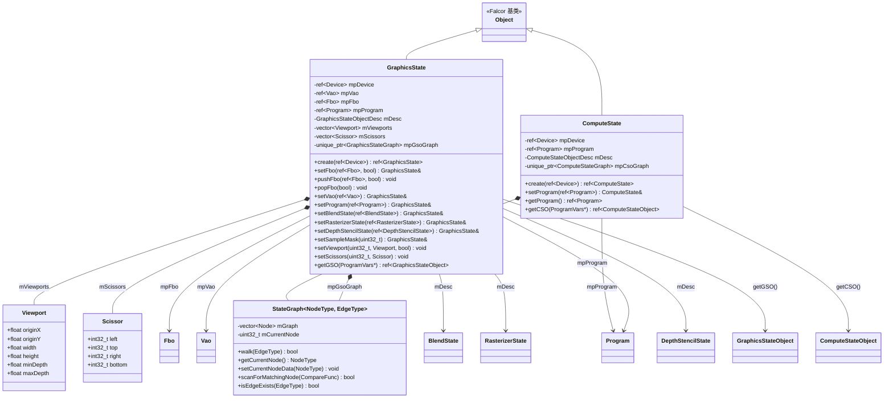
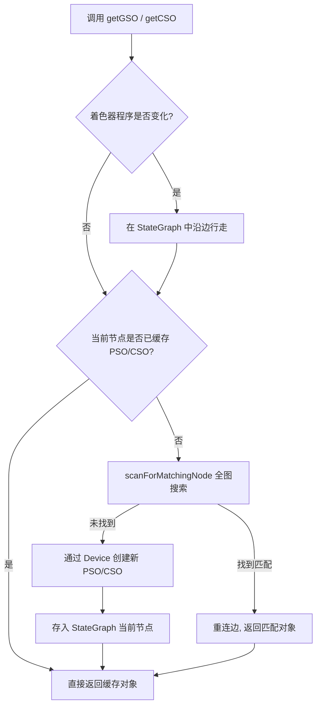

# State -- 渲染管线状态管理

> 路径: `Source/Falcor/Core/State/`

## 功能概述

本目录实现了 Falcor 渲染框架的**管线状态(Pipeline State)管理层**，负责封装 GPU 绘制调用(Draw Call)和计算调度(Dispatch)所需的全部状态信息。核心设计思想是：

- **GraphicsState** 封装一次绘制调用所需的完整图形管线状态，包括帧缓冲对象(FBO)、顶点数组对象(VAO)、混合状态、光栅化状态、深度模板状态、视口、裁剪矩形以及着色器程序。
- **ComputeState** 封装一次计算调度所需的计算管线状态，主要绑定计算着色器程序。
- **StateGraph** 提供通用的有向图缓存结构，用于高效地查找和复用已创建的管线状态对象(PSO/CSO)，避免重复创建带来的性能开销。

两种状态类均为**可变对象**，支持在渲染过程中动态修改。推荐的使用方式是为每个渲染通道创建独立的 `GraphicsState`，为每个计算着色器程序创建独立的 `ComputeState`。

## 架构图

### 状态对象获取流程

## 文件清单

| 文件名 | 类型 | 说明 |
|---|---|---|
| `GraphicsState.h` | 头文件 | 图形管线状态类 `GraphicsState` 的声明，包含视口(Viewport)、裁剪矩形(Scissor) 内嵌结构体 |
| `GraphicsState.cpp` | 实现 | `GraphicsState` 的完整实现，含 FBO/VAO/混合/光栅化/深度模板状态管理及 GSO 缓存逻辑 |
| `ComputeState.h` | 头文件 | 计算管线状态类 `ComputeState` 的声明 |
| `ComputeState.cpp` | 实现 | `ComputeState` 的完整实现，含 CSO 缓存逻辑及 Python 脚本绑定 |
| `StateGraph.h` | 头文件 | 模板类 `StateGraph<NodeType, EdgeType>` 的声明与实现（纯头文件模板） |

## 依赖关系

### 本模块的外部依赖

| 依赖模块 | 头文件路径 | 用途 |
|---|---|---|
| **Device** | `Core/API/Device.h` | GPU 设备引用，用于创建管线状态对象 |
| **Program** | `Core/Program/Program.h` | 着色器程序，提供 ProgramKernels |
| **ProgramVars** | `Core/Program/ProgramVars.h` | 着色器变量，用于获取活跃的程序内核 |
| **Fbo** | `Core/API/FBO.h` | 帧缓冲对象，GraphicsState 的渲染目标 |
| **Vao** | `Core/API/VAO.h` | 顶点数组对象，提供顶点布局与图元拓扑 |
| **BlendState** | `Core/API/BlendState.h` | 颜色混合状态 |
| **RasterizerState** | `Core/API/RasterizerState.h` | 光栅化状态（面剔除、填充模式等） |
| **DepthStencilState** | `Core/API/DepthStencilState.h` | 深度模板测试状态 |
| **GraphicsStateObject** | `Core/API/GraphicsStateObject.h` | 图形管线状态对象(GSO)，对应底层 API 的 PSO |
| **ComputeStateObject** | `Core/API/ComputeStateObject.h` | 计算管线状态对象(CSO) |
| **Object / Macros** | `Core/Object.h`, `Core/Macros.h` | Falcor 对象基类与宏定义 |
| **ScriptBindings** | `Utils/Scripting/ScriptBindings.h` | Python (pybind11) 脚本绑定支持 |

### 内部依赖

`GraphicsState` 和 `ComputeState` 均依赖同目录下的 `StateGraph` 模板类进行管线状态对象的缓存管理。

## 关键类与接口

### GraphicsState

图形管线状态类，继承自 `Object`，封装一次绘制调用所需的全部状态。

| 方法 | 返回类型 | 说明 |
|---|---|---|
| `create(ref<Device>)` | `ref<GraphicsState>` | 静态工厂方法，创建图形管线状态实例 |
| `setFbo(ref<Fbo>, bool)` | `GraphicsState&` | 设置帧缓冲对象，可选自动设置视口与裁剪矩形 |
| `pushFbo(ref<Fbo>, bool)` | `void` | 将当前 FBO 压栈并设置新 FBO，适用于多通道渲染效果 |
| `popFbo(bool)` | `void` | 从栈中恢复上一个 FBO |
| `setVao(ref<Vao>)` | `GraphicsState&` | 设置顶点数组对象 |
| `setProgram(ref<Program>)` | `GraphicsState&` | 绑定着色器程序到管线 |
| `setBlendState(ref<BlendState>)` | `GraphicsState&` | 设置颜色混合状态 |
| `setRasterizerState(ref<RasterizerState>)` | `GraphicsState&` | 设置光栅化状态 |
| `setDepthStencilState(ref<DepthStencilState>)` | `GraphicsState&` | 设置深度模板状态 |
| `setSampleMask(uint32_t)` | `GraphicsState&` | 设置采样掩码 |
| `setViewport(uint32_t, Viewport, bool)` | `void` | 设置指定索引的视口，可选同步设置裁剪矩形 |
| `setScissors(uint32_t, Scissor)` | `void` | 设置指定索引的裁剪矩形 |
| `pushViewport(uint32_t, Viewport, bool)` | `void` | 视口压栈并设置新视口 |
| `popViewport(uint32_t, bool)` | `void` | 从栈中恢复上一个视口 |
| `pushScissors(uint32_t, Scissor)` | `void` | 裁剪矩形压栈 |
| `popScissors(uint32_t)` | `void` | 裁剪矩形出栈 |
| `getGSO(const ProgramVars*)` | `ref<GraphicsStateObject>` | 获取当前状态对应的图形管线状态对象(GSO)，内部通过 StateGraph 缓存 |

**设计要点**：所有 `set*` 方法返回 `GraphicsState&`，支持链式调用。FBO、视口、裁剪矩形均支持 push/pop 栈操作，方便多渲染通道嵌套使用。

### ComputeState

计算管线状态类，继承自 `Object`，封装一次计算调度所需的状态。

| 方法 | 返回类型 | 说明 |
|---|---|---|
| `create(ref<Device>)` | `ref<ComputeState>` | 静态工厂方法，创建计算管线状态实例 |
| `setProgram(ref<Program>)` | `ComputeState&` | 绑定计算着色器程序 |
| `getProgram()` | `ref<Program>` | 获取当前绑定的计算着色器程序 |
| `getCSO(const ProgramVars*)` | `ref<ComputeStateObject>` | 获取当前状态对应的计算管线状态对象(CSO)，内部通过 StateGraph 缓存 |

### StateGraph\<NodeType, EdgeType\>

通用状态缓存图模板类。以有向图结构缓存管线状态对象，节点存储 PSO/CSO，边表示状态变化（如着色器程序变更、FBO 变更等）。

| 方法 | 返回类型 | 说明 |
|---|---|---|
| `walk(EdgeType)` | `bool` | 沿指定边行走到下一节点。若边不存在则创建新节点并返回 `false` |
| `getCurrentNode()` | `const NodeType&` | 获取当前节点存储的数据 |
| `setCurrentNodeData(NodeType)` | `void` | 设置当前节点的数据 |
| `isEdgeExists(EdgeType)` | `bool` | 检查从当前节点出发是否存在指定边 |
| `scanForMatchingNode(CompareFunc)` | `bool` | 遍历全图查找与给定比较函数匹配的节点，找到后重连边到该节点 |

**缓存策略**：当状态发生变化时（如切换着色器程序），通过 `walk()` 沿状态变化边行走。若目标节点已缓存有效的 PSO/CSO，则直接复用；否则先在全图中搜索匹配节点（`scanForMatchingNode`），搜索失败后才通过 `Device` 创建新的管线状态对象。这种策略有效减少了 PSO/CSO 的重复创建。
