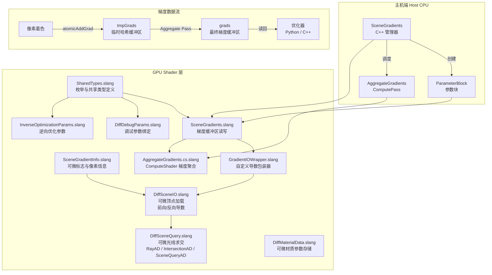
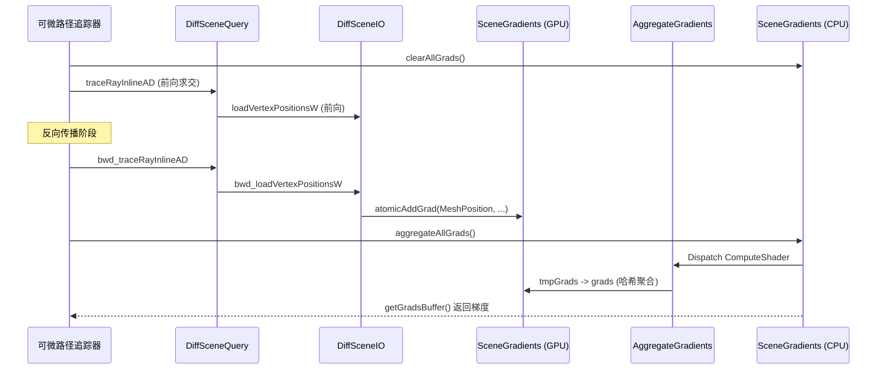

# DiffRendering -- 可微渲染系统

> 模块路径: `Source/Falcor/DiffRendering/`

## 功能概述

DiffRendering 是 Falcor 框架中的**可微渲染 (Differentiable Rendering)** 子系统，为逆向渲染 (Inverse Rendering) 与基于梯度的场景优化提供核心基础设施。该模块实现了以下关键能力:

- **场景梯度管理**: 通过 `SceneGradients` 类统一管理多种梯度类型 (材质、网格位置、法线、切线)，支持 GPU 端的原子化梯度累积与聚合。
- **可微场景查询**: 提供 `SceneQueryAD` / `DiffSceneIO` 等 Slang 结构体，对光线追踪中的顶点位置、法线、切线加载操作实现前向 (Forward) 和反向 (Backward) 自动微分。
- **哈希网格梯度聚合**: 使用 Jenkins 哈希将来自不同像素的梯度映射到哈希桶中，通过 Compute Shader 聚合为最终的参数梯度向量。
- **可微材质数据**: `DiffMaterialData` 存储可微的 BSDF 评估参数 (最多 20 个浮点数)，供可微路径追踪器使用。
- **调试支持**: 支持 ForwardDiffDebug / BackwardDiffDebug 模式，可将单变量梯度可视化为图像。
- **Python 绑定**: `SceneGradients` 通过 pybind11 导出到 Python，支持脚本化的逆向优化流程。

## 架构图

### 梯度传播流程

## 文件清单

| 文件名 | 类型 | 说明 |
|--------|------|------|
| `SharedTypes.slang` | Slang (Host/Device 共享) | 定义 `DiffMode`、`GradientType`、`GradientAggregateMode`、`DiffVariableType`、`DiffDebugParams`、`InverseOptimizationParams` 等核心枚举与结构体 |
| `SceneGradients.h` | C++ 头文件 | `SceneGradients` 类声明：梯度缓冲区的创建、清除、聚合接口 |
| `SceneGradients.cpp` | C++ 实现 | `SceneGradients` 类实现：ParameterBlock 创建、Compute Pass 调度、Python 绑定 |
| `SceneGradients.slang` | Slang | GPU 端 `SceneGradients` 结构体：`atomicAddGrad()` 原子累积、`getGrad()` 读取 |
| `SceneGradientInfo.slang` | Slang | `GradientMode` 枚举 (None/Scene/ForwardDebug)、`SceneGradientFlag` 可微标志、`SceneGradientInfo` 像素级梯度上下文 |
| `AggregateGradients.cs.slang` | Slang (ComputeShader) | `GradientsAggregator` 结构体，提供 `mainDirect` 和 `mainHashGrid` 两种聚合入口 |
| `GradientIOWrapper.slang` | Slang | `GradientIOWrapper` 结构体：通过自定义前向/反向导数实现材质参数梯度的路由写入 |
| `DiffSceneIO.slang` | Slang | `DiffSceneIO` 结构体：对顶点位置、法线、切线、相机位置提供带自定义导数的加载函数 |
| `DiffSceneQuery.slang` | Slang | `RayAD`、`IntersectionAD`、`SceneQueryAD` 结构体：可微光线求交、重心坐标计算、相机投影 |
| `DiffMaterialData.slang` | Slang | `DiffMaterialData` 可微结构体：存储 20 个浮点材质参数，提供可微读写接口 |
| `DiffDebugParams.slang` | Slang | 全局 `ParameterBlock<DiffDebugParams>` 绑定，用于调试模式 |
| `InverseOptimizationParams.slang` | Slang | 全局 `ParameterBlock<InverseOptimizationParams>` 绑定，指定目标 meshID |

## 依赖关系

### 内部依赖 (Falcor 模块)

| 依赖模块 | 用途 |
|----------|------|
| `Core/API/ParameterBlock` | GPU 参数块创建与绑定 |
| `Core/API/RenderContext` | UAV 清除、Compute Pass 执行 |
| `RenderGraph/RenderPass` | 间接依赖 (ComputePass 基类) |
| `Scene/Scene` | 场景几何数据访问 (`gScene`) |
| `Scene/SceneTypes` | `GeometryInstanceID`、`GeometryInstanceData` |
| `Scene/Material/ShadingUtils` | `ShadingFrame` (被 `DiffMaterialData` 使用) |
| `Scene/Material/MaterialParamLayout` | `MaterialParamLayoutEntry` (被 `GradientIOWrapper` 使用) |
| `Scene/RaytracingInline` | 内联光线追踪 (`SceneRayQuery`) |
| `Utils/Math/HashUtils` | `jenkinsHash()` 哈希函数 |
| `Utils/Math/MathHelpers` | 数学辅助函数 |
| `Utils/Geometry/GeometryHelpers` | 重心坐标计算 |
| `Utils/NVAPI.slangh` | NVAPI 扩展 (InterlockedAddF32 原子浮点加法) |

### 外部依赖

| 依赖 | 用途 |
|------|------|
| pybind11 | Python 绑定导出 `SceneGradients` / `GradConfig` / `GradientType` |

## 关键类与接口

### `SceneGradients` (C++ -- `SceneGradients.h`)

主机端梯度管理器，继承自 `Falcor::Object`。

| 方法 | 说明 |
|------|------|
| `SceneGradients(device, gradConfigs, mode)` | 构造函数，按 `GradConfig` 列表创建各类型梯度的 GPU 缓冲区 |
| `create(device, gradConfigs)` | 静态工厂方法，默认使用 `HashGrid` 聚合模式 |
| `clearGrads(ctx, gradType)` | 清零指定类型的临时与最终梯度缓冲区 |
| `aggregateGrads(ctx, gradType)` | 调度 Compute Pass 将 `tmpGrads` 聚合到 `grads` |
| `clearAllGrads(ctx)` | 清零所有类型的梯度 |
| `aggregateAllGrads(ctx)` | 聚合所有类型的梯度 |
| `getGradsBuffer(gradType)` | 获取最终梯度的 GPU Buffer (可通过 shared memory 读回 CPU) |
| `getActiveGradTypes()` | 返回当前激活的梯度类型列表 |
| `bindShaderData(var)` | 将 ParameterBlock 绑定到 Shader 变量 |

**嵌套类型:**

- `GradConfig`: 梯度配置 (类型、维度、哈希大小)
- `GradInfo`: 内部使用的激活状态、维度、哈希大小

### `SceneGradients` (Slang -- `SceneGradients.slang`)

GPU 端梯度缓冲区接口。

| 方法 | 说明 |
|------|------|
| `atomicAddGrad(gradType, gradIndex, hashIndex, value)` | 原子浮点加法，将梯度值累积到 `tmpGrads` 缓冲区 |
| `getGrad(gradType, gradIndex, hashIndex)` | 从 `tmpGrads` 读取指定梯度值 |
| `getGradDim(gradType)` | 获取指定梯度类型的维度 |
| `getHashSize(gradType)` | 获取指定梯度类型的哈希桶大小 |

### `SceneQueryAD` (Slang -- `DiffSceneQuery.slang`)

可微场景查询器，封装光线追踪求交的完整可微流程。

| 方法 | 说明 |
|------|------|
| `traceRayInlineAD(rayAD, isect, mode)` | 可微光线求交，返回 `IntersectionAD` |
| `computeIntersectionAD(hitInfo, ray, mode)` | 从非可微 `HitInfo` 构建可微交点 |
| `loadVertexPosW(...)` | 可微加载世界空间顶点位置 |
| `computeShadingFrame(...)` | 可微计算着色法线/切线 |
| `computeCameraRayDirection(...)` | 可微计算相机光线方向 |
| `loadCameraPosition()` | 可微获取相机位置 |

**`DiffIntersectionMode` 枚举:**

| 值 | 说明 |
|----|------|
| `AttachToRay` | 梯度附着到光线参数 (origin, direction)，重新计算重心坐标 |
| `AttachToGeometry` | 梯度附着到几何体 (顶点位置)，固定重心坐标 |

### `DiffSceneIO` (Slang -- `DiffSceneIO.slang`)

可微场景 I/O 层，为顶点属性加载提供自定义前向/反向导数。

| 方法 | 导数模式 | 梯度目标 |
|------|----------|----------|
| `loadVertexPositionsW` | Forward + Backward | `GradientType::MeshPosition` |
| `loadVertexNormalsW` | Forward + Backward | `GradientType::MeshNormal` |
| `loadVertexTangentsW` | Forward + Backward | `GradientType::MeshTangent` |
| `loadCameraPositionW` | Differentiable | (当前为 no_diff) |

### `GradientIOWrapper` (Slang -- `GradientIOWrapper.slang`)

材质梯度路由包装器，通过自定义反向导数将标量/向量梯度写入 `SceneGradients` 的指定偏移位置。

### 核心枚举类型 (SharedTypes.slang)

| 枚举 | 值 | 说明 |
|------|----|------|
| `DiffMode` | `Primal`, `BackwardDiff`, `ForwardDiffDebug`, `BackwardDiffDebug` | 可微渲染运行模式 |
| `GradientType` | `Material`, `MeshPosition`, `MeshNormal`, `MeshTangent` | 梯度参数类型 |
| `GradientAggregateMode` | `Direct`, `HashGrid` | 梯度聚合策略 |
| `DiffVariableType` | `None`, `Material`, `GeometryTranslation` | 调试可视化时选择的变量类型 |
| `GradientMode` | `None`, `Scene`, `ForwardDebug` | 梯度传播模式标志 |
