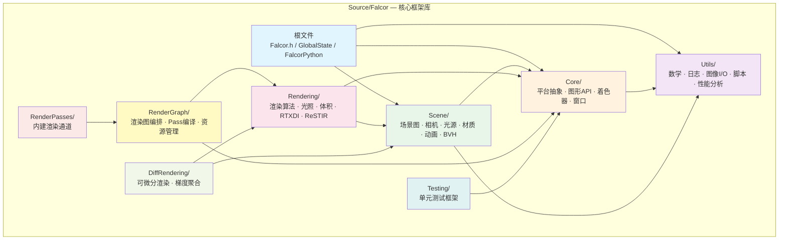

# Falcor 核心框架库

> 路径: `Source/Falcor/`

## 功能概述

`Source/Falcor/` 是 Falcor 实时渲染框架的**核心共享库**（编译为 `Falcor.dll`），包含了构建实时渲染应用所需的全部基础设施。它汇集了图形 API 抽象层、场景管理、渲染算法、渲染图系统、可微分渲染、工具集和测试框架等模块，是框架中所有上层应用（如 Mogwai、FalcorTest）的底层依赖。

核心职责包括：

- **图形 API 抽象**：对 D3D12/Vulkan 等图形后端的统一封装（Device、Buffer、Texture、RenderContext 等）
- **着色器程序管理**：基于 Slang 的着色器编译、反射与热重载
- **场景表示**：几何体、材质、光源、相机、动画的完整场景图
- **渲染图**：数据驱动的渲染管线编排系统（RenderGraph）
- **内建渲染通道**：常用渲染 Pass 的标准实现
- **可微分渲染**：梯度计算与可微渲染基础设施
- **Python 绑定**：通过 pybind11 暴露脚本接口，支持 Mogwai 和独立 Python 模块 (`falcor_ext`)
- **全局状态管理**：为 Python 场景构建和渲染图创建提供临时全局上下文

## 架构图



## 文件清单

`Source/Falcor/` 根目录下的文件（不含子目录内容）：

| 文件 | 说明 |
|------|------|
| `Falcor.h` | **主头文件** — 汇总引入 Core、Scene、Utils 各模块的关键头文件，提供一站式 `#include` 入口 |
| `GlobalState.h` | 全局状态声明 — 为 Python 绑定提供活跃的 `SceneBuilder`、`Device` 等全局访问器（标记为待废弃） |
| `GlobalState.cpp` | 全局状态实现 — 维护 `spActivePythonSceneBuilder` 和 `spActivePythonRenderGraphDevice` 两个全局变量 |
| `FalcorPython.cpp` | Python 模块入口 — 定义 `PYBIND11_MODULE(falcor_ext, m)`，初始化日志、Agility SDK、插件，调用 `ScriptBindings::initModule` |
| `CMakeLists.txt` | CMake 构建配置 — 声明 `Falcor` 共享库目标及其全部源文件 |
| `Falcor.manifest` | Windows 应用程序清单文件 |
| `Falcor.natvis` | Visual Studio 调试器可视化规则（natvis），改善 Falcor 类型在调试器中的显示 |

## 子目录索引

| 子目录 | 说明 | 关键内容 |
|--------|------|----------|
| [`Core/`](Core/) | 平台与图形 API 核心层 | Device、Buffer、Texture、RenderContext、Program、Window、SampleApp 等 |
| [`Utils/`](Utils/) | 通用工具集 | 数学库、Logger、图像 I/O、脚本绑定（pybind11）、Profiler、UI 输入、算法工具 |
| [`Scene/`](Scene/) | 场景管理 | Scene、SceneBuilder、Camera、Light、MaterialSystem、Animation、SDFs、BVH、Curves |
| [`Rendering/`](Rendering/) | 渲染算法库 | 光照采样（RTXDI/ReSTIR）、体积渲染、路径追踪工具、Materials Shading |
| [`RenderGraph/`](RenderGraph/) | 渲染图系统 | RenderGraph、RenderPass、RenderPassLibrary、资源自动管理与 Pass 编排 |
| [`DiffRendering/`](DiffRendering/) | 可微分渲染 | 可微渲染基础设施、梯度聚合、Scene Gradients |
| [`RenderPasses/`](RenderPasses/) | 内建渲染通道 | 框架自带的标准 RenderPass 实现 |
| [`Testing/`](Testing/) | 测试框架 | 单元测试基础设施、GPU 测试辅助工具 |

## 依赖关系

### 内部依赖层次

```
Testing ──► Core
RenderPasses ──► RenderGraph ──► Rendering ──► Scene ──► Core ──► Utils
                                     │                     │
                                     ▼                     ▼
                               DiffRendering           Utils
```

- **Core** 和 **Utils** 是最底层模块，不依赖其他 Falcor 子目录
- **Scene** 依赖 Core 和 Utils
- **Rendering** 依赖 Scene（间接依赖 Core/Utils）
- **RenderGraph** 依赖 Core 和 Rendering
- **DiffRendering** 依赖 Scene 和 Rendering
- **RenderPasses** 依赖 RenderGraph
- **Testing** 仅依赖 Core

### 外部依赖

| 依赖库 | 用途 |
|--------|------|
| **Slang** | 着色器语言编译器与反射 |
| **pybind11** | C++ ↔ Python 绑定（`FalcorPython.cpp` 中使用） |
| **fmt** | 格式化输出（`Falcor.h` 中引入，待 C++20 `<format>` 替代） |
| **fstd** | `span` 等 STL 扩展（待 C++20 `<span>` 替代） |
| **D3D12 / Vulkan** | 图形 API 后端（通过 Core/API 抽象） |
| **GLFW** | 跨平台窗口与输入管理 |
| **NVIDIA Aftermath** | GPU 崩溃诊断（可选） |
| **Agility SDK** | D3D12 运行时更新 |
