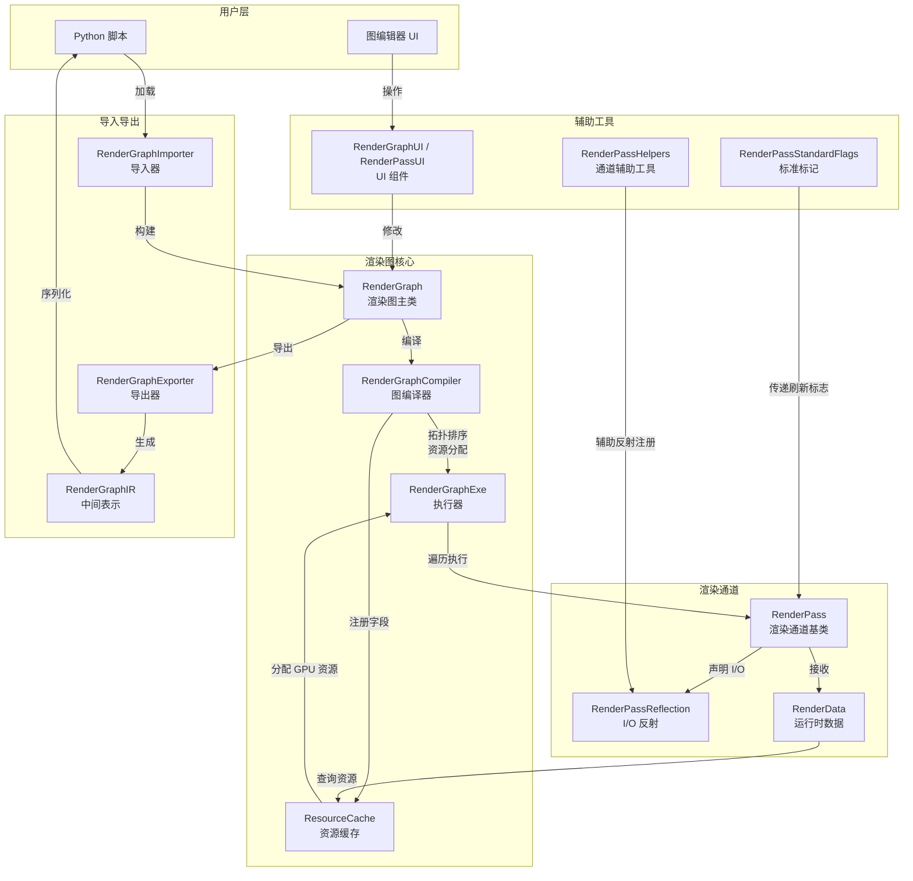
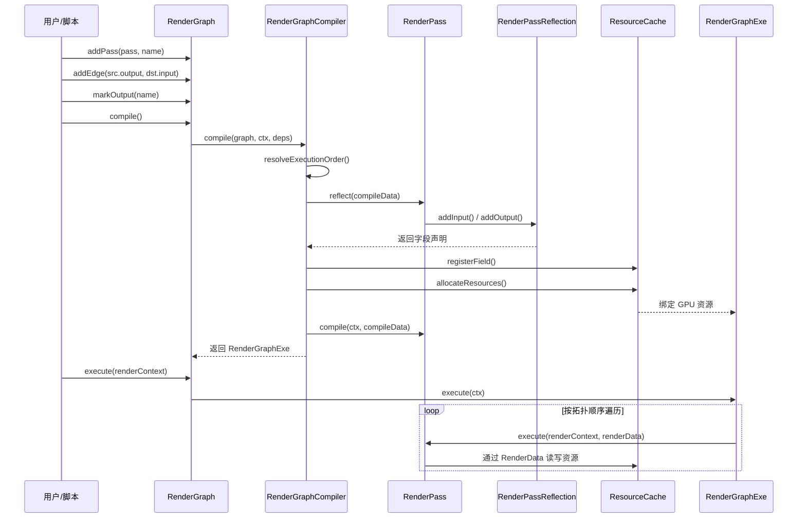

# RenderGraph -- 渲染图系统

> 源码路径: `Source/Falcor/RenderGraph/`

## 功能概述

渲染图 (Render Graph) 是 Falcor 渲染框架的核心管线编排系统。它采用**有向无环图 (DAG)** 的结构，将多个渲染通道 (Render Pass) 连接起来，形成一条完整的模块化渲染管线。

核心能力包括:

- **DAG 拓扑管理**: 以有向无环图组织渲染通道，支持添加/删除节点和边，自动检测环路
- **数据依赖与执行依赖**: 支持两种边类型 -- 数据依赖边（连接输出资源到输入资源）和执行依赖边（仅控制执行顺序）
- **自动资源分配**: 通过 `ResourceCache` 根据渲染通道声明的 I/O 反射信息自动创建和管理 GPU 资源
- **图编译与优化**: `RenderGraphCompiler` 解析拓扑排序、裁剪无用通道、插入自动通道、分配资源
- **Python 脚本导入/导出**: 通过 `RenderGraphIR` 中间表示与 Python 脚本互相转换
- **可视化编辑器 UI**: `RenderGraphUI` 提供节点图编辑界面，支持拖拽连线
- **热重载**: 支持 F5 热重载着色器和资源
- **插件化渲染通道**: `RenderPass` 基类通过插件系统动态加载，每个通道以插件形式存在

## 架构图



### 渲染通道连接流程



## 文件清单

| 文件名 | 类型 | 说明 |
|--------|------|------|
| `RenderGraph.h/.cpp` | 核心 | 渲染图主类，管理 DAG 拓扑、节点、边和图输出标记 |
| `RenderPass.h/.cpp` | 核心 | 渲染通道基类，定义 `reflect()` / `compile()` / `execute()` 生命周期；同时包含 `RenderData` 运行时数据类 |
| `RenderPassReflection.h/.cpp` | 核心 | I/O 反射系统，渲染通道通过 `Field` 描述输入/输出/内部资源的类型、格式、尺寸等属性 |
| `ResourceCache.h/.cpp` | 核心 | 资源缓存，根据反射字段声明自动分配和管理 GPU 资源（纹理、缓冲区），支持资源别名和生命周期追踪 |
| `RenderGraphCompiler.h/.cpp` | 编译 | 图编译器，执行拓扑排序、通道编译、自动通道插入、资源分配，生成可执行的 `RenderGraphExe` |
| `RenderGraphExe.h/.cpp` | 执行 | 执行器，持有编译后的通道执行列表和资源缓存，按序调用各通道的 `execute()` |
| `RenderGraphIR.h/.cpp` | 序列化 | 中间表示 (IR)，将图操作（创建通道、连边、标记输出）转换为 Python 脚本代码 |
| `RenderGraphImportExport.h/.cpp` | 序列化 | 导入器 `RenderGraphImporter` 从 Python 脚本加载图；导出器 `RenderGraphExporter` 将图保存为脚本 |
| `RenderGraphUI.h/.cpp` | UI | 可视化节点图编辑器，包含 `RenderPassUI`（单通道 UI）和 `RenderGraphUI`（图级别 UI），支持拖拽连线、增删节点 |
| `RenderPassHelpers.h/.cpp` | 辅助 | 通道开发辅助工具：I/O 尺寸枚举 `IOSize`、通道描述符 `ChannelDesc`/`ChannelList`、批量注册输入输出的模板函数 |
| `RenderPassStandardFlags.h` | 辅助 | 通道间通信的标准字典键名定义（刷新标志 `RenderPassRefreshFlags`、PRNG 维度、法线调整等） |

## 依赖关系

### 内部依赖（Falcor 模块）

| 依赖模块 | 用途 |
|----------|------|
| `Core/Object` | `RenderGraph` 和 `RenderPass` 的引用计数基类 |
| `Core/Plugin` | `RenderPass` 的插件化加载机制 |
| `Core/API/Resource`, `Texture`, `Formats` | GPU 资源类型、纹理、格式枚举 |
| `Core/API/RenderContext` | GPU 命令提交上下文 |
| `Core/Program/Program` | 着色器程序 |
| `Core/HotReloadFlags` | 热重载标志 |
| `Utils/Algorithm/DirectedGraph` | DAG 底层数据结构 |
| `Utils/Properties`, `Utils/Dictionary` | 通道配置属性和通道间通信字典 |
| `Utils/Scripting/ScriptBindings` | Python 绑定 |
| `Utils/UI/Gui` | ImGui 封装 |
| `Scene/Scene` | 场景对象，传递给渲染通道 |

### 外部依赖

无直接外部第三方依赖（间接依赖 ImGui 用于 UI 渲染）。

## 关键类与接口

### `RenderGraph`

渲染图的顶层管理类，继承 `Object`。

```cpp
class RenderGraph : public Object {
    // 创建
    static ref<RenderGraph> create(ref<Device> pDevice, const std::string& name);
    static ref<RenderGraph> createFromFile(ref<Device> pDevice, const std::filesystem::path& path);

    // 通道管理
    ref<RenderPass> createPass(const std::string& passName, const std::string& passType, const Properties& props);
    uint32_t addPass(const ref<RenderPass>& pPass, const std::string& passName);
    void removePass(const std::string& name);

    // 边管理（数据依赖：passA.output -> passB.input；执行依赖：passA -> passB）
    uint32_t addEdge(const std::string& src, const std::string& dst);
    void removeEdge(const std::string& src, const std::string& dst);

    // 输出管理
    void markOutput(const std::string& name, TextureChannelFlags mask = TextureChannelFlags::RGB);
    void unmarkOutput(const std::string& name);
    ref<Resource> getOutput(const std::string& name);

    // 编译与执行
    bool compile(RenderContext* pRenderContext, std::string& log);
    void execute(RenderContext* pRenderContext);

    // 场景与事件
    void setScene(const ref<Scene>& pScene);
    void onResize(const Fbo* pTargetFbo);
    bool onMouseEvent(const MouseEvent& mouseEvent);
    bool onKeyEvent(const KeyboardEvent& keyEvent);
    void onHotReload(HotReloadFlags reloaded);
};
```

### `RenderPass`

所有渲染通道的抽象基类，继承 `Object`，通过插件系统动态创建。

```cpp
class RenderPass : public Object {
    // 三大核心虚函数
    virtual RenderPassReflection reflect(const CompileData& compileData) = 0;  // 声明 I/O
    virtual void compile(RenderContext* pRenderContext, const CompileData& compileData) {}  // 编译回调
    virtual void execute(RenderContext* pRenderContext, const RenderData& renderData) = 0;  // 每帧执行

    // 属性与 UI
    virtual void setProperties(const Properties& props) {}
    virtual Properties getProperties() const { return {}; }
    virtual void renderUI(RenderContext* pRenderContext, Gui::Widgets& widget);

    // 场景与事件
    virtual void setScene(RenderContext* pRenderContext, const ref<Scene>& pScene) {}
    virtual void onHotReload(HotReloadFlags reloaded) {}

    // 触发重编译
    void requestRecompile();
};
```

### `RenderPassReflection` 与 `Field`

通道用来声明输入/输出/内部资源需求的反射机制。

```cpp
class RenderPassReflection {
    // 核心字段注册
    Field& addInput(const std::string& name, const std::string& desc);
    Field& addOutput(const std::string& name, const std::string& desc);
    Field& addInputOutput(const std::string& name, const std::string& desc);
    Field& addInternal(const std::string& name, const std::string& desc);

    // Field 的链式配置
    // field.texture2D(width, height).format(fmt).bindFlags(flags).flags(Flags::Optional)
};

// Field::Visibility: Input | Output | Internal
// Field::Type: Texture1D | Texture2D | Texture3D | TextureCube | RawBuffer
// Field::Flags: None | Optional | Persistent
```

### `RenderData`

在 `execute()` 中传递给渲染通道的运行时数据视图。

```cpp
class RenderData {
    const ref<Resource>& operator[](const std::string_view name) const;  // 按名称获取资源
    ref<Texture> getTexture(const std::string_view name) const;          // 按名称获取纹理
    Dictionary& getDictionary() const;                                    // 通道间通信字典
    const uint2& getDefaultTextureDims() const;                          // 默认纹理尺寸
    ResourceFormat getDefaultTextureFormat() const;                       // 默认纹理格式
};
```

### `ResourceCache`

管理渲染图中所有 GPU 资源的分配和生命周期。

```cpp
class ResourceCache {
    void registerExternalResource(const std::string& name, const ref<Resource>& pResource);
    void registerField(const std::string& name, const RenderPassReflection::Field& field,
                       uint32_t timePoint, const std::string& alias = "");
    void allocateResources(ref<Device> pDevice, const DefaultProperties& params);
    const ref<Resource>& getResource(const std::string& name) const;
    void reset();
};
```

### `RenderGraphCompiler`

负责将渲染图的逻辑描述编译为可执行形式。

```cpp
class RenderGraphCompiler {
    static std::unique_ptr<RenderGraphExe> compile(
        RenderGraph& graph, RenderContext* pRenderContext, const Dependencies& dependencies);
    // 内部流程: resolveExecutionOrder() -> compilePasses() -> insertAutoPasses() -> allocateResources()
};
```

### `RenderGraphIR`

将图操作转换为 Python 脚本的中间表示。

```cpp
class RenderGraphIR {
    void createPass(const std::string& passClass, const std::string& passName, const Properties& props);
    void addEdge(const std::string& src, const std::string& dst);
    void markOutput(const std::string& name, TextureChannelFlags mask);
    std::string getIR();  // 输出 Python 代码
};
```

### `RenderPassHelpers`

简化渲染通道开发的辅助工具集。

```cpp
struct RenderPassHelpers {
    enum class IOSize { Default, Fixed, Full, Half, Quarter, Double };
    static uint2 calculateIOSize(IOSize selection, uint2 fixedSize, uint2 windowSize);
};

// 全局辅助函数
void addRenderPassInputs(RenderPassReflection& reflector, const ChannelList& channels, ...);
void addRenderPassOutputs(RenderPassReflection& reflector, const ChannelList& channels, ...);
void clearRenderPassChannels(RenderContext* pRenderContext, const ChannelList& channels, const RenderData& renderData);
DefineList getValidResourceDefines(const ChannelList& channels, const RenderData& renderData, ...);
```
