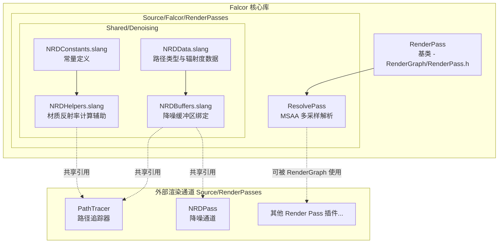
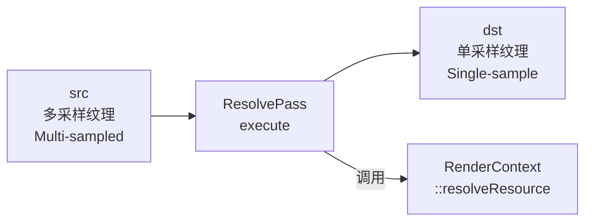

# RenderPasses -- 内部渲染通道接口与共享工具

> 模块路径: `Source/Falcor/RenderPasses/`

## 功能概述

`Source/Falcor/RenderPasses/` 是 Falcor 框架**内部** (非插件) 的 Render Pass 实现与共享着色器工具集。与外部插件目录 `Source/RenderPasses/` 不同，此模块属于 Falcor 核心库的一部分，提供:

- **ResolvePass**: 内建的多采样纹理解析渲染通道 (MSAA Resolve)，将多采样纹理转换为单采样纹理。该 Pass 不通过插件系统动态加载，而是直接编译进 Falcor 库中。
- **NRD 降噪共享工具**: 在 `Shared/Denoising/` 子目录下提供 NVIDIA Real-time Denoisers (NRD) 所需的数据结构、常量和辅助函数，供多个渲染通道 (如路径追踪器) 共享使用。

## 架构图

### ResolvePass 执行流程

## 文件清单

| 文件名 | 类型 | 说明 |
|--------|------|------|
| `ResolvePass.h` | C++ 头文件 | `ResolvePass` 类声明，继承 `RenderPass`，提供 MSAA 纹理解析功能 |
| `ResolvePass.cpp` | C++ 实现 | `ResolvePass` 的 `reflect()` 与 `execute()` 实现，调用 `RenderContext::resolveResource()` |
| `Shared/Denoising/NRDData.slang` | Slang | `NRDPathType` 枚举 (Residual/Diffuse/Specular/DeltaReflection/DeltaTransmission) 与 `NRDRadiance` 结构体 |
| `Shared/Denoising/NRDConstants.slang` | Slang | NRD 全局常量: `kNRDDepthRange`、`kNRDInvalidPathLength`、`kNRDMinReflectance` |
| `Shared/Denoising/NRDBuffers.slang` | Slang | `NRDBuffers` 结构体：降噪所需的全部 UAV 缓冲区与纹理绑定 (辐射度、命中距离、发射、反射率等) |
| `Shared/Denoising/NRDHelpers.slang` | Slang | `getMaterialReflectanceForDeltaPaths()` 等材质反射率计算辅助函数，`isDeltaReflectionAllowedAlongDeltaTransmissionPath()` 判断全内反射 |

## 依赖关系

### 内部依赖 (Falcor 模块)

| 依赖模块 | 使用者 | 用途 |
|----------|--------|------|
| `Core/Macros.h` | ResolvePass | Falcor 宏定义 (`FALCOR_API`, `FALCOR_PLUGIN_CLASS`) |
| `Core/API/Formats.h` | ResolvePass | `ResourceFormat` 枚举 |
| `Core/API/RenderContext.h` | ResolvePass | `resolveResource()` 多采样解析 |
| `RenderGraph/RenderPass.h` | ResolvePass | Render Pass 基类 (`RenderPass`, `RenderPassReflection`, `RenderData`) |
| `Utils/Logger.h` | ResolvePass | 日志警告输出 |
| `Utils/HostDeviceShared.slangh` | NRDConstants | `BEGIN_NAMESPACE_FALCOR` 宏、`HLF_MAX` 常量 |
| `Utils/Math/MathConstants.slangh` | NRDConstants | 数学常量 |
| `Scene/Scene` | NRDHelpers | 场景材质数据访问 (`gScene.materials`) |
| `Scene/ShadingData` | NRDHelpers | `ShadingData` 着色数据结构 |
| `Rendering/Materials/Fresnel` | NRDHelpers | `evalFresnelDielectric()` 菲涅尔计算 |
| `Rendering/Materials/IMaterialInstance` | NRDHelpers | `BSDFProperties` BSDF 属性 |
| `Rendering/Materials/IsotropicGGX` | NRDHelpers | `approxSpecularIntegralGGX()` 近似镜面积分 |

### 被依赖者 (下游模块)

| 下游模块 | 引用文件 | 用途 |
|----------|----------|------|
| 路径追踪器 (PathTracer 等) | `NRDBuffers.slang`, `NRDHelpers.slang` | 输出 NRD 降噪所需数据 |
| NRD 降噪通道 (NRDPass) | `NRDData.slang`, `NRDConstants.slang` | 读取路径类型与常量 |
| RenderGraph 管线 | `ResolvePass` | MSAA 纹理解析 |

## 关键类与接口

### `ResolvePass` (C++ -- `ResolvePass.h`)

MSAA 多采样纹理解析渲染通道。

| 成员 | 说明 |
|------|------|
| `create(device, props)` | 静态工厂方法 |
| `setFormat(format)` | 设置输入/输出纹理格式 (`ResourceFormat`)，默认 `Unknown` (自动匹配) |
| `reflect(compileData)` | 声明输入 `src` (多采样) 和输出 `dst` (单采样) 资源 |
| `execute(ctx, renderData)` | 执行多采样解析：验证采样数后调用 `RenderContext::resolveResource()` |

**输入/输出反射:**

| 通道 | 方向 | 说明 |
|------|------|------|
| `src` | 输入 | 多采样纹理 (sampleCount > 1) |
| `dst` | 输出 | 单采样纹理 (sampleCount = 1) |

### `NRDRadiance` (Slang -- `NRDData.slang`)

NRD 路径辐射度数据结构。

| 字段/方法 | 说明 |
|-----------|------|
| `pathType` | 路径类型 (`uint`，对应 `NRDPathType` 枚举) |
| `radiance` | RGB 辐射度值 (`float3`) |
| `getPathType()` / `setPathType()` | 路径类型存取器 |
| `getRadiance()` / `setRadiance()` | 辐射度存取器 |

### `NRDPathType` 枚举 (Slang -- `NRDData.slang`)

| 值 | 说明 |
|----|------|
| `Residual` (0) | 残差路径 (未分类到下列任何类型) |
| `Diffuse` (1) | 主命中点采样自漫反射 BSDF 瓣 |
| `Specular` (2) | 主命中点采样自镜面 BSDF 瓣 |
| `DeltaReflection` (3) | 主命中点为 delta 反射 |
| `DeltaTransmission` (4) | 路径以 delta 透射事件开始并跟随 |

### `NRDBuffers` (Slang -- `NRDBuffers.slang`)

降噪缓冲区绑定集合，包含以下 UAV 资源:

| 缓冲区组 | 包含资源 | 有效条件 |
|----------|----------|----------|
| 每采样数据 | `sampleRadiance`, `samplePrimaryHitNEEOnDelta`, `sampleHitDist`, `sampleEmission`, `sampleReflectance` | `kOutputNRDData == true` |
| 主命中点数据 | `primaryHitEmission`, `primaryHitDiffuseReflectance`, `primaryHitSpecularReflectance` | `kOutputNRDData == true` |
| Delta 反射数据 | `deltaReflectionReflectance`, `deltaReflectionEmission`, `deltaReflectionNormWRoughMaterialID`, `deltaReflectionPathLength`, `deltaReflectionHitDist` | `kOutputNRDAdditionalData == true` |
| Delta 透射数据 | `deltaTransmissionReflectance`, `deltaTransmissionEmission`, `deltaTransmissionNormWRoughMaterialID`, `deltaTransmissionPathLength`, `deltaTransmissionPosW` | `kOutputNRDAdditionalData == true` |

### NRD 辅助函数 (Slang -- `NRDHelpers.slang`)

| 函数 | 说明 |
|------|------|
| `getMaterialReflectanceForDeltaPaths(materialType, hasDeltaLobes, sd, bsdfProperties)` | 根据材质类型 (Standard/Hair) 和金属度计算 NRD 用反射率；非金属返回漫反射+透射反照率，金属返回近似镜面积分 |
| `isDeltaReflectionAllowedAlongDeltaTransmissionPath(sd)` | 判断在 delta 透射路径上是否允许 delta 反射 (全内反射或非透射镜面) |

### NRD 常量 (Slang -- `NRDConstants.slang`)

| 常量 | 值 | 说明 |
|------|----|------|
| `kNRDDepthRange` | `10000.0f` | 深度范围 |
| `kNRDInvalidPathLength` | `HLF_MAX` | 无效路径长度标记 |
| `kNRDMinReflectance` | `0.01f` | 最小反射率阈值 (防止除零) |
