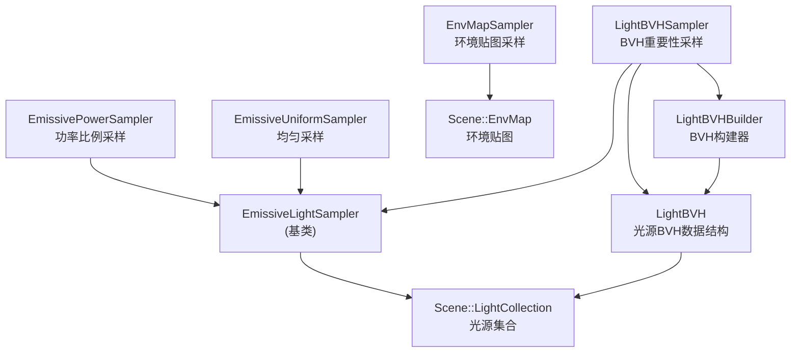

# Lights - 光照采样系统

> 源码路径: `Source/Falcor/Rendering/Lights/`

## 功能概述

Lights 模块实现了 Falcor 中完整的光照采样基础设施，主要面向发光三角形（emissive triangle）和环境贴图（environment map）两类光源。模块提供三种发光体采样策略：

1. **均匀采样**（EmissiveUniformSampler）：等概率采样所有发光三角形
2. **功率采样**（EmissivePowerSampler）：按发光功率比例采样，使用别名表（Alias Table）加速
3. **BVH采样**（LightBVHSampler）：基于光源层次包围体（BVH）的重要性采样，参考 Moreau & Clarberg 的 Ray Tracing Gems Ch.18 算法

环境光采样通过 `EnvMapSampler` 实现，利用层级重要性图（hierarchical importance map）进行高效采样。

## 架构图

## 文件清单

| 文件名 | 类型 | 说明 |
|--------|------|------|
| `EmissiveLightSampler.h` | C++ 头文件 | 发光体采样器基类定义 |
| `EmissiveLightSampler.cpp` | C++ 实现 | 基类实现 |
| `EmissiveLightSampler.slang` | Shader | GPU端发光体采样入口 |
| `EmissiveLightSamplerHelpers.slang` | Shader | 发光体采样辅助函数 |
| `EmissiveLightSamplerInterface.slang` | Shader | 发光体采样器Slang接口 |
| `EmissiveLightSamplerType.slangh` | Shader头 | 采样器类型枚举定义 |
| `EmissivePowerSampler.h` | C++ 头文件 | 功率比例采样器定义 |
| `EmissivePowerSampler.cpp` | C++ 实现 | 功率比例采样器实现（Alias Table） |
| `EmissivePowerSampler.slang` | Shader | GPU端功率采样实现 |
| `EmissiveUniformSampler.h` | C++ 头文件 | 均匀采样器定义 |
| `EmissiveUniformSampler.cpp` | C++ 实现 | 均匀采样器实现 |
| `EmissiveUniformSampler.slang` | Shader | GPU端均匀采样实现 |
| `EnvMapSampler.h` | C++ 头文件 | 环境贴图采样器定义 |
| `EnvMapSampler.cpp` | C++ 实现 | 环境贴图采样器实现（重要性图构建） |
| `EnvMapSampler.slang` | Shader | GPU端环境贴图采样 |
| `EnvMapSamplerSetup.cs.slang` | Compute Shader | 重要性图构建计算着色器 |
| `LightBVH.h` | C++ 头文件 | 光源BVH加速结构定义 |
| `LightBVH.cpp` | C++ 实现 | BVH数据管理、Refit、CPU遍历 |
| `LightBVH.slang` | Shader | GPU端BVH数据结构与遍历 |
| `LightBVHBuilder.h` | C++ 头文件 | BVH构建器定义（SAH/SAOH分割策略） |
| `LightBVHBuilder.cpp` | C++ 实现 | BVH递归构建、分割策略实现 |
| `LightBVHRefit.cs.slang` | Compute Shader | GPU端BVH refit计算着色器 |
| `LightBVHSampler.h` | C++ 头文件 | BVH采样器定义 |
| `LightBVHSampler.cpp` | C++ 实现 | BVH采样器实现 |
| `LightBVHSampler.slang` | Shader | GPU端BVH采样 |
| `LightBVHSamplerSharedDefinitions.slang` | Shader | BVH采样器共享常量和类型 |
| `LightBVHTypes.slang` | Shader | BVH节点类型定义（PackedNode） |
| `LightHelpers.slang` | Shader | 通用光照辅助函数 |

## 依赖关系

- **Core/**: `Buffer`, `Texture`, `Sampler`, `ComputePass`, `DefineList`, `Macros`
- **Scene/Lights/**: `LightCollection`（光源集合管理）, `EnvMap`（环境贴图）
- **Utils/Math/**: `AABB`, `Vector`
- **Utils/UI/**: `Gui`（调试UI）
- **Utils/Properties**: 序列化配置

## 关键类与接口

### `EmissiveLightSampler` (基类)
所有发光体采样器的公共基类，定义了 `update()`, `getDefines()`, `bindShaderData()`, `renderUI()` 等统一接口。派生类通过 `EmissiveLightSamplerType` 枚举区分类型。

### `LightBVH`
二叉BVH加速结构，存储发光三角形的空间层级划分。支持CPU遍历（`traverseBVH()`）和GPU绑定。节点以 `PackedNode` 格式紧凑存储，支持GPU端refit以更新包围盒和光照锥。

### `LightBVHBuilder`
CPU端BVH构建器，支持三种分割策略：
- **Equal**: 等分输入
- **BinnedSAH**: 基于表面积启发式（SAH）的分箱划分
- **BinnedSAOH**: 基于表面积-方向启发式（SAOH），结合光照锥和预积分通量

### `LightBVHSampler`
组合 `LightBVH` 和 `LightBVHBuilder` 的高层采样器。支持包围锥（bounding cone）裁剪、光照锥（lighting cone）背面剔除以及多种立体角包围方法。

### `EmissivePowerSampler`
使用 Alias Table 实现 O(1) 采样，按三角形发光功率比例选择光源。

### `EnvMapSampler`
通过构建层级重要性图（基于环境贴图亮度），实现对环境光的高效重要性采样。使用ComputePass在GPU上生成重要性图。
