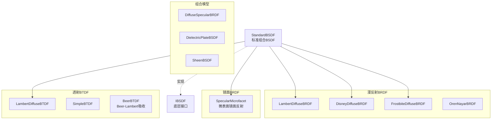

# BSDFs - 双向散射分布函数实现

> 源码路径: `Source/Falcor/Rendering/Materials/BSDFs/`

## 功能概述

BSDFs 目录包含 Falcor 渲染框架中所有底层双向散射分布函数（BSDF）的 Slang 实现。这些组件是材质求值系统的基础构建模块，被上层材质（如 StandardMaterial）组合使用。

模块涵盖了多种反射（BRDF）和透射（BTDF）模型：
- **漫反射**: Lambert、Disney、Frostbite、Oren-Nayar 四种漫反射模型
- **镜面反射**: 基于微表面理论的 GGX 镜面 BRDF
- **透射**: Lambert 漫透射、简单折射（SimpleBTDF）、Beer-Lambert 吸收（BeerBTDF）
- **组合模型**: StandardBSDF（漫反射+镜面反射+透射）、DiffuseSpecularBRDF、DielectricPlateBSDF
- **特殊模型**: SheenBSDF（天鹅绒/布料光泽层）

## 架构图

## 文件清单

| 文件名 | 类型 | 说明 |
|--------|------|------|
| `StandardBSDF.slang` | Shader | 标准BSDF组合模型（漫反射+GGX镜面+透射），支持delta事件 |
| `SpecularMicrofacet.slang` | Shader | 基于GGX微表面的镜面反射BRDF，支持各向异性 |
| `LambertDiffuseBRDF.slang` | Shader | Lambert漫反射BRDF（最简漫反射模型） |
| `DisneyDiffuseBRDF.slang` | Shader | Disney漫反射BRDF（带粗糙度相关的边缘变暗效果） |
| `FrostbiteDiffuseBRDF.slang` | Shader | Frostbite引擎漫反射BRDF（能量守恒改进版Disney） |
| `OrenNayarBRDF.slang` | Shader | Oren-Nayar漫反射BRDF（微表面漫反射，粗糙表面） |
| `LambertDiffuseBTDF.slang` | Shader | Lambert漫透射BTDF |
| `SimpleBTDF.slang` | Shader | 简化折射BTDF |
| `BeerBTDF.slang` | Shader | Beer-Lambert定律透射（指数衰减吸收） |
| `DiffuseSpecularBRDF.slang` | Shader | 漫反射+镜面反射组合BRDF |
| `DielectricPlateBSDF.slang` | Shader | 电介质板BSDF（薄膜干涉/多层效果） |
| `SheenBSDF.slang` | Shader | 光泽BSDF（天鹅绒/布料边缘光泽效果） |

## 依赖关系

- **Rendering/Materials/**: `IBSDF`（接口）, `IMaterialInstance`, `Fresnel`, `BSDFConfig.slangh`
- **Rendering/Materials/**: `Microfacet`（微表面工具函数）
- **Scene/Material/**: `MaterialData`
- **Utils/**: `ColorHelpers`, `SampleGeneratorInterface`
- **DiffRendering/**: `DiffMaterialData`（可微渲染）

## 关键类与接口

### `StandardBSDF`
标准材质使用的核心 BSDF 实现，组合了可配置的漫反射层（Lambert/Disney/Frostbite，通过 `BSDFConfig.slangh` 编译期选择）、GGX 镜面反射层和漫透射层。支持 delta 反射/透射事件（当 GGX alpha 极小时退化为完美镜面），且GGX alpha 最小值钳制为 `kMinGGXAlpha = 0.0064f`。

### `SpecularMicrofacet`
基于 Cook-Torrance 微表面理论的镜面反射 BRDF，使用 GGX 法线分布函数。支持各向异性粗糙度，Smith 遮蔽-阴影函数。

### `LambertDiffuseBRDF` / `DisneyDiffuseBRDF` / `FrostbiteDiffuseBRDF`
三种互斥的漫反射 BRDF 实现。Lambert 为经典余弦加权模型；Disney 版本添加了基于粗糙度的 Fresnel 边缘效应；Frostbite 版本在 Disney 基础上修正了能量守恒。

### `BeerBTDF`
基于 Beer-Lambert 定律的透射 BTDF，计算光线穿过介质时的指数衰减吸收。

### `SheenBSDF`
模拟天鹅绒和布料表面的光泽效果，常作为布料材质的附加层使用。
