# PBRT - PBRT兼容材质实现

> 源码路径: `Source/Falcor/Rendering/Materials/PBRT/`

## 功能概述

PBRT 目录包含与 PBRT（Physically Based Rendering）渲染器兼容的材质实现。这些材质遵循 Falcor 的 `IMaterial`/`IMaterialInstance` 接口体系，使 Falcor 能够加载和渲染 PBRT 格式的场景文件中定义的材质。

支持的 PBRT 材质类型：
- **PBRTDiffuseMaterial**: 纯漫反射材质
- **PBRTConductorMaterial**: 导体材质（金属反射）
- **PBRTDielectricMaterial**: 电介质材质（玻璃、水等透明介质）
- **PBRTCoatedConductorMaterial**: 涂层导体材质（带电介质涂层的金属）
- **PBRTCoatedDiffuseMaterial**: 涂层漫反射材质（带电介质涂层的漫反射表面）
- **PBRTDiffuseTransmissionMaterial**: 漫透射材质（薄半透明表面）

每种材质由一对文件组成：材质定义（`*Material.slang`）和材质实例（`*MaterialInstance.slang`）。

## 架构图

```mermaid
graph TD
    IMat["IMaterial<br/>材质接口"]
    IMatInst["IMaterialInstance<br/>材质实例接口"]

    subgraph PBRT材质
        PBRTDiff["PBRTDiffuseMaterial"]
        PBRTCond["PBRTConductorMaterial"]
        PBRTDiel["PBRTDielectricMaterial"]
        PBRTCoatCond["PBRTCoatedConductorMaterial"]
        PBRTCoatDiff["PBRTCoatedDiffuseMaterial"]
        PBRTDiffTrans["PBRTDiffuseTransmissionMaterial"]
    end

    subgraph PBRT材质实例
        PBRTDiffI["PBRTDiffuseMaterialInstance"]
        PBRTCondI["PBRTConductorMaterialInstance"]
        PBRTDielI["PBRTDielectricMaterialInstance"]
        PBRTCoatCondI["PBRTCoatedConductorMaterialInstance"]
        PBRTCoatDiffI["PBRTCoatedDiffuseMaterialInstance"]
        PBRTDiffTransI["PBRTDiffuseTransmissionMaterialInstance"]
    end

    PBRTDiff --> IMat
    PBRTCond --> IMat
    PBRTDiel --> IMat
    PBRTCoatCond --> IMat
    PBRTCoatDiff --> IMat
    PBRTDiffTrans --> IMat

    PBRTDiffI --> IMatInst
    PBRTCondI --> IMatInst
    PBRTDielI --> IMatInst
    PBRTCoatCondI --> IMatInst
    PBRTCoatDiffI --> IMatInst
    PBRTDiffTransI --> IMatInst
```

## 文件清单

| 文件名 | 类型 | 说明 |
|--------|------|------|
| `PBRTDiffuseMaterial.slang` | Shader | PBRT漫反射材质定义 |
| `PBRTDiffuseMaterialInstance.slang` | Shader | PBRT漫反射材质实例 |
| `PBRTConductorMaterial.slang` | Shader | PBRT导体材质定义（金属） |
| `PBRTConductorMaterialInstance.slang` | Shader | PBRT导体材质实例 |
| `PBRTDielectricMaterial.slang` | Shader | PBRT电介质材质定义（玻璃等） |
| `PBRTDielectricMaterialInstance.slang` | Shader | PBRT电介质材质实例 |
| `PBRTCoatedConductorMaterial.slang` | Shader | PBRT涂层导体材质定义 |
| `PBRTCoatedConductorMaterialInstance.slang` | Shader | PBRT涂层导体材质实例 |
| `PBRTCoatedDiffuseMaterial.slang` | Shader | PBRT涂层漫反射材质定义 |
| `PBRTCoatedDiffuseMaterialInstance.slang` | Shader | PBRT涂层漫反射材质实例 |
| `PBRTDiffuseTransmissionMaterial.slang` | Shader | PBRT漫透射材质定义 |
| `PBRTDiffuseTransmissionMaterialInstance.slang` | Shader | PBRT漫透射材质实例 |

## 依赖关系

- **Rendering/Materials/**: `IMaterial`, `IMaterialInstance`, `IBSDF`, `Fresnel`, `Microfacet`, `LobeType`
- **Rendering/Materials/BSDFs/**: 复用底层BSDF组件（如 `LambertDiffuseBRDF`, `SpecularMicrofacet`）
- **Scene/Material/**: `MaterialSystem`, `MaterialData`, `TextureSampler`, `ShadingUtils`
- **Scene/**: `ShadingData`

## 关键类与接口

### `PBRTDiffuseMaterial` / `PBRTDiffuseMaterialInstance`
纯 Lambertian 漫反射材质，对应 PBRT 的 `diffuse` 材质类型。

### `PBRTConductorMaterial` / `PBRTConductorMaterialInstance`
导体（金属）材质，使用复折射率（eta, k）描述金属反射特性，结合 GGX 微表面模型实现粗糙金属外观。

### `PBRTDielectricMaterial` / `PBRTDielectricMaterialInstance`
电介质材质，支持折射和反射。使用折射率（IOR）和 GGX 粗糙度参数，可模拟玻璃、水、塑料等透明/半透明介质。

### `PBRTCoatedConductorMaterial` / `PBRTCoatedConductorMaterialInstance`
涂层导体材质，模拟带有电介质涂层（如清漆）的金属表面。涂层和基底各自具有独立的粗糙度参数。

### `PBRTCoatedDiffuseMaterial` / `PBRTCoatedDiffuseMaterialInstance`
涂层漫反射材质，模拟带有光滑电介质涂层的漫反射表面（如上漆木材、涂釉陶瓷等）。

### `PBRTDiffuseTransmissionMaterial` / `PBRTDiffuseTransmissionMaterialInstance`
漫透射材质，模拟薄半透明表面的双向漫散射行为（如纸张、树叶等）。
