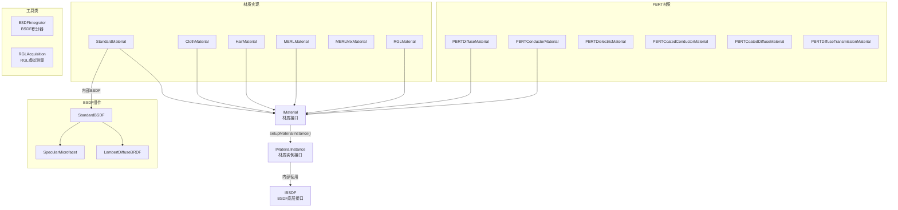

# Materials - 材质求值系统

> 源码路径: `Source/Falcor/Rendering/Materials/`

## 功能概述

Materials 模块是 Falcor 渲染框架的材质求值核心，定义了材质系统的 Slang 接口层级（`IMaterial` -> `IMaterialInstance` -> `IBSDF`），并提供了多种材质实现，包括标准 PBR 材质、布料材质、毛发材质、MERL 实测材质以及 RGL 参数化材质。

该模块的设计采用 **模式生成（Pattern Generation）** 模式：`IMaterial` 持有材质参数，在着色点处创建 `IMaterialInstance` 实例（完成纹理采样等操作），实例再通过内部的 `IBSDF` 实现完成光照计算。

子目录 `BSDFs/` 包含底层 BSDF 组件实现，`PBRT/` 包含 PBRT 渲染器兼容的材质定义。

## 架构图

## 文件清单

| 文件名 | 类型 | 说明 |
|--------|------|------|
| `IMaterial.slang` | Shader接口 | 材质顶层接口定义 |
| `IMaterialInstance.slang` | Shader接口 | 材质实例接口（BSDF求值/采样入口） |
| `IBSDF.slang` | Shader接口 | 底层BSDF函数接口 |
| `INDF.slang` | Shader接口 | 法线分布函数接口 |
| `LobeType.slang` | Shader | BSDF lobe类型标志位定义 |
| `MaterialInstanceHints.slang` | Shader | 材质实例优化提示 |
| `StandardMaterial.slang` | Shader | 标准PBR材质实现 |
| `StandardMaterialInstance.slang` | Shader | 标准材质实例 |
| `ClothBRDF.slang` | Shader | 布料BRDF模型 |
| `ClothMaterial.slang` | Shader | 布料材质 |
| `ClothMaterialInstance.slang` | Shader | 布料材质实例 |
| `HairChiang16.slang` | Shader | Chiang 2016毛发散射模型 |
| `HairMaterial.slang` | Shader | 毛发材质 |
| `HairMaterialInstance.slang` | Shader | 毛发材质实例 |
| `MERLCommon.slang` | Shader | MERL BRDF数据库通用代码 |
| `MERLMaterial.slang` | Shader | MERL实测BRDF材质 |
| `MERLMaterialInstance.slang` | Shader | MERL材质实例 |
| `MERLMixMaterial.slang` | Shader | MERL混合材质 |
| `MERLMixMaterialInstance.slang` | Shader | MERL混合材质实例 |
| `RGLCommon.slang` | Shader | RGL参数化材质通用代码 |
| `RGLMaterial.slang` | Shader | RGL材质（Dupuy & Jakob自适应参数化） |
| `RGLMaterialInstance.slang` | Shader | RGL材质实例 |
| `RGLAcquisition.h` | C++ 头文件 | RGL虚拟BRDF测量类 |
| `RGLAcquisition.cpp` | C++ 实现 | RGL测量实现 |
| `RGLAcquisition.cs.slang` | Compute Shader | RGL采集计算着色器 |
| `Fresnel.slang` | Shader | Fresnel方程实现 |
| `Microfacet.slang` | Shader | 微表面理论通用函数 |
| `NDF.slang` | Shader | 法线分布函数实现 |
| `IsotropicGGX.slang` | Shader | 各向同性GGX分布 |
| `AnisotropicGGX.slang` | Shader | 各向异性GGX分布 |
| `LayeredBSDF.slang` | Shader | 分层BSDF |
| `InteriorList.slang` | Shader | 嵌套介质内部列表管理 |
| `InteriorListHelpers.slang` | Shader | 内部列表辅助函数 |
| `TexLODHelpers.slang` | Shader | 纹理LOD计算辅助 |
| `TexLODTypes.slang` | Shader | 纹理LOD类型定义 |
| `BSDFConfig.slangh` | Shader头 | BSDF全局配置（漫反射BRDF选择等） |
| `BCSDFConfig.slangh` | Shader头 | BCSDF配置 |
| `BSDFIntegrator.h` | C++ 头文件 | BSDF数值积分工具 |
| `BSDFIntegrator.cpp` | C++ 实现 | BSDF积分实现（GPU并行归约） |
| `BSDFIntegrator.cs.slang` | Compute Shader | BSDF积分计算着色器 |

## 子目录

| 子目录 | 说明 |
|--------|------|
| [BSDFs/](BSDFs/README.md) | 双向散射分布函数实现集合 |
| [PBRT/](PBRT/README.md) | PBRT兼容材质实现 |

## 依赖关系

- **Core/**: `Buffer`, `Fence`, `ComputePass`, `Macros`
- **Scene/Material/**: `MaterialSystem`, `MaterialData`, `TextureSampler`, `ShadingUtils`, `VolumeProperties`, `RGLFile`
- **Scene/**: `Scene`, `ShadingData`, `SceneIDs`
- **Rendering/Volumes/**: `PhaseFunction`（用于体积散射材质）
- **Utils/**: 采样生成器接口、颜色辅助、数学工具
- **DiffRendering/**: `DiffMaterialData`（可微渲染支持）

## 关键类与接口

### `IMaterial` (Slang接口)
材质顶层接口。持有全部材质数据（最大128字节），关联类型 `MaterialInstance` 需实现 `IMaterialInstance`。通过 `setupMaterialInstance()` 在着色点生成材质实例（执行纹理采样等模式生成操作）。

### `IMaterialInstance` (Slang接口)
材质实例接口，提供核心BSDF操作：
- `eval()` / `evalAD()`: 求值BSDF
- `sample()`: 采样出射方向
- `evalPdf()`: 计算概率密度
- `getProperties()`: 获取材质属性（用于降噪器等）

### `IBSDF` (Slang接口)
底层BSDF函数接口，在局部坐标系中操作。约定入射方向（wi）始终在正半球，出射方向（wo）由采样产生。求值结果包含 foreshortening 项。

### `BSDFIntegrator` (C++类)
GPU辅助的BSDF数值积分工具。对给定材质和入射角执行各向同性BSDF在上半球的积分，通过ComputePass并行计算并归约结果。

### `RGLAcquisition` (C++类)
虚拟BRDF测量工具，将 Falcor 中的任意材质转换为 Dupuy & Jakob 提出的自适应参数化表示（RGL格式），支持导出为 RGLFile。
