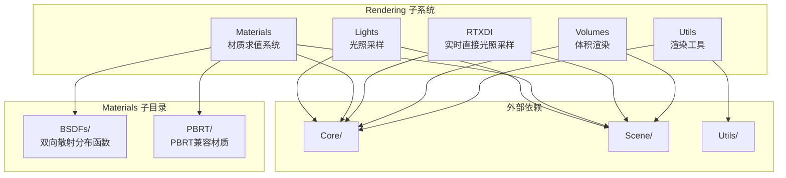

# Rendering 子系统

> 源码路径: `Source/Falcor/Rendering/`

## 功能概述

Rendering 子系统是 Falcor 渲染框架的核心渲染模块，提供了完整的光照采样、材质求值、体积渲染及实时直接光照采样（RTXDI）等功能。该子系统通过模块化的架构将渲染管线中的关键组件解耦，支持多种光照采样策略、丰富的材质模型（包括 PBRT 兼容材质）、体积渲染以及像素级统计工具。

## 架构图

## 子目录索引

| 子目录 | 说明 | 文件数 | 关键类/接口 |
|--------|------|--------|-------------|
| [Lights/](Lights/README.md) | 光照采样系统，包括发光体采样、环境光采样和光照BVH | 28 | `EmissiveLightSampler`, `LightBVH`, `EnvMapSampler` |
| [Materials/](Materials/README.md) | 材质求值系统，定义材质接口与多种材质实现 | 38+ | `IMaterial`, `IMaterialInstance`, `IBSDF` |
| [Materials/BSDFs/](Materials/BSDFs/README.md) | 双向散射分布函数实现集合 | 12 | `StandardBSDF`, `SpecularMicrofacet`, `LambertDiffuseBRDF` |
| [Materials/PBRT/](Materials/PBRT/README.md) | PBRT兼容材质实现 | 12 | `PBRTDiffuseMaterial`, `PBRTConductorMaterial`, `PBRTDielectricMaterial` |
| [RTXDI/](RTXDI/README.md) | NVIDIA RTXDI SDK 集成，实时直接光照重要性重采样 | 12 | `RTXDI` |
| [Utils/](Utils/README.md) | 渲染工具，像素级统计 | 5 | `PixelStats` |
| [Volumes/](Volumes/README.md) | 体积渲染，网格体积采样与相函数 | 7 | `GridVolumeSampler`, `PhaseFunction` |

## 依赖关系

- **Core/**: API抽象层（Buffer、Texture、ComputePass）、宏定义、程序管理
- **Scene/**: 场景管理、光源集合（LightCollection）、材质系统（MaterialSystem）、环境贴图（EnvMap）
- **Utils/**: 数学工具（AABB、Vector）、UI、并行归约、采样生成器
- **DiffRendering/**: 可微渲染支持（DiffMaterialData）

## 关键类与接口

| 类/接口 | 所在目录 | 说明 |
|---------|---------|------|
| `EmissiveLightSampler` | Lights/ | 发光体采样器基类，定义统一采样接口 |
| `LightBVH` | Lights/ | 光源BVH加速结构，支持GPU遍历 |
| `LightBVHSampler` | Lights/ | 基于BVH的发光体采样器 |
| `EnvMapSampler` | Lights/ | 环境贴图重要性采样器 |
| `IMaterial` | Materials/ | 材质接口（Slang），定义模式生成流程 |
| `IMaterialInstance` | Materials/ | 材质实例接口，提供BSDF求值与采样 |
| `IBSDF` | Materials/ | 底层BSDF函数接口 |
| `BSDFIntegrator` | Materials/ | BSDF数值积分工具（CPU端） |
| `RTXDI` | RTXDI/ | RTXDI SDK封装，支持时空重采样 |
| `PixelStats` | Utils/ | 像素级光线统计收集器 |
| `GridVolumeSampler` | Volumes/ | 网格体积透射率与散射采样 |
