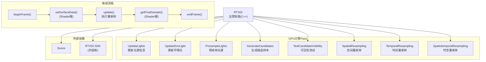

# RTXDI - 实时直接光照采样

> 源码路径: `Source/Falcor/Rendering/RTXDI/`

## 功能概述

RTXDI（Real-Time eXtended Direct Illumination）模块封装了 NVIDIA RTXDI SDK，为 Falcor 提供实时直接光照的重要性重采样（Resampled Importance Sampling, RIS）能力。该模块通过预采样光源、生成候选样本、时空重采样等步骤，实现对大规模光源场景的高效直接光照计算。

RTXDI 支持四种采样模式：
1. **NoResampling**: 无重采样（基础 RIS，Talbot 2005）
2. **SpatialResampling**: 仅空间重采样
3. **TemporalResampling**: 仅时间重采样
4. **SpatiotemporalResampling**: 时空联合重采样（默认，效果最佳）

偏差校正方式包括：Off（1/M归一化）、Basic（MIS归一化）、Pairwise（成对MIS）、RayTraced（光线追踪无偏校正）。

## 架构图

## 文件清单

| 文件名 | 类型 | 说明 |
|--------|------|------|
| `RTXDI.h` | C++ 头文件 | RTXDI主控制类定义（Options, Mode, BiasCorrection） |
| `RTXDI.cpp` | C++ 实现 | RTXDI主流程控制（beginFrame/update/endFrame） |
| `RTXDISDK.cpp` | C++ 实现 | RTXDI SDK集成桥接代码 |
| `RTXDI.slang` | Shader | GPU端RTXDI接口（setSurfaceData/getFinalSample） |
| `RTXDIApplicationBridge.slangh` | Shader头 | 应用层与RTXDI SDK的桥接定义 |
| `RTXDISetup.cs.slang` | Compute Shader | RTXDI初始化与配置Pass |
| `LightUpdater.cs.slang` | Compute Shader | 光源信息更新Pass |
| `EnvLightUpdater.cs.slang` | Compute Shader | 环境光亮度/PDF纹理更新Pass |
| `PolymorphicLight.slang` | Shader | 多态光源表示（统一发光三角形/解析光源/环境光） |
| `PackedTypes.slang` | Shader | 紧凑数据类型定义（光源信息压缩存储） |
| `SurfaceData.slang` | Shader | 表面数据结构（G-Buffer信息） |
| `ReflectTypes.cs.slang` | Compute Shader | 类型反射辅助Pass |

## 依赖关系

- **Core/**: `Macros`, `Enum`, `Buffer`, `Texture`, `ComputePass`
- **Scene/**: `Scene`（场景光源管理、相机数据）
- **Utils/**: `Properties`（配置序列化）, `PixelDebug`（像素调试）
- **外部**: RTXDI SDK（`FALCOR_HAS_RTXDI`宏控制条件编译）

## 关键类与接口

### `RTXDI` (C++类)
主控制类，管理 RTXDI 的完整生命周期：

**初始化配置**:
- `Options` 结构体包含所有可调参数：采样模式、预采样 tile 数量/大小、候选样本数、偏差校正模式、时空重采样半径/邻居数等
- `getDefines()` 返回shader预处理宏定义
- `bindShaderData()` 绑定所有GPU资源

**每帧流程**:
1. `beginFrame()` - 初始化帧状态，更新光源信息
2. shader端调用 `setSurfaceData()` 填充G-Buffer
3. `update()` - 执行完整的重采样管线（预采样 -> 候选生成 -> 可见性测试 -> 重采样）
4. shader端调用 `getFinalSample()` 获取最终光照样本
5. `endFrame()` - 帧结束处理

**光源管理**:
- 将 Falcor 光源映射到 RTXDI 分类（local/infinite/environment）
- 支持发光三角形（emissive）、解析光源（analytic）和环境光
- 自动跟踪光源变化标志并增量更新

### `PolymorphicLight` (Shader)
多态光源抽象层，将 Falcor 的不同光源类型（发光三角形、点光源、方向光等）统一为 RTXDI SDK 所需的 `RAB_LightInfo` / `RAB_LightSample` 格式。

### `SurfaceData` (Shader)
存储用于重采样的表面数据（法线、深度、材质属性等），支持双缓冲以实现时间重采样的帧间数据复用。
