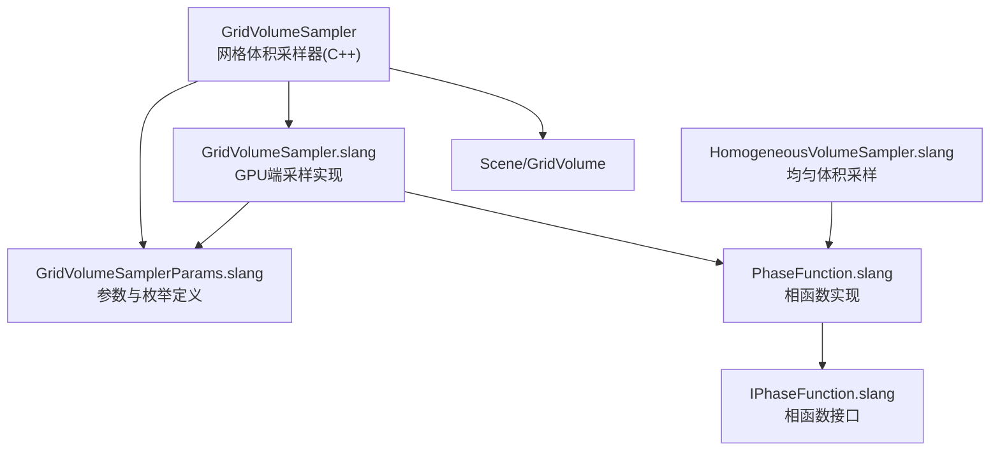

# Volumes - 体积渲染

> 源码路径: `Source/Falcor/Rendering/Volumes/`

## 功能概述

Volumes 模块实现了 Falcor 中的体积渲染支持，包括网格体积（grid volume）的透射率估计、距离采样以及相函数（phase function）计算。

体积渲染的核心挑战是在参与介质中高效计算光线传输。本模块提供：
- **透射率估计器**: 计算光线穿过体积时的衰减（支持 Ratio Tracking 等方法）
- **距离采样器**: 在体积中采样散射事件发生的位置（支持 Delta Tracking 等方法）
- **相函数**: 描述体积散射的方向分布（Henyey-Greenstein 等）

## 架构图

## 文件清单

| 文件名 | 类型 | 说明 |
|--------|------|------|
| `GridVolumeSampler.h` | C++ 头文件 | 网格体积采样器定义（Options含TransmittanceEstimator和DistanceSampler选择） |
| `GridVolumeSampler.cpp` | C++ 实现 | 采样器实现、shader defines生成 |
| `GridVolumeSampler.slang` | Shader | GPU端网格体积透射率估计与距离采样 |
| `GridVolumeSamplerParams.slang` | Shader | 透射率估计器/距离采样器类型枚举与参数定义 |
| `HomogeneousVolumeSampler.slang` | Shader | 均匀（homogeneous）体积的解析采样 |
| `IPhaseFunction.slang` | Shader接口 | 相函数Slang接口定义 |
| `PhaseFunction.slang` | Shader | 相函数实现（Henyey-Greenstein等） |

## 依赖关系

- **Core/**: `Macros`, `DefineList`
- **Scene/**: `Scene`/`IScene`（场景体积数据访问）
- **Utils/**: `Properties`（配置序列化）, `Gui`（调试UI）

## 关键类与接口

### `GridVolumeSampler` (C++类)
网格体积采样器，配置并管理 GPU 端体积渲染参数。

**配置选项** (`Options`):
- `transmittanceEstimator` - 透射率估计方法：
  - `RatioTrackingLocalMajorant`（默认）: 使用局部主导函数的比率跟踪
- `distanceSampler` - 距离采样方法：
  - `DeltaTrackingLocalMajorant`（默认）: 使用局部主导函数的 Delta 跟踪
- `useBrickedGrid` - 是否使用砖块化网格结构以提升缓存一致性

**接口**: `getDefines()` 生成shader宏定义, `bindShaderData()` 绑定GPU资源。

### `HomogeneousVolumeSampler` (Shader)
均匀体积的解析透射率计算和距离采样。当介质密度恒定时可直接使用 Beer-Lambert 定律计算，无需随机跟踪。

### `IPhaseFunction` (Slang接口)
相函数接口，定义散射方向采样和概率密度评估。相函数描述光子在体积介质中散射后的方向分布。

### `PhaseFunction` (Shader)
相函数具体实现，包含 Henyey-Greenstein 相函数等模型。Henyey-Greenstein 通过不对称参数 `g` 控制前向/各向同性/后向散射行为。
