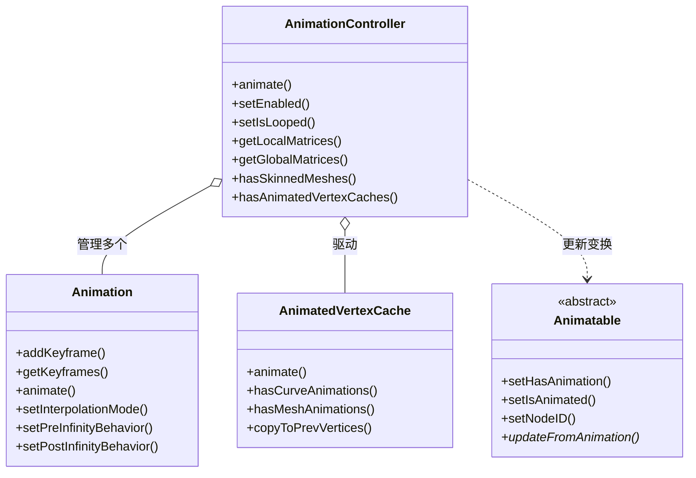

# Animation -- 动画系统

> 源码路径: `Source/Falcor/Scene/Animation/`

## 功能概述

Falcor 动画系统负责管理场景中所有对象的动画和变换更新，包括骨骼动画（Skeletal Animation）、蒙皮变形（Skinning）和顶点缓存动画（Vertex Cache Animation）。系统以场景图（Scene Graph）为基础，通过维护本地矩阵和全局矩阵的层次结构来驱动节点变换的逐帧更新。

核心控制器 `AnimationController` 是整个动画系统的调度中枢。每帧调用其 `animate()` 方法时，它首先根据当前时间更新所有 `Animation` 对象的关键帧插值结果，写入本地矩阵；然后遍历场景图，将本地变换累积为全局世界空间变换矩阵；接下来执行 GPU 端的蒙皮计算 Pass，将骨骼变换应用到网格顶点；最后驱动 `AnimatedVertexCache` 处理曲线和网格的顶点缓存动画。系统同时维护前一帧的顶点数据，用于运动模糊等时域效果。

`Animation` 类表示单个动画轨道，通过关键帧序列（平移、旋转、缩放）驱动某个场景图节点的变换。支持线性插值和 Hermite 插值两种模式，以及循环（Cycle）、振荡（Oscillate）等边界行为。`Animatable` 是一个轻量级基类，任何可被动画驱动的对象（如相机、光源）都继承自它，通过 `updateFromAnimation()` 回调接收变换更新。

GPU 端的计算通过多个 Slang 着色器完成：`Skinning.slang` 执行骨骼蒙皮变形，`UpdateMeshVertices.slang` 更新网格顶点缓存动画，`UpdateCurveVertices.slang` 和 `UpdateCurveAABBs.slang` 处理曲线动画及其包围盒更新，`UpdateCurvePolyTubeVertices.slang` 处理管状曲线网格化动画。

## 架构图

## 文件清单

| 文件 | 类型 | 说明 |
|------|------|------|
| `Animatable.h/.cpp` | C++ | 可动画对象基类，定义场景图节点绑定和变换更新接口 |
| `Animation.h/.cpp` | C++ | 单个动画轨道，管理关键帧序列和插值逻辑 |
| `AnimationController.h/.cpp` | C++ | 动画系统控制器，调度关键帧更新、矩阵传播、蒙皮和顶点缓存 |
| `AnimatedVertexCache.h/.cpp` | C++ | 顶点缓存动画，处理曲线和网格的预计算顶点动画数据 |
| `SharedTypes.slang` | Slang | 动画系统共享的 GPU 端数据类型定义（插值信息等） |
| `Skinning.slang` | Slang | 骨骼蒙皮变形的 GPU 计算着色器 |
| `UpdateMeshVertices.slang` | Slang | 网格顶点缓存动画更新计算着色器 |
| `UpdateCurveVertices.slang` | Slang | 曲线（线性扫掠球）顶点缓存动画更新 |
| `UpdateCurveAABBs.slang` | Slang | 曲线程序化图元的 AABB 包围盒更新 |
| `UpdateCurvePolyTubeVertices.slang` | Slang | 管状曲线（Poly-Tube）网格化顶点动画更新 |

## 依赖关系

- **上游依赖**: `Core/Object`, `Core/API/Buffer`, `Core/Pass/ComputePass`, `Utils/Math/Matrix`, `Utils/Math/Quaternion`, `Scene/SceneTypes.slang`, `Scene/SceneIDs`, `Scene/Curves/CurveConfig`
- **下游被依赖**: `Scene/Scene`, `Scene/SceneBuilder`, `Scene/Camera/Camera`（Camera 继承 Animatable）, `Scene/Lights/Light`（Light 继承 Animatable）

## 关键类与接口

### `Animatable`
可动画对象的抽象基类，继承自 `Object`。通过 `NodeID` 绑定到场景图节点。提供 `setHasAnimation()` / `setIsAnimated()` 控制动画状态，`updateFromAnimation(const float4x4&)` 纯虚方法在变换更新时被调用。Camera 和 Light 均继承此类。

### `Animation`
表示一条动画轨道。核心数据结构为 `Keyframe`（包含 time, translation, scaling, rotation）。关键接口：
- **关键帧管理**: `addKeyframe()`, `getKeyframe()`, `getKeyframes()`, `doesKeyframeExists()`
- **插值模式**: `InterpolationMode::Linear` 和 `InterpolationMode::Hermite`
- **边界行为**: `Behavior::Constant`, `Linear`, `Cycle`, `Oscillate`，分别控制动画在第一帧前和最后一帧后的行为
- **求值**: `animate(double currentTime)` 返回当前时间的 4x4 变换矩阵

### `AnimationController`
动画系统的核心调度器。主要功能：
- **矩阵管理**: 维护本地矩阵 (`mLocalMatrices`)、全局矩阵 (`mGlobalMatrices`)、逆转置全局矩阵 (`mInvTransposeGlobalMatrices`)，并上传到 GPU 缓冲区
- **蒙皮**: 通过 `ComputePass` 执行 GPU 端蒙皮变形，将骨骼变换应用到顶点数据
- **顶点缓存**: 通过 `AnimatedVertexCache` 处理曲线和网格的预计算动画
- **帧同步**: 维护前帧顶点数据缓冲区 (`mpPrevVertexData`)，支持运动模糊
- **控制**: `setEnabled()` 启用/禁用动画，`setIsLooped()` 控制全局循环

### `AnimatedVertexCache`
管理曲线和网格的顶点缓存动画数据。支持两种曲线表示：线性扫掠球（LSS）和管状多边形（Poly-Tube）。每种表示都有独立的 GPU 计算 Pass 用于顶点插值和包围盒更新。数据结构 `CachedCurve` 和 `CachedMesh` 分别存储曲线和网格的多帧顶点数据。
