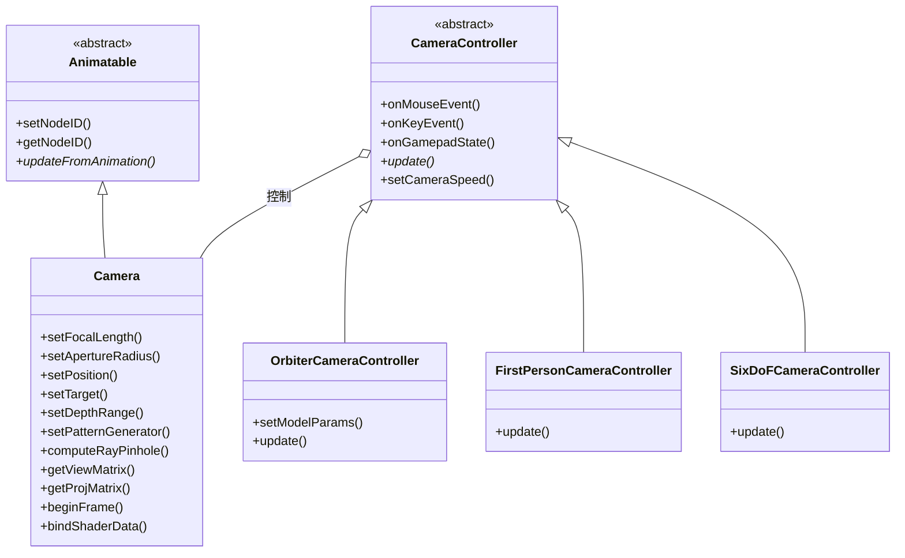

# Camera -- 相机系统

> 源码路径: `Source/Falcor/Scene/Camera/`

## 功能概述

Falcor 相机系统提供了完整的虚拟相机模型和交互式相机控制器。核心类 `Camera` 继承自 `Animatable`，实现了基于物理参数的相机模型，支持焦距（以毫米为单位的胶片相机模型）、光圈半径（用于景深效果）、快门速度、ISO 感光度等真实相机参数，同时维护视图矩阵、投影矩阵及其逆矩阵，并支持亚像素抖动（Jitter）以实现时域抗锯齿（TAA）等技术。

相机控制器子系统提供了三种交互模式：`OrbiterCameraController`（轨道相机控制器，围绕目标点旋转）、`FirstPersonCameraController`（第一人称相机控制器，类似 FPS 游戏操控）和 `SixDoFCameraController`（六自由度相机控制器，增加了滚转能力）。控制器支持鼠标、键盘和游戏手柄输入，提供速度调节和边界限制功能。

在 GPU 着色器端，`CameraData.slang` 定义了相机数据结构供着色器使用，`Camera.slang` 提供了光线生成等着色器工具函数。相机系统通过 `bindShaderData()` 方法将参数绑定到着色器变量，支持针孔相机和薄透镜模型的光线计算。

## 架构图

## 文件清单

| 文件 | 类型 | 说明 |
|------|------|------|
| `Camera.h/.cpp` | C++ | 相机核心类，实现基于物理的相机模型（焦距、光圈、景深、抖动等） |
| `Camera.slang` | Slang | 相机的 GPU 端着色器工具函数（光线生成等） |
| `CameraData.slang` | Slang | 相机数据结构定义（位置、矩阵、曝光参数等） |
| `CameraController.h/.cpp` | C++ | 相机控制器基类及三种控制器实现（轨道、第一人称、六自由度） |

## 依赖关系

- **上游依赖**: `Scene/Animation/Animatable`, `Core/Macros`, `Utils/Math/Vector`, `Utils/Math/Matrix`, `Utils/Math/AABB`, `Utils/Math/Ray`, `Utils/SampleGenerators/CPUSampleGenerator`, `Utils/Timing/CpuTimer`
- **下游被依赖**: `Scene/Scene`, `Scene/SceneBuilder`, 各种渲染 Pass（光线追踪、光栅化）

## 关键类与接口

### `Camera`
继承自 `Animatable`，是相机系统的核心类。主要功能：

- **物理相机参数**: 焦距 (`setFocalLength`)、胶片平面尺寸 (`setFrameHeight`/`setFrameWidth`)、光圈半径 (`setApertureRadius`)、焦距距离 (`setFocalDistance`)、快门速度 (`setShutterSpeed`)、ISO (`setISOSpeed`)
- **空间变换**: 位置 (`setPosition`)、目标点 (`setTarget`)、上方向 (`setUpVector`)、近远裁剪面 (`setDepthRange`)
- **矩阵计算**: `getViewMatrix()`, `getProjMatrix()`, `getViewProjMatrix()`, `getInvViewProjMatrix()` 及其无抖动版本
- **抖动模式**: `setPatternGenerator()` 绑定采样模式生成器，`setJitter()` 设置亚像素偏移
- **光线计算**: `computeRayPinhole()` 根据像素坐标计算针孔相机光线
- **视锥裁剪**: `isObjectCulled()` 检测对象是否在视锥之外
- **帧同步**: `beginFrame()` 保存前帧矩阵并检测变化类型（Movement, Exposure, Jitter, Frustum 等）
- **持久矩阵**: 支持设置持久的投影/视图矩阵，覆盖自动计算

### `CameraController`（抽象基类）
相机控制器接口。定义了鼠标、键盘、游戏手柄的事件处理接口和 `update()` 纯虚方法。提供上方向设置、移动速度控制和边界限制。

### `OrbiterCameraController`
轨道相机控制器。左键拖拽旋转，滚轮缩放。通过 `setModelParams()` 设置旋转中心、模型半径和初始距离。

### `FirstPersonCameraController` / `SixDoFCameraController`
第一人称相机控制器。WASD 移动，QE 升降，左键旋转，Shift 加速，Ctrl 减速。`SixDoFCameraController` 额外支持右键滚转。通过模板参数 `b6DoF` 区分两种模式。
