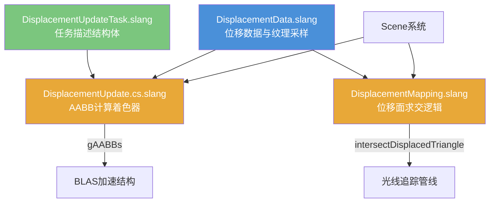

# Scene/Displacement -- 位移贴图 (Displacement Mapping)

## 功能概述

Displacement 模块为 Falcor 渲染框架提供基于纹理的**位移贴图**功能，用于在光线追踪过程中对三角形表面施加微观细节变形。核心功能包括：

- **位移数据管理 (DisplacementData)**：封装位移纹理、采样器、缩放/偏移参数，提供纹素级读取与全局/局部位移范围查询。
- **光线-位移三角形交叉 (DisplacementMapping)**：实现完整的光线-位移表面求交流水线——首先对三角形的"外壳" (shell) 进行保守 AABB 包围、棱柱求交，然后在纹理空间内进行步进式高度图追踪 (ray-marching)。支持三角面片和双线性面片两种几何元素的求交。
- **AABB 更新计算着色器 (DisplacementUpdate)**：GPU 端批量计算位移三角形的 AABB，用于更新 BLAS 加速结构中的程序化几何包围盒。
- **任务描述结构体 (DisplacementUpdateTask)**：定义 AABB 计算任务的工作分配方式。

## 架构图

## 文件清单

| 文件名 | 类型 | 说明 |
|--------|------|------|
| `DisplacementData.slang` | Slang Shared | `DisplacementData` 结构体，封装位移纹理/采样器/缩放/偏移 |
| `DisplacementMapping.slang` | Slang Shader | 位移面求交核心逻辑，包含光线-棱柱求交、纹理空间 ray-marching、法线计算 |
| `DisplacementUpdate.cs.slang` | Compute Shader | 批量计算位移三角形 AABB 的计算着色器 |
| `DisplacementUpdateTask.slang` | Slang Shared | `DisplacementUpdateTask` 主机/设备共享结构体，描述 AABB 计算任务 |

## 依赖关系

### 内部依赖
- `Scene/Scene` -- 场景全局数据访问（顶点、索引、材质）
- `Scene/SceneTypes` -- 场景基础类型定义（如 `StaticVertexData`）
- `Scene/Material/BasicMaterialData` -- 材质数据
- `Utils/Math/Ray` -- 射线结构体
- `Utils/Math/AABB` -- 轴对齐包围盒
- `Utils/Geometry/IntersectionHelpers` -- 射线-三角形交叉工具
- `Utils/HostDeviceShared.slangh` -- 主机/设备共享宏

### 外部依赖
- 无第三方外部依赖

## 关键类与接口

### `DisplacementData` (Slang)
位移贴图数据结构体，字段：
- `texture` -- 位移纹理 (Texture2D)
- `samplerState` / `samplerStateMin` / `samplerStateMax` -- 采样器（普通/最小/最大过滤）
- `size` -- 纹理尺寸（纹素单位）
- `scale` / `bias` -- 位移值 = scale * (raw + bias)

通过 `extension DisplacementData` 扩展方法：

| 方法 | 说明 |
|------|------|
| `mapValue(raw)` | 将原始纹理值映射为位移距离 |
| `readValue(texelPos, lod)` | 读取指定位置的位移值 |
| `getGlobalMinMax()` | 获取全局位移范围 |
| `getShellMinMax(texCrd0, texCrd1, texCrd2)` | 基于三角形 UV 计算局部外壳范围（使用 MIP 或 SampleGrad） |
| `getTriangleConservativeMipLevel(...)` | 计算保守 MIP 级别 |

### `DisplacementIntersection` (Slang)
位移面交叉结果：`barycentrics`（重心坐标）、`displacement`（位移量）、`t`（射线参数）。

### 核心求交函数

| 函数 | 说明 |
|------|------|
| `intersectDisplacedTriangle(ray, vertices, worldMat, displacementData, result)` | 主入口：将顶点变换到世界空间后调用求交 |
| `calcDisplacementIntersection(ray, vertices, displacementData, result)` | 核心求交：1) 棱柱面（extruded/intruded 三角形 + 3 个双线性面片）确定有效 t 区间；2) 纹理空间 ray-marching 寻找交点 |
| `traceHeightMapEstimated(...)` | 纹理空间步进追踪高度图，使用线性插值估计精确交点 |
| `rayBilinearPatchIntersectionTest(...)` | 光线-双线性面片求交（基于 Ray Tracing Gems 算法） |
| `computeDisplacedTriangleNormal(...)` | 通过中心差分法计算位移面法线 |

### `DisplacementUpdateTask` (Slang Shared)
AABB 计算任务描述：
- `meshID` -- 网格 ID
- `triangleIndex` / `count` -- 三角形起始索引与数量
- `AABBIndex` -- AABB 输出起始索引
- `kThreadCount = 16384` -- 每任务线程数
