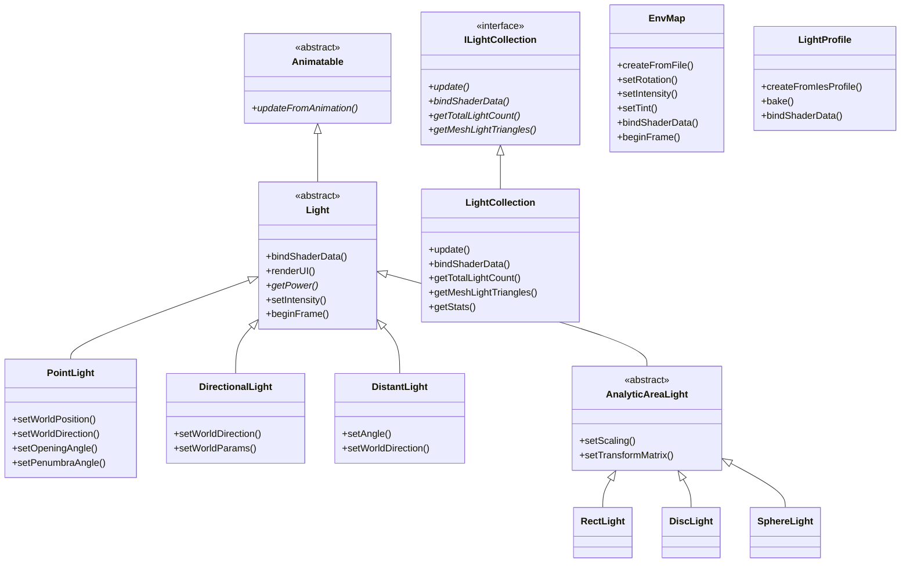

# Lights -- 光源定义

> 源码路径: `Source/Falcor/Scene/Lights/`

## 功能概述

Falcor 光源系统提供了场景中所有光照来源的定义、管理和 GPU 数据绑定。系统支持三大类光源：解析光源（Analytic Lights）、网格发光体（Mesh Lights / Emissive Triangles）和环境光照（Environment Map）。解析光源包括点光源（`PointLight`，可配置为聚光灯）、方向光（`DirectionalLight`）、远距光（`DistantLight`，张有限立体角）以及面光源（`RectLight`、`DiscLight`、`SphereLight`）。所有解析光源继承自 `Light` 基类，而 `Light` 又继承自 `Animatable`，因此光源可以参与场景动画。

网格光源通过 `LightCollection`（实现 `ILightCollection` 接口）统一管理。`LightCollection` 从场景中收集所有带发光材质的网格实例，将其三角形预处理为 `MeshLightTriangle` 数据结构，包含世界空间顶点位置、纹理坐标、法线、平均辐射亮度和辐射通量等信息。它通过 GPU 计算着色器构建三角形列表、更新顶点位置、积分发光纹理的辐射通量，并维护活跃（非剔除）三角形列表。`LightCollection` 通常被发光体采样器（Emissive Sampler）包装使用。

环境光照由 `EnvMap` 类管理，加载经纬度格式的 HDR 环境贴图，支持旋转、强度缩放和颜色色调控制。`LightProfile` 提供 IES 光度学配置文件支持，可将真实灯具的配光曲线烘焙为纹理，用于调制发光材质的发射分布。

GPU 着色器端包含多个 Slang 文件：`LightData.slang` 定义解析光源数据结构，`MeshLightData.slang` 定义网格光源数据，`LightCollection.slang` 和 `LightCollectionShared.slang` 提供网格光源的着色器访问接口，`EnvMap.slang` / `EnvMapData.slang` 处理环境贴图采样，`LightProfile.slang` 封装光度配置文件。多个 `.cs.slang` 文件实现了构建三角形列表、更新顶点、积分发光和烘焙 IES 配置文件等 GPU 计算任务。

## 架构图

## 文件清单

| 文件 | 类型 | 说明 |
|------|------|------|
| `Light.h/.cpp` | C++ | 光源基类及所有解析光源类型（PointLight, DirectionalLight, DistantLight, RectLight, DiscLight, SphereLight） |
| `LightData.slang` | Slang | 解析光源的 GPU 端数据结构（LightData, LightType 枚举） |
| `ILightCollection.h` | C++ | 网格光源集合接口，定义 UpdateFlags、MeshLightStats、MeshLightTriangle 等 |
| `LightCollection.h/.cpp` | C++ | 网格光源集合实现，管理场景中所有发光三角形的预处理和 GPU 数据 |
| `LightCollection.slang` | Slang | 网格光源集合的 GPU 端着色器接口 |
| `LightCollectionShared.slang` | Slang | 网格光源集合的共享数据定义 |
| `MeshLightData.slang` | Slang | 网格光源数据结构（MeshLightData, EmissiveTriangle 等） |
| `EnvMap.h/.cpp` | C++ | 环境贴图管理类，支持旋转、强度和色调控制 |
| `EnvMap.slang` | Slang | 环境贴图 GPU 端采样和求值函数 |
| `EnvMapData.slang` | Slang | 环境贴图 GPU 端数据结构 |
| `LightProfile.h/.cpp` | C++ | IES 光度学配置文件加载和管理 |
| `LightProfile.slang` | Slang | 光度配置文件 GPU 端采样接口 |
| `BakeIesProfile.cs.slang` | Slang | IES 配置文件烘焙到纹理的计算着色器 |
| `BuildTriangleList.cs.slang` | Slang | 构建发光三角形列表的计算着色器 |
| `UpdateTriangleVertices.cs.slang` | Slang | 更新发光三角形顶点位置的计算着色器 |
| `EmissiveIntegrator.3d.slang` | Slang | 发光纹理辐射通量积分的着色器（3D 渲染 Pass） |
| `FinalizeIntegration.cs.slang` | Slang | 完成辐射通量积分的后处理计算着色器 |

## 依赖关系

- **上游依赖**: `Scene/Animation/Animatable`, `Core/Object`, `Core/API/Buffer`, `Core/API/Texture`, `Core/API/Sampler`, `Core/API/Fence`, `Core/Pass/ComputePass`, `Core/State/GraphicsState`, `Core/Program/Program`, `Utils/Math/Vector`
- **下游被依赖**: `Scene/Scene`, `Scene/SceneBuilder`, 各种发光体采样器（Emissive Sampler）, 渲染 Pass

## 关键类与接口

### `Light`（抽象基类）
所有解析光源的基类，继承自 `Animatable`。提供强度设置、激活/停用、帧变化检测（`beginFrame()` 返回 `Changes` 标志）和着色器数据绑定。`Changes` 枚举跟踪活跃状态、位置、方向、强度、面积等变化。

### `PointLight`
点光源/聚光灯。支持设置世界空间位置和方向、锥角 (`setOpeningAngle`) 和半影角 (`setPenumbraAngle`)。当锥角小于 pi 时表现为聚光灯。

### `DirectionalLight`
方向光源，模拟无限远处的平行光（如太阳光）。通过 `setWorldDirection()` 设置方向，`setWorldParams()` 设置场景中心和半径（用于阴影范围计算）。

### `DistantLight`
远距光源，与方向光类似但张有限立体角。通过 `setAngle()` 设置半张角，使光源具有有限的角尺寸。

### `AnalyticAreaLight`（抽象基类）/ `RectLight` / `DiscLight` / `SphereLight`
解析面光源。`AnalyticAreaLight` 提供缩放和变换矩阵控制。三种派生类分别表示矩形、圆盘和球体面光源，各自实现几何参数的更新逻辑。

### `ILightCollection` / `LightCollection`
网格光源集合。`ILightCollection` 定义了抽象接口，`LightCollection` 是其具体实现。主要功能：
- **数据收集**: 从场景中收集所有带发光材质的网格实例
- **预处理**: 构建三角形列表，计算法线、面积、平均辐射亮度和辐射通量
- **动态更新**: `update()` 处理网格变换更新和发光三角形剔除
- **GPU 资源**: 维护三角形数据缓冲区、活跃列表、通量数据等，通过 `bindShaderData()` 绑定到着色器
- **CPU 同步**: `getMeshLightTriangles()` 提供 CPU 回读能力，`prepareSyncCPUData()` 预调度数据复制以避免 GPU 阻塞

### `EnvMap`
环境贴图管理类。从 HDR 纹理文件加载经纬度格式的环境光照，支持 XYZ 轴旋转、标量强度和 RGB 色调调制。通过 `beginFrame()` 跟踪帧间变化。

### `LightProfile`
IES 光度学配置文件。从 `.ies` 文件加载真实灯具配光数据，通过 `bake()` 方法使用 GPU 计算着色器将配光曲线烘焙为纹理。可绑定到着色器用于调制发光材质的辐射分布。
