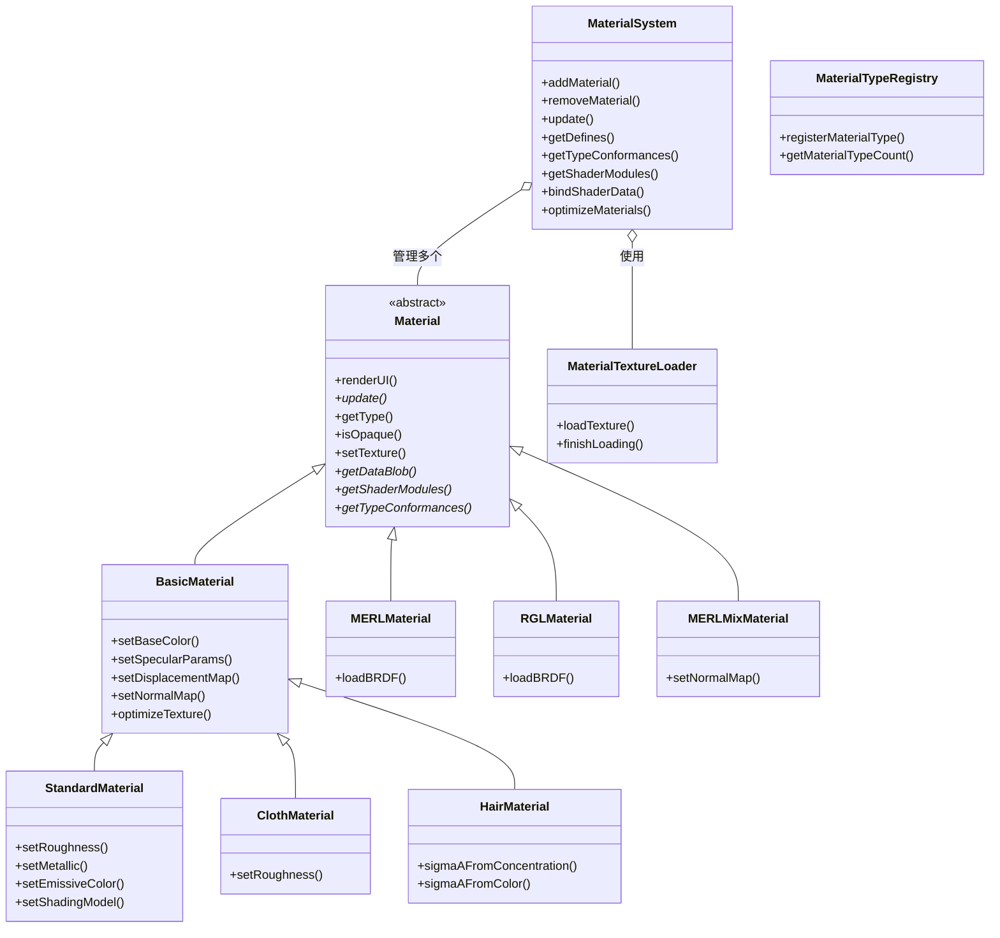

# Material -- 材质系统

> 源码路径: `Source/Falcor/Scene/Material/`

## 功能概述

Falcor 材质系统是渲染框架中负责描述物体表面光学属性的核心子系统。它提供了一套完整的材质抽象层次结构，从抽象基类 `Material` 出发，经由 `BasicMaterial` 中间层，派生出多种具体材质类型，包括标准 PBR 材质（`StandardMaterial`）、布料材质（`ClothMaterial`）、毛发材质（`HairMaterial`）等。系统同时支持基于实测数据的材质，如 MERL 数据库材质（`MERLMaterial`、`MERLMixMaterial`）和 RGL 数据库材质（`RGLMaterial`），以及与 PBRT 渲染器兼容的一系列材质类型（位于 `PBRT/` 子目录）。

材质系统的核心管理器是 `MaterialSystem` 类，它维护场景中所有材质及其关联资源（纹理、采样器、缓冲区）的集合。`MaterialSystem` 负责将材质数据上传至 GPU、管理纹理描述符数组、提供 Shader 模块和类型一致性列表（Type Conformances），并支持材质去重和纹理优化等功能。每帧调用 `update()` 方法确保所有 GPU 数据保持最新。

在 GPU 着色器端，系统通过 Slang 语言定义了对应的数据结构和接口。`MaterialData.slang` 定义了材质头部和数据块格式，`MaterialFactory.slang` 提供了根据材质类型动态创建材质实例的工厂方法，`MaterialTypes.slang` 定义了材质类型枚举。每种具体材质类型都有对应的 `.slang` 着色器模块，实现了双向散射分布函数（BSDF）的采样和求值逻辑。

材质系统还包含一些辅助组件：`MaterialTextureLoader` 提供异步纹理加载能力，`MaterialTypeRegistry` 支持运行时动态注册新材质类型，`MaterialParamLayout` 定义了可微分材质的参数布局，`DiffuseSpecularUtils` 提供漫反射-镜面反射参数转换工具。`TextureHandle.slang` 和 `TextureSampler.slang` 封装了 GPU 端的纹理访问逻辑。

## 架构图

## 文件清单

| 文件 | 类型 | 说明 |
|------|------|------|
| `Material.h/.cpp` | C++ | 材质抽象基类，定义纹理槽位、更新标志、Alpha模式等核心接口 |
| `BasicMaterial.h/.cpp` | C++ | 基础非分层材质中间类，提供纹理通道管理、位移贴图、基色/高光参数等 |
| `BasicMaterialData.slang` | Slang | BasicMaterial 的 GPU 端数据结构定义 |
| `StandardMaterial.h/.cpp` | C++ | 标准 PBR 材质，支持 MetalRough 和 SpecGloss 两种着色模型 |
| `StandardMaterialParamLayout.slang` | Slang | StandardMaterial 的可微分参数布局定义 |
| `ClothMaterial.h/.cpp` | C++ | 布料材质，使用专用的布料 BSDF 模型 |
| `HairMaterial.h/.cpp` | C++ | 毛发材质，基于 Marschner 模型的头发渲染 |
| `MERLMaterial.h/.cpp` | C++ | 基于 MERL BRDF 数据库的实测材质 |
| `MERLMaterialData.slang` | Slang | MERLMaterial 的 GPU 端数据结构 |
| `MERLFile.h/.cpp` | C++ | MERL BRDF 文件读取器 |
| `MERLMixMaterial.h/.cpp` | C++ | 支持多个 MERL BRDF 混合和空间变化的材质 |
| `MERLMixMaterialData.slang` | Slang | MERLMixMaterial 的 GPU 端数据结构 |
| `RGLMaterial.h/.cpp` | C++ | 基于 RGL BRDF 数据库的实测材质（Dupuy & Jakob 2018） |
| `RGLMaterialData.slang` | Slang | RGLMaterial 的 GPU 端数据结构 |
| `RGLFile.h/.cpp` | C++ | RGL BRDF 文件读取器 |
| `RGLCommon.h/.cpp` | C++ | RGL 材质公共工具函数 |
| `MaterialSystem.h/.cpp` | C++ | 材质系统管理器，管理所有材质、纹理、采样器和 GPU 资源 |
| `MaterialSystem.slang` | Slang | 材质系统的 GPU 端实现，提供着色器绑定接口 |
| `MaterialData.slang` | Slang | 材质头部（MaterialHeader）和数据块（MaterialDataBlob）定义 |
| `MaterialFactory.slang` | Slang | 材质工厂，根据类型动态创建材质实例 |
| `MaterialTypes.slang` | Slang | 材质类型枚举和 Alpha 模式定义 |
| `MaterialTypeRegistry.h/.cpp` | C++ | 材质类型动态注册表，支持运行时扩展材质类型 |
| `MaterialParamLayout.h/.slang/.slangh` | C++/Slang | 可微分材质参数布局定义 |
| `SerializedMaterialParams.h` | C++ | 材质参数序列化/反序列化支持 |
| `MaterialTextureLoader.h/.cpp` | C++ | 异步材质纹理加载器 |
| `DiffuseSpecularData.slang` | Slang | 漫反射-镜面反射数据结构 |
| `DiffuseSpecularUtils.h/.cpp` | C++ | 漫反射-镜面反射参数转换工具 |
| `TextureHandle.slang` | Slang | GPU 端纹理句柄封装 |
| `TextureSampler.slang` | Slang | GPU 端纹理采样器封装 |
| `ShadingUtils.slang` | Slang | 着色工具函数（法线映射等） |
| `AlphaTest.slang` | Slang | Alpha 测试实现 |
| `VolumeProperties.slang` | Slang | 体积属性（吸收、散射系数等） |

## 依赖关系

- **上游依赖**: `Core/Object`, `Core/API/Texture`, `Core/API/Buffer`, `Core/API/Sampler`, `Core/API/ParameterBlock`, `Core/Program/Program`, `Utils/Image/TextureManager`, `Utils/Image/TextureAnalyzer`, `Scene/Transform`
- **下游被依赖**: `Scene/Scene`, `Scene/SceneBuilder`, `Scene/Lights/LightCollection`（发光材质）, 各种渲染 Pass
- **子目录**: `PBRT/` -- 包含与 PBRT 渲染器兼容的材质类型

## 关键类与接口

### `Material`（抽象基类）
所有材质的基类，继承自 `Object`。定义了材质的通用接口，包括：
- **纹理槽位**: `TextureSlot` 枚举（BaseColor, Specular, Emissive, Normal, Transmission, Displacement, Index）
- **更新机制**: `update()` 纯虚方法，由 `MaterialSystem` 调用以准备 GPU 数据
- **着色器集成**: `getShaderModules()`, `getTypeConformances()`, `getDataBlob()` 用于着色器程序配置
- **属性控制**: Alpha 模式、双面标志、薄表面、折射率、嵌套优先级等

### `BasicMaterial`
非分层材质的中间基类，扩展了 `Material` 的纹理通道管理能力。提供基色、高光参数、法线贴图、位移贴图、透射、体积散射等属性的统一管理。支持 MetalRough 和 SpecGloss 两种着色模型。

### `StandardMaterial`
最常用的标准 PBR 材质。支持金属度-粗糙度（MetalRough）和镜面-光泽度（SpecGloss）两种工作流，提供完整的自发光、透射、体积属性支持。支持可微分参数序列化。

### `MaterialSystem`
材质系统的核心管理器。主要功能：
- **材质管理**: 添加、移除、替换、去重材质
- **资源管理**: 纹理采样器、缓冲区、3D 纹理的分配和管理
- **GPU 同步**: `update()` 方法确保所有材质数据上传至 GPU
- **着色器配置**: 提供 Defines、Type Conformances、Shader Modules 供渲染程序使用
- **优化**: `optimizeMaterials()` 分析纹理并将常量纹理替换为统一材质参数

### `MaterialTypeRegistry`
线程安全的材质类型注册表，支持在运行时注册新的材质类型。通过 `registerMaterialType()` 注册后获得唯一的 `MaterialType` 标识符。
