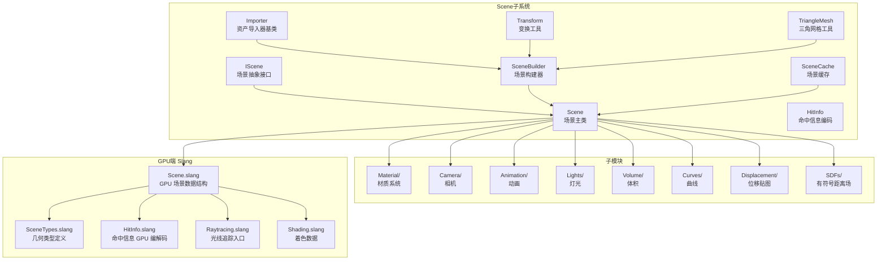

# Scene -- 场景子系统

> 路径: `Source/Falcor/Scene/`

## 功能概述

Scene 子系统是 Falcor 渲染框架的核心模块，负责完整的场景图 (Scene Graph) 管理、场景资源加载以及光线追踪 (Ray Tracing) 场景接口。其主要职责包括：

- **场景图管理**：维护层级化的节点树结构，管理网格 (Mesh)、曲线 (Curve)、SDF 网格等几何实例的变换与父子关系。
- **场景构建与导入**：通过 `SceneBuilder` 与插件化的 `Importer` 体系，从多种文件格式（如 USD、FBX、glTF、OBJ 等）加载场景资产，并完成网格优化、材质合并、BLAS/TLAS 加速结构 (Acceleration Structure) 构建等预处理流程。
- **光线追踪场景接口**：在 GPU 端提供统一的 `Scene` Slang 结构体（全局 `gScene`），封装加速结构、几何实例、材质系统、灯光、相机、体积等全部运行时数据的访问方法。
- **命中信息编码**：通过 `HitInfo` 实现光线命中点的紧凑编码（128 位标准模式或 64 位压缩模式），支持三角形、位移三角形、曲线、SDF 网格和自定义图元等多种几何类型。
- **场景缓存**：`SceneCache` 将场景的二进制运行时表示持久化到磁盘，大幅减少复杂资产的重复加载时间。

## 架构图



## 文件清单

下表列出 `Source/Falcor/Scene/` 根目录下的全部文件：

| 文件名 | 类型 | 说明 |
|-------|------|------|
| `IScene.h` / `IScene.cpp` | C++ | 场景抽象接口，定义 `UpdateFlags`、`RenderSettings`、着色器绑定等统一契约 |
| `Scene.h` / `Scene.cpp` | C++ | 场景主类 `Scene`，继承 `IScene`，持有全部运行时资源并管理 BLAS/TLAS 加速结构 |
| `SceneBuilder.h` / `SceneBuilder.cpp` | C++ | 场景构建器，负责资产导入后的网格/曲线/SDF/材质/灯光/相机组装与优化 |
| `SceneBuilderDump.h` / `SceneBuilderDump.cpp` | C++ | 场景构建器的调试/转储工具 |
| `SceneCache.h` / `SceneCache.cpp` | C++ | 场景缓存读写，基于 SHA1 哈希键将 `SceneData` 序列化/反序列化到磁盘 |
| `SceneIDs.h` | C++ | 类型安全的场景 ID 定义（`MeshID`、`CurveID`、`NodeID`、`MaterialID` 等） |
| `Importer.h` / `Importer.cpp` | C++ | 资产导入器基类（插件接口），支持按文件扩展名自动选择导入器 |
| `ImporterError.h` | C++ | 导入器异常类型 |
| `HitInfo.h` / `HitInfo.cpp` | C++ | 命中信息主机端工具，计算 `HitInfo` 的位分配并生成着色器 defines |
| `Transform.h` / `Transform.cpp` | C++ | 变换辅助类，支持平移/旋转/缩放的多种组合顺序 |
| `TriangleMesh.h` / `TriangleMesh.cpp` | C++ | 简单三角网格工具类，提供 Quad/Cube/Sphere 等基本几何体工厂方法 |
| `Scene.slang` | Slang | GPU 端场景数据结构 `Scene`（全局 `gScene`），包含加速结构、顶点/索引缓冲、实例数据、材质、灯光、相机、体积等全部访问方法 |
| `SceneTypes.slang` | Slang | GPU/CPU 共享的几何类型定义：`GeometryInstanceID`、`GeometryType`、`MeshDesc`、`StaticVertexData`、`CurveDesc`、`SplitVertexBuffer`/`SplitIndexBuffer` 等 |
| `SceneBlock.slang` | Slang | 场景参数块入口，仅导入 `Scene.slang` |
| `SceneDefines.slangh` | Slang | 场景编译期宏定义（几何类型标志、缓冲区计数等） |
| `HitInfo.slang` | Slang | 命中信息 GPU 端编解码逻辑 |
| `HitInfoType.slang` | Slang | 命中类型枚举（`HitType`） |
| `Intersection.slang` | Slang | 光线-图元相交测试工具 |
| `Raytracing.slang` | Slang | DXR 光线追踪着色器入口（ClosestHit、AnyHit、Miss 等） |
| `RaytracingInline.slang` | Slang | 内联光线追踪（RayQuery）接口 |
| `SceneRayQueryInterface.slang` | Slang | 场景光线查询接口抽象 |
| `Raster.slang` | Slang | 光栅化着色器入口 |
| `Shading.slang` | Slang | 着色数据准备（`ShadingData` 构建） |
| `ShadingData.slang` | Slang | `ShadingData` 结构体定义 |
| `VertexAttrib.slangh` | Slang | 顶点属性插值辅助宏 |
| `VertexData.slang` | Slang | `VertexData` 结构体，存储插值后的顶点属性 |
| `MeshIO.cs.slang` | Slang | 网格数据读写 Compute Shader |
| `NullTrace.cs.slang` | Slang | 空光线追踪 Compute Shader（用于预热/测试） |

## 子目录索引

| 子目录 | 说明 | README 链接 |
|-------|------|------------|
| `Animation/` | 动画系统：骨骼动画、蒙皮 (Skinning)、顶点缓存动画、动画控制器 | [Animation/README.md](Animation/README.md) |
| `Camera/` | 相机系统：透视/正交相机、第一人称/轨道/六自由度控制器 | [Camera/README.md](Camera/README.md) |
| `Curves/` | 曲线几何：曲线细分配置与 poly-tube 生成 | [Curves/README.md](Curves/README.md) |
| `Displacement/` | 位移贴图：基于高度图的三角形位移映射及 GPU 更新 | [Displacement/README.md](Displacement/README.md) |
| `Lights/` | 灯光系统：解析光源 (点光/方向光/聚光)、环境光贴图、发光三角形集合、IES 光度学配置 | [Lights/README.md](Lights/README.md) |
| `Material/` | 材质系统：材质基类、BasicMaterial (Metal-Rough/Spec-Gloss)、布料/头发/MERL 等特殊材质、材质类型注册、纹理加载 | [Material/README.md](Material/README.md) |
| `SDFs/` | 有符号距离场 (SDF) 网格：多种 SDF 表示与 GPU 球追踪求交 | [SDFs/README.md](SDFs/README.md) |
| `Volume/` | 体积渲染：OpenVDB 网格加载、体积数据 GPU 传输 | [Volume/README.md](Volume/README.md) |

## 依赖关系

### 对外部模块的依赖

| 依赖模块 | 用途 |
|---------|------|
| `Core/` | GPU 设备抽象、程序编译、加速结构 (BLAS/TLAS) API、VAO、资源格式 |
| `Core/Plugin` | 插件系统，用于动态发现并加载 Importer 插件 |
| `Core/AssetResolver` | 资产路径解析 |
| `Utils/Math/` | 向量、矩阵、四元数、AABB、打包格式等数学工具 |
| `Utils/Settings/` | 全局配置 (`Settings`) |
| `Utils/CryptoUtils` | SHA1 哈希（用于场景缓存键） |
| `Utils/SplitBuffer` | 超 4GB 缓冲区拆分适配器 |
| `Utils/UI/Gui` | 调试 UI |
| `Rendering/Materials/` | 纹理 LOD 辅助（`TexLODHelpers`） |
| pybind11 | Python 绑定（`SceneBuilder::import` 接受 Python 字典参数） |
| sigs | 信号/槽库（场景更新通知） |

### 内部子模块间的依赖

```
Scene (主类)
 ├── Animation/AnimationController  -- 驱动骨骼/顶点动画
 ├── Camera/Camera                  -- 当前活动相机
 ├── Lights/Light, EnvMap, LightCollection -- 全部光源
 ├── Material/MaterialSystem        -- 材质管理与 GPU 参数块
 ├── Volume/GridVolume, Grid        -- 体积数据
 ├── SDFs/SDFGrid                   -- SDF 几何
 ├── Curves/ (通过 SceneBuilder)    -- 曲线细分
 └── Displacement/ (GPU Slang)      -- 位移映射

SceneBuilder
 ├── Importer        -- 资产导入
 ├── SceneCache      -- 缓存读写
 ├── Transform       -- 变换工具
 ├── TriangleMesh    -- 简单几何工厂
 └── Material/MaterialTextureLoader -- 异步纹理加载
```

## 关键类与接口

### IScene (场景抽象接口)

定义在 `IScene.h`。所有场景实现必须遵守的统一接口：

- **UpdateFlags**：位标志枚举，标识场景每帧的变化类型（几何移动、相机移动、材质变化、灯光变化等），供渲染通道决策是否需要更新。
- **RenderSettings**：渲染设置结构体，控制环境光、解析光源、发光面、体积等的启用状态。
- `getShaderDefines()` / `getTypeConformances()` / `getShaderModules()`：为着色器编译提供场景相关的宏、类型一致性声明和模块列表。
- `bindShaderData()` / `bindShaderDataForRaytracing()`：将场景数据绑定到着色器变量，后者还负责按需创建 TLAS。
- `raytrace()`：便捷光线追踪调度方法。

### Scene (场景主类)

定义在 `Scene.h`，继承 `IScene`。核心职责：

- **资源持有**：持有全部几何缓冲区（顶点、索引、曲线、SDF）、实例变换矩阵、材质系统 (`MaterialSystem`)、灯光列表、相机列表、动画控制器、环境贴图、体积等。
- **加速结构管理**：根据 `SceneBuilder::Flags` 策略构建 BLAS 分组（静态合并 / 动态合并 / 实例合并），管理 TLAS 的重建 (Rebuild) 或更新 (Refit)。
- **帧更新** (`update()`)：每帧驱动动画控制器、更新变换矩阵、更新 BLAS/TLAS、检测变化并返回 `UpdateFlags`。
- **GPU 数据绑定**：通过 `ParameterBlock<Scene>` 将全部运行时数据映射到 GPU 端的 `gScene` 全局变量。

### SceneBuilder (场景构建器)

定义在 `SceneBuilder.h`。场景的构建入口：

- **Flags**：控制构建行为的位标志（是否合并材质、是否使用原始切线空间、是否合并静态网格、是否使用场景缓存等）。
- **Mesh / ProcessedMesh**：原始网格描述与预处理后的运行时格式。支持多种属性频率（常量/逐面/逐顶点/FaceVarying）。
- **addMesh / addCurve / addSDFGrid**：添加各类几何体。
- **addMaterial / addLight / addCamera / addAnimation**：添加场景资产。
- **addNode / addMeshInstance**：构建场景图节点与几何实例。
- **getScene()**：触发全部后处理（图优化、网格合并、BLAS 分组、缓冲区创建）并返回最终 `Scene` 对象。

### HitInfo (命中信息编码)

定义在 `HitInfo.h`（主机端）和 `HitInfo.slang`（GPU 端）。

- 标准模式：128 位（`RGBA32Uint`），存储命中类型 + 实例 ID + 图元索引 + 重心坐标。
- 压缩模式：64 位，仅适用于纯三角形场景，重心坐标量化为 16 位 unorm。
- 支持的命中类型：`Triangle`、`DisplacedTriangle`、`Curve`、`SDFGrid`、`Custom`。
- 主机端 `HitInfo::init()` 根据场景几何复杂度自动计算各字段所需位数，通过 `getDefines()` 传递给着色器编译。

### Scene.slang (GPU 端场景数据)

GPU 端 `Scene` 结构体作为全局 `ParameterBlock<Scene> gScene` 暴露，提供：

- 光线追踪加速结构 (`RaytracingAccelerationStructure rtAccel`)
- 实例变换矩阵（当前帧和前一帧）
- 几何实例数据、网格描述、顶点/索引缓冲（支持 >4GB 的 SplitBuffer）
- 曲线、SDF 网格、自定义图元数据
- 材质系统 (`ParameterBlock<MaterialSystem>`)
- 灯光、环境贴图、相机、体积
- 丰富的几何访问方法：`getIndices()`、`getVertex()`、`getVertexData()`、`getFaceNormalW()`、`getPrevPosW()` 等
- 曲率估算工具方法
