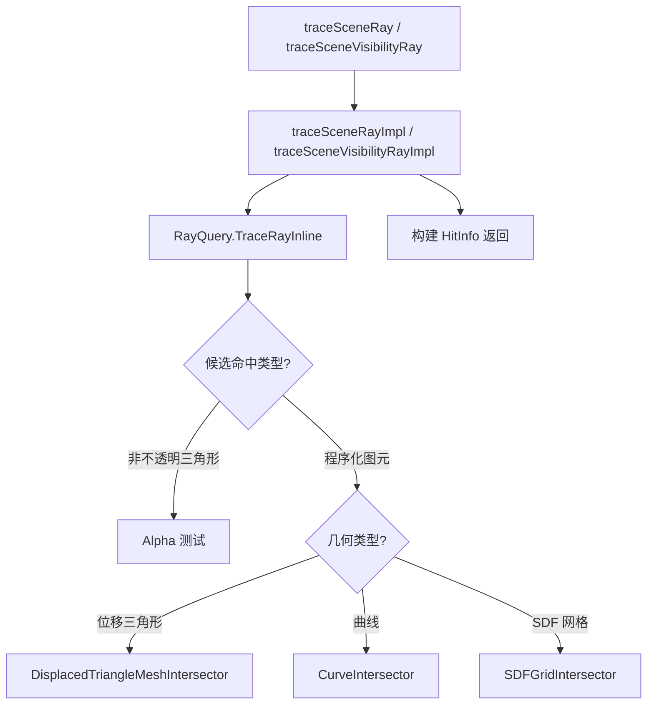

# RaytracingInline.slang 源码文档

> 路径: `Source/Falcor/Scene/RaytracingInline.slang`
> 类型: Slang 着色器文件
> 模块: Scene

## 功能概述

RaytracingInline.slang 提供基于 DXR 1.1 内联光线追踪（RayQuery）的场景光线追踪实现。与 DXR 1.0 的 Hit Group 着色器不同，内联光线追踪在计算着色器中完成所有相交测试和着色逻辑。此模块支持：

- 对三角形网格的 Alpha 测试
- 对程序化几何体（位移三角形、曲线、SDF 网格）的自定义相交测试
- 最近命中光线追踪和可见性光线追踪
- 通过 `SceneRayQuery` 结构体实现 `ISceneRayQuery` 接口

## 结构体与接口

### `SceneRayQuery<let UseAlphaTest : int>`

实现 `ISceneRayQuery` 接口的场景光线查询器，`UseAlphaTest` 模板参数控制是否执行 Alpha 测试。

| 方法 | 说明 |
|------|------|
| `HitInfo traceRay(Ray, out float hitT, uint rayFlags, uint instanceInclusionMask)` | 追踪最近命中光线 |
| `bool traceVisibilityRay(Ray, uint rayFlags, uint instanceInclusionMask)` | 追踪可见性光线，返回是否可见 |

## 函数

| 函数签名 | 说明 |
|----------|------|
| `GeometryType getCommittedGeometryType(RayQuery)` | 获取已提交命中的几何类型 |
| `GeometryType getCandidateGeometryType(RayQuery)` | 获取候选命中的几何类型 |
| `TriangleHit getCommittedTriangleHit(RayQuery)` | 从已提交命中创建 TriangleHit |
| `TriangleHit getCandidateTriangleHit(RayQuery)` | 从候选命中创建 TriangleHit |
| `HitInfo traceSceneRay<UseAlphaTest>(Ray, out float hitT, uint rayFlags, uint mask)` | 追踪场景光线，返回命中信息 |
| `bool traceSceneVisibilityRay<UseAlphaTest>(Ray, uint rayFlags, uint mask)` | 追踪可见性光线 |

## 架构图

## 依赖关系 / import

- `Scene/SceneDefines.slangh` - 场景几何类型宏定义
- `Utils.Attributes` - 着色器属性
- `Scene.Intersection` - 程序化几何体相交测试
- `Scene.SDFs.SDFGridHitData` - SDF 网格命中数据
- `Scene.Shading`（导出） - 着色模块
- `Scene.SceneRayQueryInterface`（导出） - 光线查询接口

## 实现细节

- 根据 `UseAlphaTest` 参数和场景是否包含程序化几何体，选择不同的 `RayQuery` 模板参数以优化性能
- 可见性光线使用 `RAY_FLAG_ACCEPT_FIRST_HIT_AND_END_SEARCH` 提前终止
- 标记 `[__NoSideEffect]` 以支持反向自动微分的性能优化
