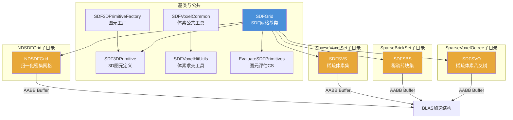

# Scene/SDFs -- 有符号距离场 (Signed Distance Fields)

## 功能概述

SDFs 模块为 Falcor 渲染框架提供**有符号距离场 (SDF)** 几何表示与光线追踪求交支持。SDF 网格将隐式表面存储为体素角点处的有符号距离值，支持通过程序化 3D 图元或文件数据进行初始化。模块提供四种 GPU 加速数据结构实现：

1. **NDSDFGrid (Normalized Dense Grid)** -- 归一化密集网格，以多层体积纹理层级表示，所有距离值归一化到 [-1, 1]。
2. **SDFSVS (Sparse Voxel Set)** -- 稀疏体素集，仅实例化与隐式表面相交的体素，每个体素对应一个 AABB。
3. **SDFSBS (Sparse Brick Set)** -- 稀疏砖块集，以 NxN 密集体素砖块为单位组织稀疏存储，支持 BC4 有损压缩，可动态编辑与增量更新。
4. **SDFSVO (Sparse Voxel Octree)** -- 稀疏体素八叉树，对表面体素构建八叉树层次结构。

所有实现均继承自 `SDFGrid` 基类，通过 AABB 缓冲区作为程序化几何提供给 BLAS 加速结构，在交叉着色器中完成光线-SDF 求交。

## 架构图

## 文件清单

### 根目录 (`Scene/SDFs/`)

| 文件名 | 类型 | 说明 |
|--------|------|------|
| `SDFGrid.h` | C++ Header | `SDFGrid` 抽象基类，定义 SDF 网格的通用接口 |
| `SDFGrid.cpp` | C++ Source | 基类实现：图元管理、文件 I/O、图元评估 ComputePass |
| `SDFGrid.slang` | Slang Shader | GPU 端 SDF 网格绑定与采样分发 |
| `SDFGridBase.slang` | Slang Shader | SDF 网格 GPU 基础接口定义 |
| `SDFGridHitData.slang` | Slang Shader | SDF 命中数据结构体 |
| `SDFGridNoDefines.slangh` | Slang Header | 用于清除 SDF 相关宏定义的头文件 |
| `SDF3DPrimitiveCommon.slang` | Slang Shared | `SDF3DPrimitive` 与 `SDF3DShapeType` 主机/设备共享定义 |
| `SDF3DPrimitive.slang` | Slang Shader | 3D SDF 图元求值 GPU 实现 |
| `SDF3DPrimitiveFactory.h` | C++ Header | `SDF3DPrimitiveFactory` 工厂类（图元创建与 AABB 计算） |
| `SDF3DPrimitiveFactory.cpp` | C++ Source | 图元工厂实现 |
| `EvaluateSDFPrimitives.cs.slang` | Compute Shader | 在 GPU 上将 SDF 图元评估到网格纹理的计算着色器 |
| `SDFVoxelCommon.slang` | Slang Shader | 体素公共工具：位置编码/解码、距离值打包、表面检测、三线性插值 |
| `SDFVoxelHitUtils.slang` | Slang Shader | 体素级光线求交工具函数 |
| `SDFVoxelTypes.slang` | Slang Shader | 体素类型定义 |
| `SDFSurfaceVoxelCounter.cs.slang` | Compute Shader | 统计表面体素数量的计算着色器 |

### 子目录 `NormalizedDenseSDFGrid/`

| 文件名 | 类型 | 说明 |
|--------|------|------|
| `NDSDFGrid.h` | C++ Header | `NDSDFGrid` 类，归一化密集 SDF 网格 |
| `NDSDFGrid.cpp` | C++ Source | 归一化密集网格实现：多层纹理创建与资源管理 |
| `NDSDFGrid.slang` | Slang Shader | GPU 端归一化密集网格的采样与求交 |

### 子目录 `SparseBrickSet/`

| 文件名 | 类型 | 说明 |
|--------|------|------|
| `SDFSBS.h` | C++ Header | `SDFSBS` 类，稀疏砖块集（支持 BC4 压缩与动态编辑） |
| `SDFSBS.cpp` | C++ Source | 稀疏砖块集实现：从 SD Field/图元构建砖块 |
| `SDFSBS.slang` | Slang Shader | GPU 端稀疏砖块集的采样与求交 |
| `BC4Encode.slang` | Slang Shader | GPU 端 BC4 编码 |
| `SDFSBSAssignBrickValidityFromSDFieldPass.cs.slang` | Compute Shader | 根据 SD Field 标记砖块有效性 |
| `SDFSBSResetBrickValidity.cs.slang` | Compute Shader | 重置砖块有效性标记 |
| `SDFSBSCopyIndirectionBuffer.cs.slang` | Compute Shader | 复制间接寻址缓冲区 |
| `SDFSBSCreateBricksFromSDField.cs.slang` | Compute Shader | 从 SD Field 创建砖块数据 |
| `SDFSBSCreateBricksFromChunks.cs.slang` | Compute Shader | 从 chunk 创建砖块数据 |
| `SDFSBSCreateChunksFromPrimitives.cs.slang` | Compute Shader | 从图元创建 chunk |
| `SDFSBSCompactifyChunks.cs.slang` | Compute Shader | 紧缩 chunk 缓冲区 |
| `SDFSBSComputeIntervalSDFieldFromGrid.cs.slang` | Compute Shader | 从网格计算区间 SD Field |
| `SDFSBSExpandSDFieldData.cs.slang` | Compute Shader | 扩展 SD Field 数据分辨率 |
| `SDFSBSPruneEmptyBricks.cs.slang` | Compute Shader | 剪枝空砖块 |

### 子目录 `SparseVoxelOctree/`

| 文件名 | 类型 | 说明 |
|--------|------|------|
| `SDFSVO.h` | C++ Header | `SDFSVO` 类，稀疏体素八叉树 |
| `SDFSVO.cpp` | C++ Source | 八叉树构建实现 |
| `SDFSVO.slang` | Slang Shader | GPU 端八叉树遍历与求交 |
| `SDFSVOHashTable.slang` | Slang Shader | 八叉树哈希表数据结构 |
| `SDFSVOBuildLevelFromTexture.cs.slang` | Compute Shader | 从纹理构建八叉树层级 |
| `SDFSVOBuildOctree.cs.slang` | Compute Shader | 构建八叉树 |
| `SDFSVOLocationCodeSorter.cs.slang` | Compute Shader | 位置编码排序 |
| `SDFSVOWriteSVOOffsets.cs.slang` | Compute Shader | 写入 SVO 偏移量 |

### 子目录 `SparseVoxelSet/`

| 文件名 | 类型 | 说明 |
|--------|------|------|
| `SDFSVS.h` | C++ Header | `SDFSVS` 类，稀疏体素集 |
| `SDFSVS.cpp` | C++ Source | 稀疏体素集实现 |
| `SDFSVS.slang` | Slang Shader | GPU 端稀疏体素集求交 |
| `SDFSVSVoxelizer.cs.slang` | Compute Shader | 体素化计算着色器 |

## 依赖关系

### 内部依赖
- `Core/Object` -- 引用计数基类
- `Core/API/Buffer`, `Core/API/Texture` -- GPU 资源
- `Core/Pass/ComputePass` -- 计算着色器通道
- `Utils/Math/AABB`, `Utils/Math/Vector` -- 数学工具
- `Utils/Math/FormatConversion` -- snorm 打包/解包
- `Utils/Algorithm/PrefixSum` -- 前缀和（SDFSBS 使用）
- `Utils/SDF/SDFOperationType` -- SDF 操作类型枚举
- `Scene/Transform` -- 变换组件

### 外部依赖
- 无第三方外部依赖

## 关键类与接口

### `SDFGrid` (C++ 抽象基类)
所有 SDF 网格实现的公共基类。

| 方法 | 说明 |
|------|------|
| `setPrimitives(primitives, gridWidth)` | 设置 SDF 图元并指定目标网格宽度 |
| `addPrimitives(primitives)` | 追加图元 |
| `removePrimitives(ids)` / `updatePrimitives(...)` | 删除/更新图元 |
| `setValues(cornerValues, gridWidth)` | 直接设置角点距离值 |
| `loadValuesFromFile(path)` | 从 .sdfg 文件加载 |
| `loadPrimitivesFromFile(path, gridWidth)` | 从文件加载图元 |
| `update(pRenderContext)` | 虚函数，应用变更并返回更新标志 |
| `createResources(pRenderContext)` | 纯虚函数，创建 GPU 资源 |
| `getAABBBuffer()` / `getAABBCount()` | 获取 AABB 缓冲区（用于 BLAS 构建） |
| `bindShaderData(var)` | 绑定到 Shader 变量 |
| `bakePrimitives(batchSize)` | 将图元烘焙到网格表示中 |

**类型枚举**：`None` / `NormalizedDenseGrid` / `SparseVoxelSet` / `SparseBrickSet` / `SparseVoxelOctree`

### `SDF3DPrimitive` (Slang Shared)
3D SDF 图元描述结构体：
- `shapeType` -- 形状类型（Sphere / Ellipsoid / Box / Torus / Cone / Capsule）
- `shapeData` -- 形状参数 (float3)
- `shapeBlobbing` -- 形状膨胀系数
- `operationType` -- 布尔操作类型（来自 `SDFOperationType`）
- `operationSmoothing` -- 操作平滑系数
- `translation` / `invRotationScale` -- 变换信息

### `SDF3DPrimitiveFactory` (C++)
静态工厂类：
- `initCommon(...)` -- 创建图元实例
- `computeAABB(primitive)` -- 计算图元包围盒

### `NDSDFGrid` (C++)
归一化密集网格，单个 AABB 覆盖整个网格，通过多层体积纹理进行层次化 SDF 求交。`narrowBandThickness` 参数控制归一化距离对应的体素对角线数。

### `SDFSBS` (C++)
稀疏砖块集，支持可配置的砖块宽度 (`brickWidth`)，可选 BC4 压缩。提供从 SD Field 和/或图元两种构建路径，支持增量更新（动态编辑）。

### `SDFSVO` (C++)
稀疏体素八叉树，通过多个计算着色器通道构建：表面体素计数 -> 层级构建 -> 位置编码排序 -> 八叉树组装。

### `SDFSVS` (C++)
稀疏体素集，最简单的稀疏表示。每个表面体素对应一个 AABB，适合中等复杂度的 SDF 场景。

### `SDFVoxelCommon` (Slang)
体素级公共工具：
- `encodeLocation()` / `decodeLocation()` -- 64 位 Morton 编码的位置码编/解码
- `packValues()` / `unpackValues()` -- 8 个距离值的 snorm8 打包
- `containsSurface()` -- 判断体素是否包含隐式表面
- `sdfVoxelTrilin()` -- 体素内三线性插值
