# SparseBrickSet - 稀疏砖块集SDF

## 功能概述

本目录实现了稀疏砖块集有符号距离场（SDF Sparse Brick Set，简称 SDFSBS），这是 Falcor 框架中高效表示 SDF 数据的加速结构。与密集网格不同，SDFSBS 仅为包含表面的区域分配"砖块"（brick），每个砖块是一个固定大小的体素小块，从而大幅减少内存占用。

核心特性：

- **稀疏砖块结构**：使用间接纹理（indirection texture）将虚拟砖块坐标映射到实际砖块 ID，仅存储包含表面的砖块
- **可配置砖块宽度**：砖块宽度可自定义（默认 7 体素），影响精度与内存的平衡
- **BC4 压缩支持**：可选的有损 BC4 纹理压缩，进一步减少 GPU 内存占用（要求砖块宽度+1 为 4 的倍数）
- **多种构建管线**：
  - 从有符号距离场（SD Field）构建：验证砖块有效性、前缀求和紧凑化、从距离场创建砖块
  - 从图元（Primitives）构建：创建根块、细分块、紧凑化、修剪空砖块、从块创建砖块
  - 混合构建：支持从距离场和图元组合构建，包括区间距离场计算和网格扩展
- **动态更新**：支持运行时添加图元并增量更新加速结构
- **分辨率缩放**：支持分辨率缩放因子调整
- **GPU 光线求交**：Slang 着色器实现了基于砖块遍历的光线-SDF 求交算法

## 文件清单

| 文件名 | 类型 | 说明 |
|--------|------|------|
| `SDFSBS.h` | 头文件 | `SDFSBS` 类声明，继承自 `SDFGrid`，定义砖块参数、GPU 资源和计算通道 |
| `SDFSBS.cpp` | 源文件 | CPU 端完整实现：砖块构建管线、资源管理、着色器数据绑定 |
| `SDFSBS.slang` | Slang着色器 | GPU 端砖块遍历与光线求交算法 |
| `BC4Encode.slang` | Slang着色器 | BC4 纹理压缩编码实现 |
| `SDFSBSAssignBrickValidityFromSDFieldPass.cs.slang` | 计算着色器 | 从距离场判断并标记砖块有效性 |
| `SDFSBSResetBrickValidity.cs.slang` | 计算着色器 | 重置砖块有效性标记 |
| `SDFSBSCopyIndirectionBuffer.cs.slang` | 计算着色器 | 复制间接缓冲区数据 |
| `SDFSBSCreateBricksFromSDField.cs.slang` | 计算着色器 | 从距离场数据创建砖块 |
| `SDFSBSCreateChunksFromPrimitives.cs.slang` | 计算着色器 | 从图元创建初始块（chunks） |
| `SDFSBSCompactifyChunks.cs.slang` | 计算着色器 | 紧凑化块数组，移除无效块 |
| `SDFSBSComputeIntervalSDFieldFromGrid.cs.slang` | 计算着色器 | 从网格计算区间距离场 |
| `SDFSBSCreateBricksFromChunks.cs.slang` | 计算着色器 | 从块创建最终砖块数据 |
| `SDFSBSExpandSDFieldData.cs.slang` | 计算着色器 | 扩展距离场数据分辨率 |
| `SDFSBSPruneEmptyBricks.cs.slang` | 计算着色器 | 修剪不包含表面的空砖块 |

## 依赖关系

```mermaid
graph TD
    SDFSBS[SDFSBS 类] --> SDFGrid[SDFGrid 基类]
    SDFSBS --> ComputePass[Core/Pass/ComputePass]
    SDFSBS --> PrefixSum[Utils/Algorithm/PrefixSum]
    SDFSBS --> Texture[Core/API/Texture]
    SDFSBS --> Buffer[Core/API/Buffer]
    SDFSBS --> Device[Core/API/Device]
    SDFSBS --> RenderContext[Core/API/RenderContext]

    SDFSBS_slang[SDFSBS.slang] --> SDFGridBase[SDFGridBase]
    SDFSBS_slang --> SDFVoxelCommon[SDFVoxelCommon]
    SDFSBS_slang --> SDFVoxelHitUtils[SDFVoxelHitUtils]
    SDFSBS_slang --> AABB_util[Utils/Math/AABB]
    SDFSBS_slang --> FormatConversion[Utils/Math/FormatConversion]
    SDFSBS_slang --> IntersectionHelpers[Utils/Geometry/IntersectionHelpers]

    style SDFSBS fill:#f9f,stroke:#333
    style SDFSBS_slang fill:#bbf,stroke:#333
```

### 内部依赖
- `Scene/SDFs/SDFGrid.h` - SDF 网格基类
- `Core/Pass/ComputePass.h` - GPU 计算通道
- `Utils/Algorithm/PrefixSum.h` - 前缀求和算法（用于砖块紧凑化）
- `Core/API/Device.h` - GPU 设备接口
- `Core/API/RenderContext.h` - 渲染上下文
- `Scene/SDFs/SDFVoxelCommon` / `SDFVoxelHitUtils` - 体素求交与公共工具
- `Utils/Math/FormatConversion` / `PackedFormats` - 数据格式转换
