# SparseVoxelOctree - 稀疏体素八叉树SDF

## 功能概述

本目录实现了稀疏体素八叉树有符号距离场（SDF Sparse Voxel Octree，简称 SDFSVO），这是 Falcor 框架中基于八叉树层级结构的 SDF 加速表示。八叉树仅存储包含表面的体素节点，通过层级结构实现高效的空间跳跃。

核心特性：

- **八叉树层级结构**：从根节点到最精细级别的完整八叉树，每个节点存储 SDF 值和子节点偏移
- **GPU 构建管线**：
  1. 统计包含表面的体素数量
  2. 从 3D 距离纹理构建最精细层级的体素
  3. 自底向上构建所有父层级
  4. 使用位置码（location code）排序实现空间局部性
  5. 写入 SVO 偏移量并构建最终八叉树缓冲区
- **哈希表辅助构建**：使用哈希表临时存储所有层级的体素，支持快速查找父子关系
- **位置码排序**：实现了完整的 Bitonic Merge Sort（BMS），包括本地 BMS、大翻转（Big Flip）和大分散（Big Disperse）步骤
- **GPU 光线求交**：Slang 着色器实现了基于八叉树遍历的栈式光线-SDF 求交算法
- **NVAPI 依赖**：构建过程需要 NVAPI 支持

## 文件清单

| 文件名 | 类型 | 说明 |
|--------|------|------|
| `SDFSVO.h` | 头文件 | `SDFSVO` 类声明，继承自 `SDFGrid`，定义八叉树参数和构建所需的计算通道/缓冲区 |
| `SDFSVO.cpp` | 源文件 | CPU 端完整实现：八叉树构建管线（体素计数、层级构建、排序、SVO 组装） |
| `SDFSVO.slang` | Slang着色器 | GPU 端八叉树遍历与光线求交算法 |
| `SDFSVOHashTable.slang` | Slang着色器 | GPU 哈希表数据结构，用于构建过程中存储和查找体素 |
| `SDFSVOBuildLevelFromTexture.cs.slang` | 计算着色器 | 从 3D 距离纹理构建八叉树层级（支持最精细层级和其他层级两种模式） |
| `SDFSVOBuildOctree.cs.slang` | 计算着色器 | 从哈希表和排序后的位置码构建最终 SVO 缓冲区 |
| `SDFSVOLocationCodeSorter.cs.slang` | 计算着色器 | Bitonic Merge Sort 实现，对位置码进行 GPU 排序 |
| `SDFSVOWriteSVOOffsets.cs.slang` | 计算着色器 | 将排序后的位置码地址写入哈希表中作为 SVO 偏移量 |

## 依赖关系

```mermaid
graph TD
    SDFSVO[SDFSVO 类] --> SDFGrid[SDFGrid 基类]
    SDFSVO --> ComputePass[Core/Pass/ComputePass]
    SDFSVO --> Buffer[Core/API/Buffer]
    SDFSVO --> Texture[Core/API/Texture]
    SDFSVO --> Device[Core/API/Device]
    SDFSVO --> RenderContext[Core/API/RenderContext]
    SDFSVO --> SharedCache[Utils/SharedCache]
    SDFSVO --> MathHelpers[Utils/Math/MathHelpers]
    SDFSVO --> SDFVoxelTypes[Scene/SDFs/SDFVoxelTypes.slang]

    SDFSVO_slang[SDFSVO.slang] --> SDFVoxelCommon[SDFVoxelCommon]
    SDFSVO_slang --> SDFVoxelHitUtils[SDFVoxelHitUtils]
    SDFSVO_slang --> SDFVoxelTypes_s[SDFVoxelTypes]
    SDFSVO_slang --> SDFGridBase[SDFGridBase]
    SDFSVO_slang --> IntersectionHelpers[IntersectionHelpers]
    SDFSVO_slang --> FormatConversion[FormatConversion]

    style SDFSVO fill:#f9f,stroke:#333
    style SDFSVO_slang fill:#bbf,stroke:#333
```

### 内部依赖
- `Scene/SDFs/SDFGrid.h` - SDF 网格基类
- `Scene/SDFs/SDFVoxelTypes.slang` - SDF 体素类型定义（`SDFSVOHashTableVoxel`、`SDFSVOVoxel`）
- `Core/API/Buffer.h` / `Texture.h` / `Device.h` / `RenderContext.h` - GPU 资源管理
- `Core/Pass/ComputePass.h` - GPU 计算通道
- `Utils/SharedCache.h` - 共享资源缓存（单位 AABB 缓冲区）
- `Utils/Math/MathHelpers.h` - 数学辅助函数
- **NVAPI** - NVIDIA 驱动 API（必需）
