# SparseVoxelSet - 稀疏体素集SDF

## 功能概述

本目录实现了稀疏体素集有符号距离场（SDF Sparse Voxel Set，简称 SDFSVS），这是 Falcor 框架中最简单的稀疏 SDF 表示方式。与八叉树或砖块集不同，稀疏体素集直接存储所有包含表面的体素及其 AABB，没有层级加速结构。

核心特性：

- **扁平稀疏结构**：每个包含表面的体素独立存储为一个 AABB 和一个体素数据条目，不使用层级索引
- **GPU 构建管线**：
  1. 使用计算着色器统计 3D 距离纹理中包含表面的体素数量
  2. 分配结构化缓冲区存储体素 AABB 和体素数据
  3. 使用体素化计算着色器并行提取所有表面体素
- **距离归一化**：距离值根据网格宽度和体素对角线长度进行归一化，存储为 SNorm8 格式
- **GPU 光线求交**：Slang 着色器实现了逐体素的光线-SDF 求交算法，依赖硬件加速的 AABB 遍历

## 文件清单

| 文件名 | 类型 | 说明 |
|--------|------|------|
| `SDFSVS.h` | 头文件 | `SDFSVS` 类声明，继承自 `SDFGrid`，定义体素缓冲区和构建所需的计算通道 |
| `SDFSVS.cpp` | 源文件 | CPU 端实现：体素计数、缓冲区分配、体素化管线、着色器数据绑定 |
| `SDFSVS.slang` | Slang着色器 | GPU 端稀疏体素集的光线求交算法实现 |
| `SDFSVSVoxelizer.cs.slang` | 计算着色器 | 体素化通道：从 3D 距离纹理中提取包含表面的体素，生成 AABB 和体素数据 |

## 依赖关系

```mermaid
graph TD
    SDFSVS[SDFSVS 类] --> SDFGrid[SDFGrid 基类]
    SDFSVS --> ComputePass[Core/Pass/ComputePass]
    SDFSVS --> Buffer[Core/API/Buffer]
    SDFSVS --> Texture[Core/API/Texture]
    SDFSVS --> Device[Core/API/Device]
    SDFSVS --> RenderContext[Core/API/RenderContext]
    SDFSVS --> MathHelpers[Utils/Math/MathHelpers]
    SDFSVS --> SDFVoxelTypes[Scene/SDFs/SDFVoxelTypes.slang]

    SDFSVS_slang[SDFSVS.slang] --> SDFGridBase[SDFGridBase]
    SDFSVS_slang --> SDFVoxelCommon[SDFVoxelCommon]
    SDFSVS_slang --> SDFVoxelHitUtils[SDFVoxelHitUtils]
    SDFSVS_slang --> SDFVoxelTypes_s[SDFVoxelTypes]
    SDFSVS_slang --> AABB_util[Utils/Math/AABB]
    SDFSVS_slang --> IntersectionHelpers[IntersectionHelpers]

    style SDFSVS fill:#f9f,stroke:#333
    style SDFSVS_slang fill:#bbf,stroke:#333
```

### 内部依赖
- `Scene/SDFs/SDFGrid.h` - SDF 网格基类
- `Scene/SDFs/SDFVoxelTypes.slang` - SDF 体素类型定义（`SDFSVSVoxel`）
- `Scene/SDFs/SDFSurfaceVoxelCounter.cs.slang` - 表面体素计数着色器（位于父目录）
- `Core/API/Buffer.h` / `Texture.h` / `Device.h` / `RenderContext.h` - GPU 资源管理
- `Core/Pass/ComputePass.h` - GPU 计算通道
- `Utils/Math/MathHelpers.h` - 数学辅助函数
- `Utils/Math/MathConstants.slangh` - 数学常量（`M_SQRT3`）
