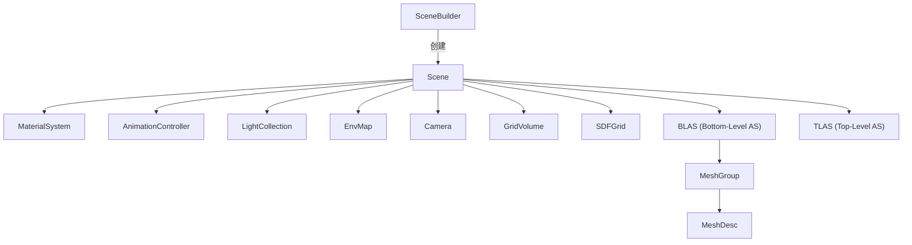

# Scene 源码文档

> 路径: `Source/Falcor/Scene/Scene.h` + `Source/Falcor/Scene/Scene.cpp`
> 类型: C++ 头文件 + 实现
> 模块: Scene

## 功能概述

Scene 是 Falcor 的核心场景类，负责管理渲染所需的所有场景资源，包括几何体（网格、曲线、SDF 网格）、材质、光源、相机、动画、体积等。它同时管理 DXR 光线追踪的加速结构（BLAS/TLAS）的构建和更新。

Scene 继承自 IScene 抽象接口，是渲染管线的数据枢纽。

## 类与接口

### `Scene`

- **继承**: `IScene`
- **职责**: 持有并管理所有场景资源，构建和维护光线追踪加速结构，提供着色器绑定接口

#### 关键方法

| 方法签名 | 说明 |
|----------|------|
| `UpdateFlags update(RenderContext*, double currentTime)` | 每帧更新场景状态（动画、变换、加速结构等） |
| `void bindShaderData(const ShaderVar&) const` | 绑定场景数据到着色器变量 |
| `void bindShaderDataForRaytracing(RenderContext*, const ShaderVar&, uint32_t rayTypeCount)` | 绑定光线追踪资源（含 TLAS） |
| `void getShaderDefines(DefineList&) const` | 获取场景的着色器宏定义 |
| `void getTypeConformances(TypeConformanceList&, TypeConformancesKind) const` | 获取类型一致性声明 |
| `uint32_t getMeshCount() const` | 获取网格数量 |
| `uint32_t getCurveCount() const` | 获取曲线数量 |
| `uint32_t getSDFGridCount() const` | 获取 SDF 网格数量 |
| `uint32_t getGeometryInstanceCount() const` | 获取几何实例总数 |
| `const MeshDesc& getMesh(MeshID) const` | 根据 ID 获取网格描述 |
| `const CurveDesc& getCurve(CurveID) const` | 根据 ID 获取曲线描述 |
| `const ref<SDFGrid>& getSDFGrid(SdfGridID) const` | 根据 ID 获取 SDF 网格 |
| `GeometryTypeFlags getGeometryTypes() const` | 获取场景中存在的几何类型标志 |

#### 关键内部类型

| 类型 | 说明 |
|------|------|
| `UpdateMode` | 加速结构更新模式：`Rebuild`（重建）或 `Refit`（更新） |
| `SDFGridConfig` | SDF 网格配置（实现类型、相交方法、梯度评估方法等） |
| `Metadata` | 导入器提供的渲染元数据（光圈、ISO、快门等） |
| `MeshGroup` | 网格组，对应一个 BLAS |
| `Node` | 场景图节点 |
| `SceneData` | 创建 Scene 对象所需的完整数据集 |

#### 加速结构布局

```
TLAS
├── BLAS 0: 合并的静态网格（多个 Geometry）
├── BLAS 1-N: 动态/实例化网格
└── BLAS M: 程序化图元（曲线、SDF 等）
```

- `InstanceID() + GeometryIndex()` 映射到全局 `GeometryInstanceData` 索引
- Shader Table 每个几何体和光线类型一个 Hit Group

## 架构图



## 依赖关系

### 本文件引用

- `IScene.h` - 抽象接口基类
- `SceneIDs.h` - 场景对象 ID 类型
- `SceneTypes.slang` - 场景类型定义（主机/设备共享）
- `HitInfo.h` - 命中信息编码
- `Animation/AnimationController.h` - 动画控制器
- `Lights/Light.h`, `LightCollection.h`, `EnvMap.h` - 光源系统
- `Camera/Camera.h`, `CameraController.h` - 相机系统
- `Material/MaterialSystem.h` - 材质系统
- `Volume/GridVolume.h`, `Grid.h` - 体积渲染
- `SDFs/SDFGrid.h` - SDF 网格
- `Core/API/RtAccelerationStructure.h` - 光线追踪加速结构

### 被以下文件引用

- 所有渲染通道（RenderPass）
- `SceneBuilder` - 构建场景
- `SceneCache` - 场景缓存
- `HitInfo.cpp` - 初始化命中信息编码

## 实现细节

- BLAS 创建策略：静态非实例化网格合并到单个 BLAS（可预变换）；动态网格按变换矩阵分组；实例化网格按实例集合分组
- 使用 `SplitBuffer` 支持超过 4GB 的顶点/索引缓冲区
- `SceneData` 结构体包含场景的全部运行时数据，由 `SceneBuilder` 准备后传递给 Scene 构造函数
