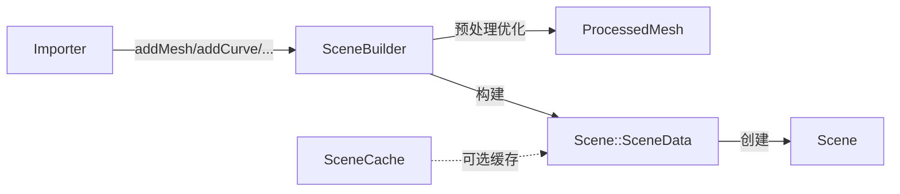

# SceneBuilder 源码文档

> 路径: `Source/Falcor/Scene/SceneBuilder.h` + `Source/Falcor/Scene/SceneBuilder.cpp`
> 类型: C++ 头文件 + 实现
> 模块: Scene

## 功能概述

SceneBuilder 是场景构建器，负责从各种资产导入器接收原始几何、材质、光源、相机等数据，对其进行预处理和优化，最终生成 `Scene::SceneData` 来创建 `Scene` 对象。它是导入器与 Scene 之间的桥梁。

主要职责包括：网格去重与合并、切线空间生成（MikkTSpace）、索引格式优化、BLAS 分组策略、场景图优化等。

## 类与接口

### `SceneBuilder`

- **继承**: 无
- **职责**: 收集场景数据，执行预处理和优化，构建最终的 Scene 对象

#### 关键枚举

##### `Flags`

| 标志 | 说明 |
|------|------|
| `DontMergeMaterials` | 不合并同属性材质 |
| `UseOriginalTangentSpace` | 使用原始切线空间 |
| `AssumeLinearSpaceTextures` | 假设颜色纹理为线性空间 |
| `DontMergeMeshes` | 不合并相同材质的网格 |
| `NonIndexedVertices` | 转为非索引顶点 |
| `Force32BitIndices` | 强制 32 位索引 |
| `RTDontMergeStatic` | 不合并静态网格到单个 BLAS |
| `RTDontMergeDynamic` | 不合并动态网格 |
| `RTDontMergeInstanced` | 不合并实例化网格 |
| `UseCompressedHitInfo` | 使用压缩命中信息 |
| `TessellateCurvesIntoPolyTubes` | 将曲线细分为多边形管道 |
| `UseCache` | 启用场景缓存 |
| `RebuildCache` | 重建场景缓存 |

#### 关键内部类型

##### `Mesh`

导入器用于添加网格的描述结构体，支持多种顶点属性频率：

| 属性频率 | 说明 |
|----------|------|
| `Constant` | 整个网格一个值 |
| `Uniform` | 每个面一个值 |
| `Vertex` | 每个顶点一个值 |
| `FaceVarying` | 每个面的每个顶点一个值 |

##### `Curve`

曲线描述结构体，包含顶点位置、半径和纹理坐标。

##### `ProcessedMesh` / `ProcessedCurve`

预处理后的网格/曲线数据，格式化为可直接写入全局缓冲区的格式。

#### 关键方法

| 方法签名 | 说明 |
|----------|------|
| `SceneBuilder(ref<Device>, const path&, const Settings&, Flags)` | 构造函数，导入资产文件 |
| `MeshID addMesh(const Mesh& mesh)` | 添加网格到场景 |
| `CurveID addCurve(const Curve& curve)` | 添加曲线到场景 |
| `NodeID addNode(const Node& node)` | 添加场景图节点 |
| `MaterialID addMaterial(const ref<Material>&)` | 添加材质 |
| `LightID addLight(const ref<Light>&)` | 添加光源 |
| `ref<Scene> getScene()` | 完成构建并返回 Scene 对象 |

## 架构图

## 依赖关系

### 本文件引用

- `Scene.h` - Scene 类及其内部类型
- `SceneCache.h` - 场景缓存
- `SceneIDs.h` - 场景 ID 类型
- `Transform.h` - 变换工具
- `TriangleMesh.h` - 三角形网格工具
- `SceneTypes.slang` - 场景类型定义
- `Material/MaterialTextureLoader.h` - 材质纹理加载器

### 被以下文件引用

- 各导入器（Importer）实现
- 应用程序代码（创建场景）

## 实现细节

- 网格预处理：`ProcessedMesh` 包含去重后的顶点数据和优化后的索引（16 位或 32 位）
- MikkTSpace 切线空间生成：除非明确使用原始切线空间，否则自动重新生成
- BLAS 分组策略在 `getScene()` 中执行，根据 Flags 决定合并策略
- 支持从内存缓冲区导入（用于嵌入式资产或流式加载）
