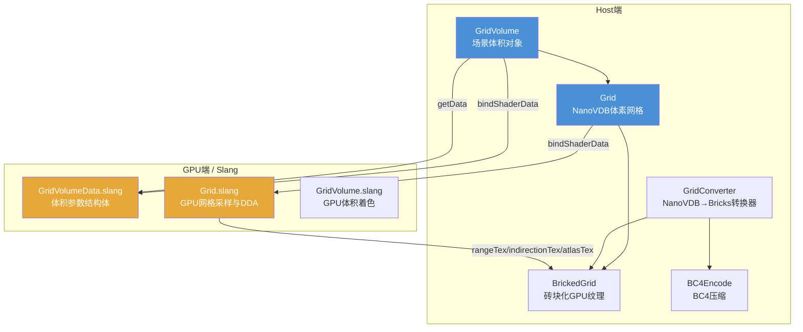

# Scene/Volume -- 体积数据 (Volume Data)

## 功能概述

Volume 模块为 Falcor 渲染框架提供**异构参与介质**（heterogeneous participating media）的表示与渲染支持。核心功能包括：

- **体素网格 (Grid)**：基于 NanoVDB 的稀疏体素数据结构，支持从 OpenVDB/NanoVDB 文件加载，也可程序化生成球体/盒体网格。提供世界空间与索引空间之间的坐标变换、最近邻/三线性/随机采样，以及 DDA 遍历器。
- **砖块化网格 (BrickedGrid)**：将 NanoVDB 数据转换为 GPU 友好的三级纹理结构——范围纹理 (range)、间接寻址纹理 (indirection)、图集纹理 (atlas)——支持 BC4 / UNORM8 / UNORM16 压缩格式，可高效进行局部 majorant 查询。
- **网格体积 (GridVolume)**：场景级体积对象，管理密度 (density) 和自发光 (emission) 两个网格槽位，支持网格序列动画播放、密度/发射缩放、散射反照率、各向异性相位函数、黑体辐射模式等属性，并与 Falcor 动画系统集成。
- **BC4 编码**：CPU 端将 4x4 uint8 alpha 块压缩为 64 位 BC4 格式，用于体积图集纹理的有损压缩。

## 架构图

## 文件清单

| 文件名 | 类型 | 说明 |
|--------|------|------|
| `BC4Encode.h` | C++ Header | BC4 (DXT5 Alpha) 块压缩实现，将 4x4 uint8 值编码为 64 位 |
| `BrickedGrid.h` | C++ Header | `BrickedGrid` 结构体，持有 range / indirection / atlas 三张 3D 纹理 |
| `Grid.h` | C++ Header | `Grid` 类，基于 NanoVDB 的体素网格，支持文件加载与程序化创建 |
| `Grid.cpp` | C++ Source | `Grid` 类实现，包括 OpenVDB/NanoVDB 文件解析与 GPU 资源创建 |
| `Grid.slang` | Slang Shader | GPU 端 `Grid` 结构体，提供采样（最近邻/三线性/随机）与 DDA 遍历 |
| `GridConverter.h` | C++ Header | `NanoVDBToBricksConverter` 模板类，将 NanoVDB 转为砖块化 3D 纹理 |
| `GridVolume.h` | C++ Header | `GridVolume` 类，场景级异构体积，管理网格序列与介质属性 |
| `GridVolume.cpp` | C++ Source | `GridVolume` 类实现，包括 UI 渲染、属性更新与动画播放逻辑 |
| `GridVolume.slang` | Slang Shader | GPU 端体积着色逻辑 |
| `GridVolumeData.slang` | Slang Shared | `GridVolumeData` 主机/设备共享结构体，包含变换矩阵与介质参数 |

## 依赖关系

### 内部依赖
- `Core/API/Buffer`, `Core/API/Texture` -- GPU 缓冲区与纹理资源
- `Core/Object` -- 引用计数基类
- `Utils/Math/AABB`, `Utils/Math/Matrix`, `Utils/Math/Vector` -- 数学工具
- `Utils/UI/Gui` -- UI 渲染接口
- `Scene/Animation/Animatable` -- 动画基类（`GridVolume` 继承自 `Animatable`）

### 外部依赖
- **NanoVDB** (`nanovdb/NanoVDB.h`, `nanovdb/util/GridHandle.h`) -- 稀疏体素数据结构
- **PNanoVDB** (`nanovdb/PNanoVDB.h`) -- GPU 端 NanoVDB 只读访问（Slang 侧使用）

## 关键类与接口

### `Grid` (C++)
基于 NanoVDB 的体素网格宿主端管理类。

| 方法 | 说明 |
|------|------|
| `createSphere()` / `createBox()` | 程序化创建球体/盒体网格 |
| `createFromFile(path, gridname)` | 从 OpenVDB 或 NanoVDB 文件加载 |
| `bindShaderData(var)` | 将网格数据绑定到 Shader 变量 |
| `getWorldBounds()` | 获取世界空间 AABB |
| `getValue(ijk)` | CPU 端按索引读取单个体素值 |
| `getTransform()` / `getInvTransform()` | 获取 NanoVDB 仿射变换矩阵 |

### `Grid` (Slang GPU)
GPU 端网格采样结构体，核心方法：

- `lookupIndex()` / `lookupIndexTex()` -- 最近邻采样（NanoVDB / 砖块纹理）
- `lookupLinearWorld()` / `lookupLinearIndexTex()` -- 三线性插值采样
- `lookupStochasticWorld()` -- 随机采样（用于蒙特卡洛积分）
- `DDA` 内部结构 -- 支持体素级与叶节点级两种遍历粒度

### `GridVolume` (C++)
场景级异构体积管理类，继承自 `Animatable`。

| 方法 | 说明 |
|------|------|
| `loadGrid(slot, path, gridname)` | 加载单个网格到指定槽位 |
| `loadGridSequence(slot, paths, gridname)` | 加载网格序列（动画） |
| `setDensityScale()` / `setAlbedo()` / `setAnisotropy()` | 设置介质物理属性 |
| `setEmissionMode()` / `setEmissionTemperature()` | 设置发射模式（直接/黑体） |
| `updatePlayback(time)` | 基于全局时间更新当前帧 |

### `NanoVDBToBricksConverter<TexelType, kBitsPerTexel>` (C++)
模板转换器，将 NanoVDB 浮点网格转换为砖块化 GPU 纹理。预定义别名：
- `NanoVDBConverterBC4` -- 4-bit BC4 压缩
- `NanoVDBConverterUNORM8` -- 8-bit 无压缩
- `NanoVDBConverterUNORM16` -- 16-bit 无压缩

### `GridVolumeData` (Slang Shared)
主机/设备共享数据结构，字段包括 `transform`、`invTransform`、`densityScale`、`emissionScale`、`albedo`、`anisotropy`、`emissionTemperature` 等。
