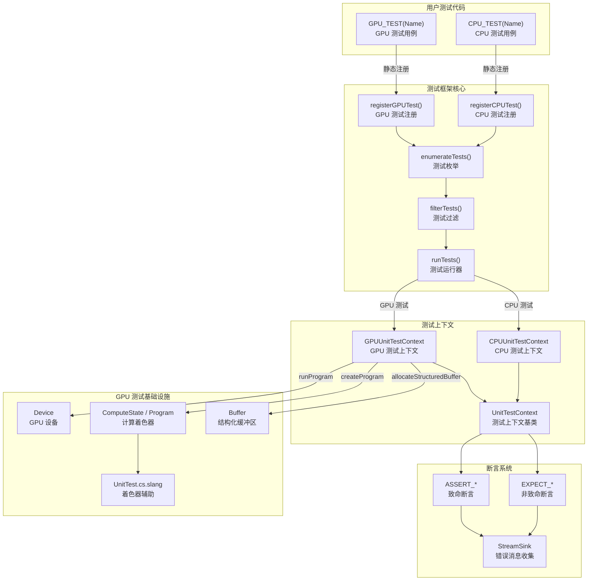
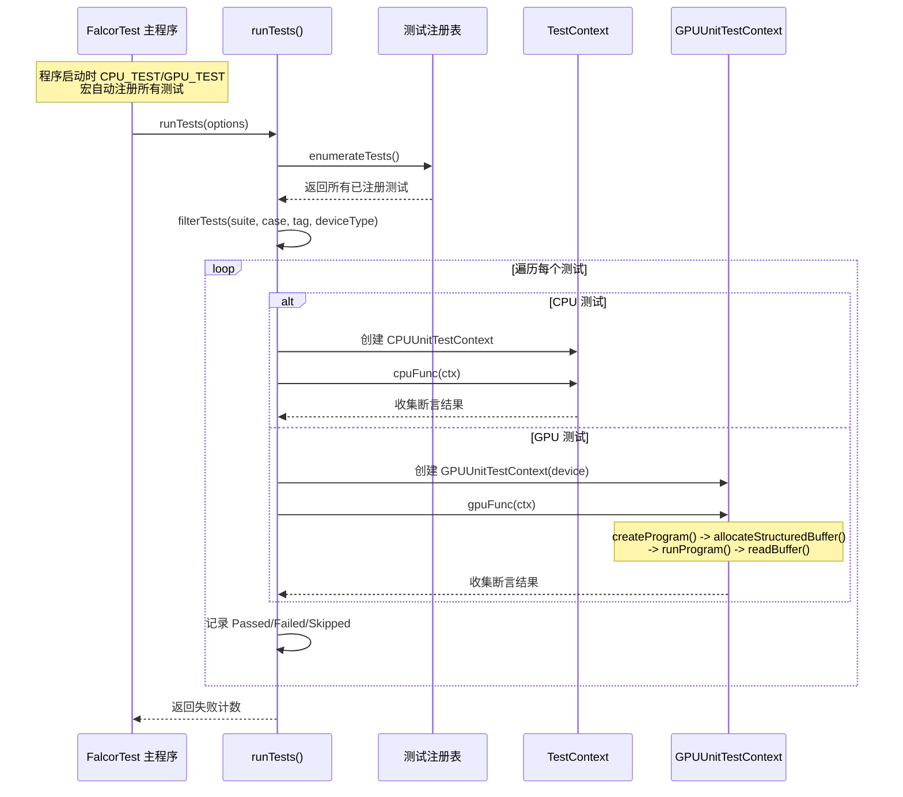

# Testing -- 单元测试框架

> 源码路径: `Source/Falcor/Testing/`

## 功能概述

Falcor 测试模块提供了一套完整的单元测试框架，同时支持 **CPU 测试**和 **GPU 测试**。该框架允许开发者编写在 CPU 上运行的纯逻辑测试以及在 GPU 上运行计算着色器的测试，用于验证渲染框架各模块的正确性。

核心能力包括:

- **CPU 单元测试**: 通过 `CPU_TEST` 宏注册纯 CPU 端测试用例
- **GPU 单元测试**: 通过 `GPU_TEST` 宏注册 GPU 计算着色器测试，自动管理设备、程序编译和缓冲区分配
- **丰富的断言宏**: 提供 `EXPECT_*` (非致命) 和 `ASSERT_*` (致命) 两类断言，支持相等、不等、大于、小于等比较
- **测试标签与过滤**: 支持按套件名、用例名、标签过滤测试，支持按设备类型 (D3D12/Vulkan) 筛选
- **跳过机制**: 通过 `SKIP("reason")` 标记尚未实现或暂时禁用的测试
- **并行执行**: 支持多线程并行运行测试用例
- **XML 报告输出**: 支持生成 JUnit 兼容的 XML 测试报告
- **GPU 着色器测试辅助**: `GPUUnitTestContext` 提供 `createProgram()`、`allocateStructuredBuffer()`、`runProgram()` 等 GPU 测试专用 API
- **Slang 着色器端测试支持**: 配套 `UnitTest.cs.slang` 提供着色器端的测试辅助代码

## 架构图



### 测试执行流程



## 文件清单

| 文件名 | 类型 | 说明 |
|--------|------|------|
| `UnitTest.h` | 头文件 | 测试框架完整 API：测试注册宏 (`CPU_TEST`/`GPU_TEST`)、断言宏 (`EXPECT_*`/`ASSERT_*`)、`UnitTestContext`/`CPUUnitTestContext`/`GPUUnitTestContext` 类、辅助选项类 (`Tags`/`Skip`/`DeviceTypes`)、比较辅助模板 |
| `UnitTest.cpp` | 实现 | 测试运行器实现：测试注册表管理、测试枚举与过滤、并行执行调度、XML 报告生成、结果统计与输出 |
| `UnitTest.cs.slang` | 着色器 | GPU 测试的 Slang 着色器辅助代码，配合 `GPUUnitTestContext` 使用 |

## 依赖关系

### 内部依赖（Falcor 模块）

| 依赖模块 | 用途 |
|----------|------|
| `Core/Error` | 异常基类 `Exception` |
| `Core/API/Device` | GPU 设备管理，`GPUUnitTestContext` 持有设备引用 |
| `Core/API/RenderContext` | GPU 命令提交，用于分发计算着色器 |
| `Core/State/ComputeState` | 计算管线状态对象 |
| `Core/Program/Program` | 着色器程序编译与管理 |
| `Core/Program/ProgramVars` | 着色器变量绑定 |
| `Core/Program/ShaderVar` | 着色器变量访问 |
| `Utils/Math/Vector` | 数学向量类型 (`uint2`, `uint3`) |
| `Utils/StringFormatters` | 字符串格式化 |
| `Utils/Threading` | 多线程并行执行 |
| `Utils/Logger` | 日志输出 |

### 外部依赖

| 依赖库 | 用途 |
|--------|------|
| `fmt` | 格式化错误消息和测试报告输出 |
| `pugixml` | 生成 JUnit 兼容的 XML 测试报告 |
| `BS_thread_pool` | 轻量级线程池，用于并行运行测试 |

## 关键类与接口

### 测试注册宏

```cpp
// 定义一个 CPU 单元测试（自动标记 "cpu" 标签）
CPU_TEST(TestName, /* 可选参数 */) {
    // ctx 类型: CPUUnitTestContext&
    EXPECT_EQ(1 + 1, 2);
}

// 定义一个 GPU 单元测试（自动标记 "gpu" 标签）
GPU_TEST(TestName, /* 可选参数 */) {
    // ctx 类型: GPUUnitTestContext&
    ctx.createProgram("Shaders/MyTest.cs.slang");
    ctx.allocateStructuredBuffer("result", 1024);
    ctx.runProgram(1024);
    auto result = ctx.readBuffer<float>("result");
    EXPECT_EQ(result[0], 1.0f);
}

// 可选参数:
SKIP("reason")                        // 跳过测试
TAGS("tag1", "tag2")                  // 添加标签
DEVICE_TYPES(Device::Type::D3D12)     // 限制设备类型
```

### `UnitTestContext`

所有测试上下文的基类，提供失败报告和跳过能力。

```cpp
class UnitTestContext {
    void skip(const char* message);                        // 运行时跳过测试
    void reportFailure(const std::string& message);        // 报告测试失败
    std::vector<std::string> getFailureMessages() const;   // 获取所有失败消息
    int mNumFailures = 0;                                  // 失败计数
};
```

### `CPUUnitTestContext`

CPU 测试上下文，直接继承 `UnitTestContext`，无额外成员。

```cpp
class CPUUnitTestContext : public UnitTestContext {};
```

### `GPUUnitTestContext`

GPU 测试上下文，封装了创建计算着色器、分配缓冲区、分发计算、回读结果的完整流程。

```cpp
class GPUUnitTestContext : public UnitTestContext {
    GPUUnitTestContext(ref<Device> pDevice);

    // 创建计算着色器程序
    void createProgram(const std::filesystem::path& path,
                       const std::string& csEntry = "main",
                       const DefineList& programDefines = DefineList(),
                       SlangCompilerFlags flags = SlangCompilerFlags::None,
                       ShaderModel shaderModel = ShaderModel::Unknown,
                       bool createShaderVars = true);
    void createProgram(const ProgramDesc& desc, const DefineList& programDefines, bool createShaderVars);

    // 创建/重建着色器变量
    void createVars();

    // 访问着色器变量
    ProgramVars& vars();
    ShaderVar operator[](const std::string& name);

    // 分配结构化缓冲区
    void allocateStructuredBuffer(const std::string& name, uint32_t nElements,
                                  const void* pInitData = nullptr, size_t initDataSize = 0);

    // 回读缓冲区数据
    template<typename T>
    std::vector<T> readBuffer(const char* bufferName);

    // 分发计算着色器
    void runProgram(const uint3& dimensions);
    void runProgram(uint32_t width = 1, uint32_t height = 1, uint32_t depth = 1);

    // 获取设备和上下文
    const ref<Device>& getDevice() const;
    RenderContext* getRenderContext() const;
    Program* getProgram() const;
    ProgramVars* getVars() const;
};
```

### 断言宏

框架提供两类断言: `EXPECT_*` (失败后继续执行) 和 `ASSERT_*` (失败后中止当前测试)。

| 宏 | 说明 |
|----|------|
| `EXPECT(expr)` / `ASSERT(expr)` | 验证表达式为真 |
| `EXPECT_TRUE(expr)` / `ASSERT_TRUE(expr)` | 验证为 `true` |
| `EXPECT_FALSE(expr)` / `ASSERT_FALSE(expr)` | 验证为 `false` |
| `EXPECT_EQ(lhs, rhs)` / `ASSERT_EQ(lhs, rhs)` | 验证相等 (`==`) |
| `EXPECT_NE(lhs, rhs)` / `ASSERT_NE(lhs, rhs)` | 验证不等 (`!=`) |
| `EXPECT_LT(lhs, rhs)` / `ASSERT_LT(lhs, rhs)` | 验证小于 (`<`) |
| `EXPECT_LE(lhs, rhs)` / `ASSERT_LE(lhs, rhs)` | 验证小于等于 (`<=`) |
| `EXPECT_GT(lhs, rhs)` / `ASSERT_GT(lhs, rhs)` | 验证大于 (`>`) |
| `EXPECT_GE(lhs, rhs)` / `ASSERT_GE(lhs, rhs)` | 验证大于等于 (`>=`) |
| `EXPECT_THROW(expr)` | 验证表达式抛出异常 |
| `EXPECT_THROW_AS(expr, type)` | 验证表达式抛出指定类型异常 |

所有宏均支持 `_MSG` 后缀变体（如 `EXPECT_EQ_MSG(lhs, rhs, msg)`），用于附加自定义失败消息。

### `RunOptions`

测试运行配置。

```cpp
struct RunOptions {
    Device::Desc deviceDesc;            // GPU 设备描述
    std::string testSuiteFilter;        // 套件名过滤（正则）
    std::string testCaseFilter;         // 用例名过滤（正则）
    std::string tagFilter;              // 标签过滤
    std::filesystem::path xmlReportPath; // XML 报告输出路径
    uint32_t parallel = 1;              // 并行线程数
    uint32_t repeat = 1;               // 重复运行次数
};

int32_t runTests(const RunOptions& options);  // 返回失败测试数
```

### 异常类型

| 异常类 | 说明 |
|--------|------|
| `TooManyFailedTestsException` | 单个测试失败次数超过 `kMaxTestFailures` (25) 时抛出 |
| `ErrorRunningTestException` | 测试运行时发生错误 |
| `AssertingTestException` | `ASSERT_*` 断言失败时抛出，中止当前测试 |
| `SkippingTestException` | 调用 `skip()` 时抛出，标记测试为跳过 |
