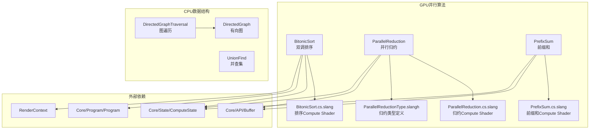

# Utils/Algorithm -- 算法工具库

## 功能概述

`Utils/Algorithm` 提供 Falcor 渲染框架中常用的 GPU 并行算法和通用数据结构。该模块包含三种核心 GPU 并行算法（双调排序、并行归约、前缀和）以及两种 CPU 端数据结构（有向图、并查集），覆盖了渲染管线中数据处理与图结构管理的典型需求。

主要功能包括：

- **双调排序 (Bitonic Sort)**：基于 GPU Compute Shader 的原地排序算法，利用 warp 内水平操作与共享内存实现高效排序，适用于短序列的并行排序场景。
- **并行归约 (Parallel Reduction)**：在纹理(Texture)所有像素上执行并行归约操作（求和或最小/最大值），采用递归分块策略（每块 1024 元素），支持 GPU 异步回读。
- **前缀和 (Prefix Sum)**：GPU 上的并行前缀和（排他扫描），原地计算 `y[i] = x[0] + ... + x[i-1]`，支持输出总和到独立缓冲区(Buffer)。
- **有向图 (Directed Graph)**：基于哈希表的有向图数据结构，支持节点/边的增删查操作，用于渲染图(Render Graph)等场景。
- **并查集 (Union Find)**：模板化的并查集（不相交集合），支持路径压缩和按大小合并，用于连通分量检测。

## 架构图



## 文件清单

| 文件名 | 类型 | 说明 |
|--------|------|------|
| `BitonicSort.h` | C++ 头文件 | 双调排序类声明，支持按 chunk 分组原地排序 |
| `BitonicSort.cpp` | C++ 源文件 | 双调排序 CPU 端控制逻辑实现 |
| `BitonicSort.cs.slang` | Slang Compute Shader | 双调排序 GPU 内核（warp 水平操作 + 共享内存） |
| `ParallelReduction.h` | C++ 头文件 | 并行归约类声明，支持 Sum 和 MinMax 操作 |
| `ParallelReduction.cpp` | C++ 源文件 | 并行归约 CPU 端调度与缓冲区管理 |
| `ParallelReduction.cs.slang` | Slang Compute Shader | 并行归约 GPU 内核 |
| `ParallelReductionType.slangh` | Slang 头文件 | 归约操作类型枚举定义 |
| `PrefixSum.h` | C++ 头文件 | 前缀和类声明，排他扫描接口 |
| `PrefixSum.cpp` | C++ 源文件 | 前缀和 CPU 端调度（两遍扫描） |
| `PrefixSum.cs.slang` | Slang Compute Shader | 前缀和 GPU 内核 |
| `DirectedGraph.h` | C++ 头文件 | 有向图数据结构（节点、边、增删查） |
| `DirectedGraphTraversal.h` | C++ 头文件 | 有向图遍历工具 |
| `UnionFind.h` | C++ 头文件 | 模板并查集（路径压缩 + 按大小合并） |

## 依赖关系

### 外部依赖
- `Core/Macros.h` -- 平台宏与导出宏
- `Core/API/Buffer.h` -- GPU 缓冲区
- `Core/State/ComputeState.h` -- 计算管线状态
- `Core/Program/Program.h` / `ProgramVars.h` -- 着色器程序管理
- `Core/Error.h` / `Utils/Logger.h` -- 错误处理与日志
- C++ 标准库（`<vector>`、`<unordered_map>`、`<unordered_set>`）

### 被依赖（下游模块）
- `RenderPasses/` -- 各种渲染通道使用并行归约和前缀和
- `Scene/` -- 场景构建使用排序和前缀和
- `Core/` -- 渲染图系统使用 `DirectedGraph`

## 关键类与接口

### `BitonicSort` 类
GPU 原地双调排序。时间复杂度 O(N*log^2(N))，但高度并行化且几乎无分支。需要 NVIDIA GPU 和 NVAPI。

```cpp
bool execute(RenderContext* pRenderContext, ref<Buffer> pData,
             uint32_t totalSize, uint32_t chunkSize, uint32_t groupSize = 256);
```

- `totalSize` -- 缓冲区总元素数（无需是 chunkSize 的倍数）
- `chunkSize` -- 每个分块的大小（必须为 2 的幂，范围 [1, groupSize]）

### `ParallelReduction` 类
对纹理所有像素执行并行归约。支持 `Sum`（求和）和 `MinMax`（最小/最大值）两种操作类型。递归分块处理，每块 1024 元素。

```cpp
template<typename T>
void execute(RenderContext* pRenderContext, const ref<Texture>& pInput,
             Type operation, T* pResult = nullptr,
             ref<Buffer> pResultBuffer = nullptr, uint64_t resultOffset = 0);
```

建议将结果存入 GPU 缓冲区后异步回读，避免完整 GPU 刷新。

### `PrefixSum` 类
GPU 并行前缀和（排他扫描）。对 `uint32_t` 数组原地计算。

```cpp
void execute(RenderContext* pRenderContext, ref<Buffer> pData,
             uint32_t elementCount, uint32_t* pTotalSum = nullptr,
             ref<Buffer> pTotalSumBuffer = nullptr, uint64_t pTotalSumOffset = 0);
```

### `DirectedGraph` 类
基于哈希表的有向图。`Node` 维护入边/出边列表，`Edge` 存储源/目标节点 ID。支持 `addNode()`、`addEdge()`、`removeNode()`（级联删除关联边）、`removeEdge()` 等操作。

### `UnionFind<T>` 模板类
并查集，仅支持无符号整数类型。提供 `findSet()`（带路径压缩）、`unionSet()`（按大小合并）、`connectedSets()` 和 `getSetCount()` 接口。
