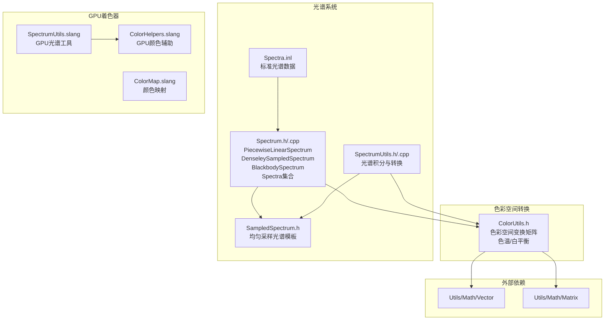

# Utils/Color -- 颜色空间工具库

## 功能概述

`Utils/Color` 提供 Falcor 渲染框架中颜色空间转换和光谱处理的完整工具集。该模块覆盖了从物理光谱到 RGB 颜色的全部转换链路，同时支持 CPU 端精确计算和 GPU 端实时着色器运算。

Falcor 默认假设所有输入/输出均采用 sRGB 色彩空间（基于 ITU-R Rec. BT.709），并提供以下核心功能：

- **色彩空间变换矩阵**：预定义 RGB Rec.709 与 CIE XYZ 之间的 3x3 变换矩阵，以及 XYZ 与 LMS 空间的 CAT02 和 Bradford 变换矩阵。
- **色温转换**：黑体辐射色温到 CIE XYZ 的近似转换（基于 Kang et al. 2002 分段有理多项式方法，支持 1667K~25000K）。
- **白平衡**：基于 von Kries 变换（LMS 空间对角缩放）计算 RGB Rec.709 白平衡矩阵，以 D65 白点为参考。
- **光谱表示**：三种光谱类型 -- 分段线性插值光谱 (`PiecewiseLinearSpectrum`)、密采样光谱 (`DenseleySampledSpectrum`)、黑体辐射光谱 (`BlackbodySpectrum`)。
- **均匀采样光谱**：模板化的 `SampledSpectrum<T>` 类，支持标量和向量类型的均匀波长采样。
- **光谱转换工具**：`SpectrumUtils` 提供 CIE 1931 XYZ 色匹配函数、D65 标准光源、光谱到 RGB 的积分转换。
- **GPU 着色器支持**：`ColorHelpers.slang` 和 `ColorMap.slang` 提供 GPU 端颜色辅助函数和颜色映射。

## 架构图

## 文件清单

| 文件名 | 类型 | 说明 |
|--------|------|------|
| `ColorUtils.h` | C++ 头文件 | RGB/XYZ/LMS 色彩空间变换矩阵、色温转 XYZ、白平衡矩阵计算 |
| `SampledSpectrum.h` | C++ 头文件 | 模板化均匀采样光谱 `SampledSpectrum<T>`，支持线性插值求值 |
| `Spectrum.h` | C++ 头文件 | 三种光谱类型声明及光谱内积/转换函数模板 |
| `Spectrum.cpp` | C++ 源文件 | `blackbodyEmission()`、`BlackbodySpectrum`、`PiecewiseLinearSpectrum` 实现 |
| `SpectrumUtils.h` | C++ 头文件 | `SpectrumUtils` 类：CIE XYZ 匹配函数、D65 评估、光谱积分转 XYZ/RGB |
| `SpectrumUtils.cpp` | C++ 源文件 | CIE 1931 XYZ 和 D65 采样数据、转换函数实现 |
| `SpectrumUtils.slang` | Slang 着色器 | GPU 端光谱工具函数 |
| `Spectra.inl` | C++ 内联数据 | 标准光谱数据（CIE XYZ 1931 等） |
| `ColorHelpers.slang` | Slang 着色器 | GPU 端颜色辅助函数（亮度计算、色调映射等） |
| `ColorMap.slang` | Slang 着色器 | GPU 端颜色映射（伪彩色、热力图等） |

## 依赖关系

### 外部依赖
- `Core/Macros.h` -- 平台宏与导出符号
- `Core/Error.h` -- 错误检查
- `Utils/Math/Vector.h` -- `float2`、`float3` 向量类型
- `Utils/Math/Matrix.h` -- `float3x3` 矩阵类型及 `mul` 运算
- `Utils/Math/Common.h` -- 通用数学工具
- `fstd/span.h` -- span 容器（C++20 替代）

### 被依赖（下游模块）
- `Scene/Lights/` -- 光源使用光谱和色温转换
- `Scene/Material/` -- 材质系统使用颜色转换
- `RenderPasses/` -- 后处理通道使用白平衡和色调映射

## 关键类与接口

### 色彩空间变换（`ColorUtils.h`）

预定义的 3x3 变换矩阵常量：
- `kColorTransform_RGBtoXYZ_Rec709` / `kColorTransform_XYZtoRGB_Rec709` -- RGB Rec.709 与 CIE XYZ 互转
- `kColorTransform_XYZtoLMS_CAT02` / `kColorTransform_LMStoXYZ_CAT02` -- CIE XYZ 与 LMS (CAT02) 互转
- `kColorTransform_XYZtoLMS_Bradford` / `kColorTransform_LMStoXYZ_Bradford` -- CIE XYZ 与 LMS (Bradford) 互转

关键函数：
- `colorTemperatureToXYZ(float T, float Y)` -- 色温(K)转 CIE XYZ
- `calculateWhiteBalanceTransformRGB_Rec709(float T)` -- 计算目标色温的白平衡 3x3 矩阵

### `PiecewiseLinearSpectrum` 类
分段线性插值光谱。存储波长-值对，支持从交错数据或文件加载，线性插值求值，波长范围外返回零。

### `DenseleySampledSpectrum` 类
密采样光谱，等间隔存储采样值。支持从任意光谱对象构造（可指定采样步长），最近邻查找求值。

### `BlackbodySpectrum` 类
黑体辐射光谱。根据开尔文温度计算辐射强度，可选归一化（峰值为 1）。

### `SampledSpectrum<T>` 模板类
均匀采样光谱，模板参数 T 可为 `float`、`float2`、`float3`、`float4`。支持线性插值求值、CIE 1931 XYZ 转换。

### `SpectrumUtils` 类
光谱转换核心工具类，提供：
- `wavelengthToXYZ_CIE1931(lambda)` -- 波长到 CIE XYZ（1nm 采样，线性插值）
- `wavelengthToD65(lambda)` -- D65 标准光源评估
- `toXYZ()` / `toXYZ_D65()` / `toRGB_D65()` -- 通用光谱积分转颜色值
- `integrate()` -- 通用光谱积分框架（黎曼和近似）
