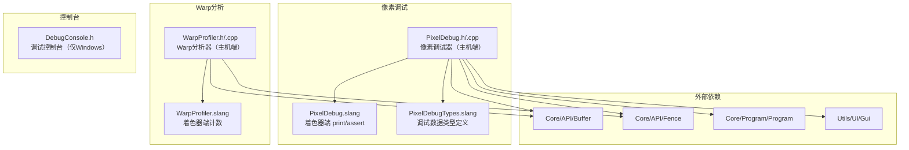

# Utils/Debug -- 调试工具库

## 功能概述

`Utils/Debug` 提供 Falcor 渲染框架的着色器调试与性能分析工具。该模块使 GPU 着色器能够在运行时输出调试信息（打印值、断言检测）并收集 warp 级别的性能统计数据，是渲染管线开发和问题排查的核心支撑工具。

主要功能包括：

- **像素调试器 (Pixel Debug)**：允许在 Slang 着色器中使用 `print()` 和 `assert()` 进行交互式调试。选择特定像素后，可输出该像素着色器执行过程中的任意基本类型值（bool、int、float、向量等）。断言会检测所有像素，失败时记录坐标和触发信息。使用异步回读机制，对性能影响较小。
- **Warp 分析器 (Warp Profiler)**：收集 warp 级别的执行统计数据，生成 warp 直方图。每个 warp 有 32 个线程（lane），分析器记录每个 profiling bin 中各 warp 的活跃线程数分布，可导出 CSV 格式。
- **调试控制台 (Debug Console)**：Windows 平台专用，动态创建控制台窗口并重定向 `std::cout`、`std::cerr`、`std::cin`，便于图形应用程序中的文本输出调试。

## 架构图



## 文件清单

| 文件名 | 类型 | 说明 |
|--------|------|------|
| `PixelDebug.h` | C++ 头文件 | `PixelDebug` 类声明：帧控制、程序绑定、UI 渲染、鼠标事件 |
| `PixelDebug.cpp` | C++ 源文件 | 像素调试器实现：GPU 缓冲区管理、异步数据回读、打印/断言解析 |
| `PixelDebug.slang` | Slang 着色器 | 着色器端 `print()` 和 `assert()` 函数实现 |
| `PixelDebugTypes.slang` | Slang 着色器 | `PrintRecord` 和 `AssertRecord` 数据结构定义 |
| `WarpProfiler.h` | C++ 头文件 | `WarpProfiler` 类声明：直方图收集、CSV 导出 |
| `WarpProfiler.cpp` | C++ 源文件 | Warp 分析器实现：GPU 缓冲区管理与数据回读 |
| `WarpProfiler.slang` | Slang 着色器 | 着色器端 warp 级别计数逻辑 |
| `DebugConsole.h` | C++ 头文件 | Windows 调试控制台（RAII 模式，自动创建/销毁） |

## 依赖关系

### 外部依赖
- `Core/Macros.h` -- 平台宏（`FALCOR_WINDOWS` 等）
- `Core/API/Buffer.h` -- GPU 缓冲区（打印/断言/直方图数据）
- `Core/API/Fence.h` -- GPU 围栏（异步回读同步）
- `Core/Program/Program.h` -- 着色器程序管理与特化
- `Utils/UI/Gui.h` -- UI 控件（像素选择、调试信息显示）
- Windows API（`<windows.h>`）-- 仅 DebugConsole

### 被依赖（下游模块）
- `RenderPasses/` -- 各渲染通道可集成像素调试和 warp 分析
- 用户自定义渲染通道 -- 通过导入 `PixelDebug.slang` 使用调试功能

## 关键类与接口

### `PixelDebug` 类
着色器调试核心类。使用工作流：

1. **主机端集成**：
   - `beginFrame(pRenderContext, frameDim)` -- 帧开始时调用
   - `prepareProgram(pProgram, var)` -- 在 dispatch 前绑定调试资源
   - `endFrame(pRenderContext)` -- 帧结束时触发异步回读
   - `renderUI(widget)` -- 渲染调试 UI
   - `onMouseEvent(mouseEvent)` -- 处理鼠标点击选择像素

2. **着色器端使用**：
   - `import PixelDebug;` -- 导入模块
   - `printSetPixel(pixel)` -- 设置当前像素
   - `print(value)` -- 输出任意基本类型值
   - `assert(condition)` -- 断言检测

关键实现细节：
- 使用 `mpPrintBuffer` / `mpAssertBuffer` 在 GPU 上收集数据
- 通过 `mpReadbackBuffer` 和 `mpFence` 异步回读到 CPU
- 调试关闭时通过宏禁用着色器代码，零开销

### `WarpProfiler` 类
Warp 级别性能分析器。

```cpp
WarpProfiler(ref<Device> pDevice, uint32_t binCount);
void bindShaderData(const ShaderVar& var) const;
void begin(RenderContext* pRenderContext);
void end(RenderContext* pRenderContext);
std::vector<uint32_t> getWarpHistogram(uint32_t binIndex, uint32_t binCount = 1);
bool saveWarpHistogramsAsCSV(const std::filesystem::path& path);
```

- `binCount` -- profiling bin 数量（可按不同代码路径分 bin 统计）
- `getWarpHistogram()` -- 返回 32 个桶的直方图，桶 i 表示有 i+1 个活跃线程的 warp 数量
- Warp 大小固定为 32（`kWarpSize = 32`）

### `DebugConsole` 类
Windows 平台 RAII 调试控制台。构造时调用 `AllocConsole()` 创建控制台窗口并重定向标准流，析构时恢复并释放。支持 `waitForKey` 选项在关闭前等待按键。
