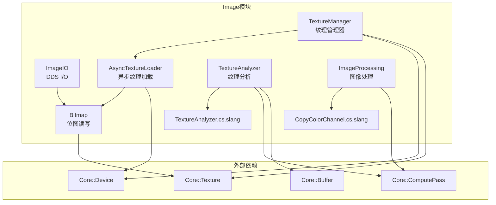

# Utils/Image -- 图像工具模块

## 功能概述

本模块提供 Falcor 渲染框架中图像输入/输出 (I/O) 与图像处理的全套工具类，涵盖以下核心能力：

- **位图读写** -- 支持 PNG、JPEG、TGA、BMP、PFM、EXR 等常见格式的加载与保存（`Bitmap`）。
- **DDS 图像 I/O** -- 专门处理 DDS 格式的纹理加载与保存，支持 BC1-BC7 块压缩模式（`ImageIO`）。
- **异步纹理加载** -- 利用多线程工作线程池异步加载纹理，避免主线程阻塞（`AsyncTextureLoader`）。
- **纹理管理** -- 线程安全的纹理集中管理器，支持 UDIM 纹理、延迟加载、异步加载及 GPU 描述符数组绑定（`TextureManager`）。
- **纹理分析** -- GPU 端计算着色器驱动的纹理内容分析，检测常量通道、数值范围、NaN/Inf 等属性（`TextureAnalyzer`）。
- **图像处理** -- GPU 颜色通道拷贝等计算着色器工具（`ImageProcessing`）。

## 架构图

## 文件清单

| 文件名 | 类型 | 说明 |
|--------|------|------|
| `AsyncTextureLoader.h` | 头文件 | 异步纹理加载器声明，多线程工作线程池 |
| `AsyncTextureLoader.cpp` | 实现 | 异步纹理加载器实现 |
| `Bitmap.h` | 头文件 | 内存位图类声明，支持多种图像格式读写 |
| `Bitmap.cpp` | 实现 | 位图加载/保存实现（PNG、JPEG、EXR 等） |
| `ImageIO.h` | 头文件 | DDS 文件 I/O，支持 BC1-BC7 块压缩 |
| `ImageIO.cpp` | 实现 | DDS 加载/保存实现 |
| `ImageProcessing.h` | 头文件 | GPU 图像处理工具类（颜色通道拷贝） |
| `ImageProcessing.cpp` | 实现 | 图像处理计算着色器调度 |
| `CopyColorChannel.cs.slang` | Slang 着色器 | 颜色通道拷贝的计算着色器 |
| `TextureAnalyzer.h` | 头文件 | GPU 纹理内容分析器（常量检测、数值范围） |
| `TextureAnalyzer.cpp` | 实现 | 纹理分析计算着色器调度 |
| `TextureAnalyzer.cs.slang` | Slang 着色器 | 纹理分析的计算着色器 |
| `TextureManager.h` | 头文件 | 线程安全纹理管理器，支持 UDIM |
| `TextureManager.cpp` | 实现 | 纹理管理器实现（加载队列、句柄映射等） |

## 依赖关系

| 依赖项 | 用途 |
|--------|------|
| `Core/API/Texture` | GPU 纹理资源 |
| `Core/API/Buffer` | GPU 缓冲区（分析结果存储） |
| `Core/API/Formats` | 资源格式枚举 (`ResourceFormat`) |
| `Core/API/ResourceViews` | 着色器资源视图 / UAV |
| `Core/Pass/ComputePass` | 计算着色器通道 |
| `Core/Program/ShaderVar` | 着色器变量绑定 |
| `Core/Platform/OS` | 文件对话框过滤器 |
| `Scene/Material/TextureHandle.slang` | GPU 端纹理句柄定义 |
| `std::thread` / `std::mutex` | C++ 多线程原语 |

## 关键类与接口

### `Bitmap`
内存位图对象，用于 CPU 端图像数据的加载与保存。

- `createFromFile(path, isTopDown, importFlags)` -- 从文件加载位图
- `saveImage(path, width, height, fileFormat, ...)` -- 将像素数据保存到文件
- `FileFormat` 枚举 -- `PngFile`, `JpegFile`, `TgaFile`, `BmpFile`, `PfmFile`, `ExrFile`, `DdsFile`
- `ExportFlags` / `ImportFlags` -- 导出/导入控制标志

### `ImageIO`
DDS 格式专用 I/O 类。

- `loadTextureFromDDS(pDevice, path, loadAsSrgb)` -- 从 DDS 加载为 GPU 纹理
- `saveToDDS(path, bitmap, mode, generateMips)` -- 保存位图/纹理为 DDS
- `CompressionMode` 枚举 -- `BC1` ~ `BC7`, `None`

### `AsyncTextureLoader`
多线程异步纹理加载器。

- 构造时指定工作线程数（默认为 `hardware_concurrency`）
- `loadFromFile(path, generateMipLevels, loadAsSRGB, ...)` -- 异步加载，返回 `std::future<ref<Texture>>`
- `loadMippedFromFiles(paths, ...)` -- 从多个文件加载完整 mip 链

### `TextureManager`
集中式纹理管理器，线程安全，支持 UDIM 纹理寻址。

- `loadTexture(path, ...)` -- 请求加载纹理，返回 `CpuTextureHandle`
- `addTexture(pTexture)` -- 直接注册已有纹理
- `waitForAllTexturesLoading()` -- 阻塞等待所有异步加载完成
- `beginDeferredLoading()` / `endDeferredLoading()` -- 延迟批量加载模式
- `bindShaderData(var, descCount, udimsVar)` -- 将所有纹理绑定到着色器描述符数组

### `TextureAnalyzer`
GPU 端纹理内容分析器。

- `analyze(pRenderContext, pInput, mipLevel, ...)` -- 分析单张纹理
- `analyze(pRenderContext, inputs, pResult, ...)` -- 批量分析多张纹理
- `Result` 结构体 -- 包含通道常量掩码、最小/最大值、Inf/NaN 检测

### `ImageProcessing`
GPU 图像处理工具。

- `copyColorChannel(pRenderContext, pSrc, pDst, srcMask)` -- 拷贝指定颜色通道到目标纹理
