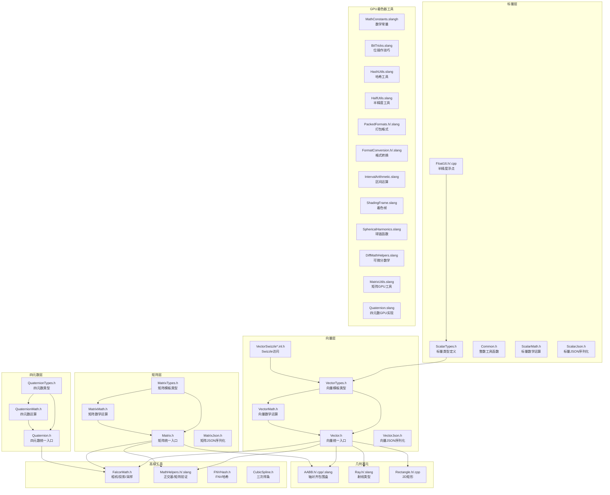

# Utils/Math -- 数学工具库

## 功能概述

`Utils/Math` 是 Falcor 渲染框架的核心数学工具库，提供了实时渲染所需的全部基础数学类型与运算支持。该模块同时覆盖 CPU 端（C++ 头文件）和 GPU 端（Slang 着色器文件），确保主机与设备之间的数据布局和语义一致。

主要功能包括：

- **标量类型与运算**：定义 `float16_t`（半精度浮点）、`uint` 等基础标量类型，以及 `isPowerOf2`、`div_round_up`、`align_to` 等常用整数工具函数。
- **向量(Vector)系统**：模板化的 `vector<T,N>` 类型，支持 1~4 维向量，提供 swizzle 访问、逐元素算术运算以及 `dot`、`cross`、`normalize` 等标准向量操作。
- **矩阵(Matrix)系统**：模板化的 `matrix<T,R,C>` 类型，支持矩阵乘法、转置、求逆、行列式等线性代数运算，并提供 JSON 序列化支持。
- **四元数(Quaternion)系统**：四元数类型及其数学运算（乘法、共轭、插值等），用于 3D 旋转表示。
- **几何基元**：`AABB`（轴对齐包围盒）、`Ray`（射线，兼容 DXR RayDesc 布局）、`Rectangle`（2D 矩形区域）。
- **相机与投影**：鼠标坐标到世界空间射线转换、FOV/焦距互转、光圈参数计算等。
- **GPU 着色器工具**：Slang 端的数学辅助函数（`MathHelpers.slang`）、位操作技巧（`BitTricks.slang`）、哈希函数（`HashUtils.slang`）、半精度工具（`HalfUtils.slang`）、区间运算（`IntervalArithmetic.slang`）、球谐函数（`SphericalHarmonics.slang`）、着色帧（`ShadingFrame.slang`）等。
- **格式转换**：打包数据格式的编码/解码（`PackedFormats`、`FormatConversion`），支持 CPU 和 GPU 两端。
- **可微分数学**：`DiffMathHelpers.slang` 提供可微分渲染所需的数学辅助函数。

## 架构图

## 文件清单

| 文件名 | 类型 | 说明 |
|--------|------|------|
| `ScalarTypes.h` | C++ 头文件 | 基础标量类型定义（`float16_t`、`uint`、`Handedness` 枚举、类型特征） |
| `ScalarMath.h` | C++ 头文件 | 标量数学运算函数 |
| `ScalarJson.h` | C++ 头文件 | 标量类型的 JSON 序列化支持 |
| `Float16.h` | C++ 头文件 | 半精度浮点类型 `float16_t` 的定义与运算符重载 |
| `Float16.cpp` | C++ 源文件 | `float32ToFloat16` / `float16ToFloat32` 转换实现 |
| `Common.h` | C++ 头文件 | 通用整数工具：`isPowerOf2`、`div_round_up`、`align_to` |
| `VectorTypes.h` | C++ 头文件 | 模板向量类型 `vector<T,N>` 定义（1~4维） |
| `VectorMath.h` | C++ 头文件 | 向量数学运算（dot、cross、normalize、lerp 等） |
| `VectorSwizzle2.inl.h` | C++ 内联头文件 | 2维向量 swizzle 访问宏 |
| `VectorSwizzle3.inl.h` | C++ 内联头文件 | 3维向量 swizzle 访问宏 |
| `VectorSwizzle4.inl.h` | C++ 内联头文件 | 4维向量 swizzle 访问宏 |
| `Vector.h` | C++ 头文件 | 向量模块统一入口（包含 VectorTypes + VectorMath） |
| `VectorJson.h` | C++ 头文件 | 向量类型的 JSON 序列化 |
| `MatrixTypes.h` | C++ 头文件 | 模板矩阵类型 `matrix<T,R,C>` 定义 |
| `MatrixMath.h` | C++ 头文件 | 矩阵数学运算（乘法、转置、求逆、行列式等） |
| `Matrix.h` | C++ 头文件 | 矩阵模块统一入口（包含 MatrixTypes + MatrixMath） |
| `MatrixJson.h` | C++ 头文件 | 矩阵类型的 JSON 序列化 |
| `MatrixUtils.slang` | Slang 着色器 | GPU 端矩阵工具函数 |
| `QuaternionTypes.h` | C++ 头文件 | 四元数类型定义 |
| `QuaternionMath.h` | C++ 头文件 | 四元数数学运算 |
| `Quaternion.h` | C++ 头文件 | 四元数模块统一入口 |
| `Quaternion.slang` | Slang 着色器 | GPU 端四元数实现 |
| `AABB.h` | C++ 头文件 | 轴对齐包围盒（AABB）：include、intersection、transform 等 |
| `AABB.cpp` | C++ 源文件 | AABB 辅助实现 |
| `AABB.slang` | Slang 着色器 | GPU 端 AABB 等价实现 |
| `Ray.h` | C++ 头文件 | 射线类型（兼容 DXR RayDesc 布局，32字节） |
| `Ray.slang` | Slang 着色器 | GPU 端射线类型 |
| `Rectangle.h` | C++ 头文件 | 2D 轴对齐矩形（UV tile），类似 AABB 的 2D 版本 |
| `Rectangle.cpp` | C++ 源文件 | Rectangle 辅助实现 |
| `FalcorMath.h` | C++ 头文件 | 相机数学工具：射线生成、旋转矩阵、FOV/焦距转换、光圈参数、Hammersley 采样 |
| `MathHelpers.h` | C++ 头文件 | CPU 端辅助：正交基构建（`perp_stark`、`branchlessONB`）、矩阵验证 |
| `MathHelpers.slang` | Slang 着色器 | GPU 端数学辅助函数 |
| `FNVHash.h` | C++ 头文件 | FNV-1a 哈希函数实现 |
| `CubicSpline.h` | C++ 头文件 | 三次样条插值 |
| `MathConstants.slangh` | Slang 头文件 | 数学常量定义（PI、E 等） |
| `BitTricks.slang` | Slang 着色器 | 位操作技巧（位计数、位反转等） |
| `HashUtils.slang` | Slang 着色器 | GPU 端哈希工具函数 |
| `HalfUtils.slang` | Slang 着色器 | GPU 端半精度浮点工具 |
| `PackedFormats.h` | C++ 头文件 | 打包数据格式编解码（CPU 端） |
| `PackedFormats.slang` | Slang 着色器 | 打包数据格式编解码（GPU 端） |
| `FormatConversion.h` | C++ 头文件 | 数据格式转换（CPU 端） |
| `FormatConversion.slang` | Slang 着色器 | 数据格式转换（GPU 端） |
| `IntervalArithmetic.slang` | Slang 着色器 | 区间运算 |
| `ShadingFrame.slang` | Slang 着色器 | 着色参考帧（切线空间） |
| `SphericalHarmonics.slang` | Slang 着色器 | 球谐函数 |
| `DiffMathHelpers.slang` | Slang 着色器 | 可微分渲染数学辅助 |

## 依赖关系

### 外部依赖
- `Core/Macros.h` -- 平台宏定义
- `Core/Error.h` -- 错误处理与断言
- `Core/API/Raytracing.h` -- DXR 光线追踪类型（`RtAABB`）
- `Utils/Logger.h` -- 日志系统
- `fmt/core.h` -- 格式化输出库
- C++ 标准库（`<cstdint>`、`<limits>`、`<cmath>`、`<algorithm>` 等）

### 被依赖（下游模块）
- `Utils/Color/` -- 颜色空间转换使用向量和矩阵类型
- `Utils/Geometry/` -- 几何工具依赖 MathHelpers
- `Utils/Algorithm/` -- 算法工具使用基础数学类型
- `Scene/` -- 场景模块大量使用 AABB、Ray、变换矩阵
- `RenderPasses/` -- 渲染通道使用各种数学工具

## 关键类与接口

### `AABB` 结构体
轴对齐包围盒，通过最小/最大点存储。提供包含(`include`)、求交(`intersection`)、变换(`transform`)、面积/体积计算等操作。支持运算符重载（`|` 并集、`&` 交集）。可转换为 DXR 的 `RtAABB`。同时提供 GPU 端等价实现 (`AABB.slang`)。

### `Ray` 结构体
射线类型，包含 `origin`、`tMin`、`dir`、`tMax` 四个字段。内存布局严格匹配 DXR `RayDesc`（共 32 字节），通过 `static_assert` 验证。

### `Rectangle` 结构体
2D 轴对齐矩形，接口设计与 `AABB` 对齐，用于 UV 空间的区域表示。

### `vector<T, N>` 模板
N 维向量模板类（N=1~4），支持 swizzle 访问、逐元素算术运算。预定义类型别名：`float2`、`float3`、`float4`、`int2`、`uint3` 等。

### `matrix<T, R, C>` 模板
R 行 C 列矩阵模板类，支持矩阵乘法（`mul`）、转置（`transpose`）、求逆（`inverse`）、行列式（`determinant`）等标准线性代数运算。

### `float16_t` 类型
半精度浮点类型，支持与 `float` 的互转、算术运算符、比较运算符以及特殊值检测（`isFinite`、`isInf`、`isNan`）。提供 `h` 字面量后缀。

### 关键自由函数
- `mousePosToWorldRay()` -- 屏幕坐标转世界空间射线
- `focalLengthToFovY()` / `fovYToFocalLength()` -- 焦距与 FOV 互转
- `perp_stark()` -- 生成正交向量
- `branchlessONB()` -- 无分支正交基构建（基于 Pixar 论文）
- `validateTransformMatrix()` -- 变换矩阵有效性验证
- `radicalInverse()` / `hammersleyUniform()` / `hammersleyCosine()` -- 低差异序列采样
