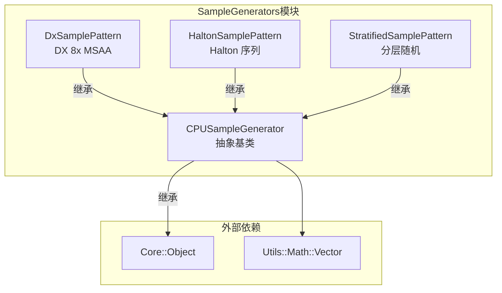

# Utils/SampleGenerators -- CPU 采样序列生成器模块

## 功能概述

本模块提供 Falcor 渲染框架中在 CPU 端生成二维采样序列的工具类，主要用于抗锯齿 (AA) 和时域采样中的像素抖动偏移。模块包含一个抽象基类和三种具体的采样模式生成器：

- **CPUSampleGenerator** -- 抽象基类，定义 CPU 二维采样序列的统一接口。
- **DxSamplePattern** -- Direct3D 标准 8x MSAA/SSAA 采样模式，固定 8 个采样点。
- **HaltonSamplePattern** -- 基于 Halton 低差异序列的采样模式，支持可选的周期性重复。
- **StratifiedSamplePattern** -- 分层随机采样模式，在网格中均匀分层后随机扰动，并对顺序进行随机排列以避免相关性伪影。

## 架构图

## 文件清单

| 文件名 | 类型 | 说明 |
|--------|------|------|
| `CPUSampleGenerator.h` | 头文件 | CPU 二维采样序列生成器抽象基类 |
| `DxSamplePattern.h` | 头文件 | DirectX 8x MSAA 采样模式声明 |
| `DxSamplePattern.cpp` | 实现 | DX MSAA 固定采样点数据 |
| `HaltonSamplePattern.h` | 头文件 | Halton 低差异序列采样模式声明 |
| `HaltonSamplePattern.cpp` | 实现 | Halton 序列计算实现 |
| `StratifiedSamplePattern.h` | 头文件 | 分层随机采样模式声明 |
| `StratifiedSamplePattern.cpp` | 实现 | 分层采样与随机排列实现 |

## 依赖关系

| 依赖项 | 用途 |
|--------|------|
| `Core/Object` | 引用计数基类 |
| `Core/Macros` | `FALCOR_API` 导出宏 |
| `Utils/Math/Vector` | `float2` 向量类型 |
| `std::random` | 随机数引擎（分层采样排列） |

## 关键类与接口

### `CPUSampleGenerator` (抽象基类)
所有 CPU 二维采样序列生成器的基类，继承自 `Object`。

- `getSampleCount()` -- 返回采样序列的总样本数
- `reset(startID)` -- 重置采样器到指定起始位置
- `next()` -- 返回下一个二维采样点 (`float2`)，范围为 `[-0.5, 0.5)`

### `DxSamplePattern`
Direct3D 标准 8 点 MSAA 采样模式。

- 固定 8 个预定义采样点位置
- `create(sampleCount)` -- 工厂方法（目前仅支持 sampleCount=8）
- 采样点循环使用

### `HaltonSamplePattern`
基于 Halton 序列的低差异采样模式。

- `create(sampleCount)` -- 工厂方法，`sampleCount=0` 表示无限不重复序列
- 使用基数 2 和 3 的 Halton 序列生成二维点
- 适用于渐进式收敛的时域抗锯齿 (TAA)

### `StratifiedSamplePattern`
分层随机采样模式。

- `create(sampleCount)` -- 工厂方法，自动计算最优的 X/Y 分层数
- 在 `mBinsX x mBinsY` 网格中进行分层抖动
- 使用 Fisher-Yates 随机排列避免低差异序列相关性
- 超过 `getSampleCount()` 后继续生成均匀随机样本
