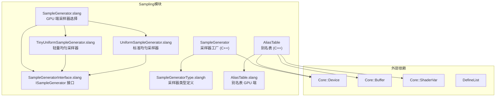

# Utils/Sampling -- 采样工具模块

## 功能概述

本模块提供 Falcor 渲染框架中用于 GPU 端随机采样的核心基础设施，包括：

- **采样器生成器框架** -- 可扩展的 GPU 采样器工厂，支持注册、创建不同类型的采样器（`SampleGenerator`）。
- **采样器接口** -- Slang GPU 端的采样器接口 `ISampleGenerator`，定义统一的随机数生成协议。
- **均匀采样器** -- 轻量级与标准级两种均匀随机数生成器，用于 GPU 着色器内的蒙特卡洛采样。
- **别名表** -- Alias Method 实现，用于按权重从离散概率分布中高效采样（`AliasTable`）。

## 架构图

## 文件清单

| 文件名 | 类型 | 说明 |
|--------|------|------|
| `SampleGenerator.h` | 头文件 | GPU 采样器基类与工厂，支持类型注册和 UI |
| `SampleGenerator.cpp` | 实现 | 采样器工厂实现与内置类型注册 |
| `SampleGenerator.slang` | Slang 着色器 | GPU 端根据编译宏选择具体采样器类型 |
| `SampleGeneratorInterface.slang` | Slang 着色器 | `ISampleGenerator` 接口定义及 `sampleNext1D/2D/3D/4D` 便捷函数 |
| `SampleGeneratorType.slangh` | Slang 头文件 | 采样器类型常量宏 (`SAMPLE_GENERATOR_TINY_UNIFORM` 等) |
| `TinyUniformSampleGenerator.slang` | Slang 着色器 | 轻量级均匀伪随机数生成器实现 |
| `UniformSampleGenerator.slang` | Slang 着色器 | 标准均匀伪随机数生成器实现 |
| `AliasTable.h` | 头文件 | 别名表 (Alias Method) 声明 |
| `AliasTable.cpp` | 实现 | 别名表构建逻辑 |
| `AliasTable.slang` | Slang 着色器 | 别名表 GPU 端采样逻辑 |

## 依赖关系

| 依赖项 | 用途 |
|--------|------|
| `Core/API/Buffer` | GPU 缓冲区（别名表数据） |
| `Core/Program/ShaderVar` | 着色器变量绑定 |
| `Core/Program/DefineList` | 宏定义列表（选择采样器类型） |
| `Core/Object` | 引用计数基类 |
| `Utils/UI/Gui` | 采样器 UI 下拉列表 |
| `std::random` | C++ 随机数引擎（别名表构建） |

## 关键类与接口

### `SampleGenerator` (C++)
GPU 采样器基类与工厂。继承自 `Object`，提供可扩展的采样器注册/创建机制。

- `create(pDevice, type)` -- 工厂方法，按类型创建采样器实例
- `getDefines()` -- 返回用于着色器编译的宏定义列表
- `bindShaderData(var)` -- 将采样器数据绑定到着色器
- `beginFrame()` / `endFrame()` -- 帧级生命周期回调
- `registerType(type, name, createFunc)` -- 注册新的采样器类型

### `ISampleGenerator` (Slang)
GPU 端采样器统一接口。

- `next()` -- 返回下一个 `uint` 随机值（状态自动推进）
- `sampleNext1D(sg)` -- 生成 `[0, 1)` 范围内的 `float` 随机值
- `sampleNext2D(sg)` / `sampleNext3D(sg)` / `sampleNext4D(sg)` -- 多维采样

### 采样器类型
通过 `SampleGeneratorType.slangh` 中的宏定义选择：
- `SAMPLE_GENERATOR_TINY_UNIFORM` (0) -- 轻量级均匀采样器，状态占用小
- `SAMPLE_GENERATOR_UNIFORM` (1) -- 标准均匀采样器（默认）

### `AliasTable` (C++)
Alias Method 实现，用于从离散概率分布中 O(1) 采样。

- 构造函数接受权重数组和随机数引擎
- `bindShaderData(var)` -- 绑定表数据到着色器
- `getCount()` -- 返回条目数
- `getWeightSum()` -- 返回权重总和
- GPU 端通过 `AliasTable.slang` 进行采样
