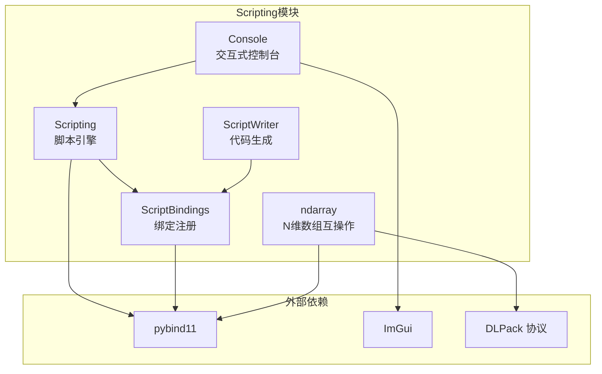

# Utils/Scripting -- 脚本系统模块

## 功能概述

本模块提供 Falcor 渲染框架的 Python 脚本集成层，基于 pybind11 实现 C++ 与 Python 之间的双向绑定，涵盖以下核心能力：

- **脚本引擎** -- Python 解释器的初始化/关闭、脚本执行与求值（`Scripting`）。
- **绑定注册框架** -- 延迟绑定机制，支持模块化地将 C++ 类型暴露给 Python，自动处理依赖顺序（`ScriptBindings`）。
- **脚本代码生成** -- 从 C++ 端自动生成 Python 函数/属性调用代码（`ScriptWriter`）。
- **交互式控制台** -- ImGui 集成的交互式 Python 控制台，支持命令历史浏览（`Console`）。
- **N 维数组互操作** -- 基于 DLPack 协议的 ndarray 类型，支持与 NumPy、PyTorch、TensorFlow、JAX 的零拷贝数据交换（`ndarray`）。

## 架构图

## 文件清单

| 文件名 | 类型 | 说明 |
|--------|------|------|
| `Scripting.h` | 头文件 | 脚本引擎核心类，管理 Python 解释器与执行上下文 |
| `Scripting.cpp` | 实现 | 脚本引擎实现（start/shutdown/runScript 等） |
| `ScriptBindings.h` | 头文件 | 绑定注册框架、延迟绑定机制及 `FALCOR_SCRIPT_BINDING` 宏 |
| `ScriptBindings.cpp` | 实现 | 绑定初始化与延迟绑定执行 |
| `ScriptWriter.h` | 头文件 | Python 代码生成辅助类（函数调用、属性设置等） |
| `Console.h` | 头文件 | ImGui 交互式 Python 控制台 |
| `Console.cpp` | 实现 | 控制台渲染、命令历史、输入处理 |
| `ndarray.h` | 头文件 | DLPack ndarray 类型定义，支持多框架张量互操作 |
| `ndarray.cpp` | 实现 | DLPack 导入/导出/引用计数管理 |

## 依赖关系

| 依赖项 | 用途 |
|--------|------|
| `pybind11` | Python C++ 绑定库 |
| `Core/Macros` | `FALCOR_API` 导出宏 |
| `Core/Error` | 异常处理 |
| `Core/Enum` | 枚举信息元数据 (`EnumInfo<T>`) |
| `Core/ObjectPython` | Object 类型的 Python 绑定支持 |
| `Core/Platform/OS` | 文件对话框过滤器 |
| `ImGui` | 交互式控制台 UI |
| `DLPack` | N 维数组零拷贝数据交换协议 |

## 关键类与接口

### `Scripting`
脚本引擎核心类，管理 Python 解释器生命周期。

- `start()` / `shutdown()` -- 启动/关闭 Python 解释器
- `runScript(script, context, captureOutput)` -- 执行 Python 脚本字符串
- `runScriptFromFile(path, context, ...)` -- 从文件执行脚本
- `interpretScript(script, context)` -- 执行并返回求值结果字符串
- `getDefaultContext()` / `getCurrentContext()` -- 获取执行上下文
- `Context` 内部类 -- 封装 Python globals 字典，提供 `setObject()` / `getObject()` / `getObjects<T>()` 方法

### `ScriptBindings`
绑定注册框架，支持延迟加载与依赖解析。

- `registerBinding(f)` -- 注册即时绑定函数
- `registerDeferredBinding(name, f)` -- 注册延迟绑定函数
- `resolveDeferredBinding(name, m)` -- 按名称解析并执行延迟绑定
- `initModule(m)` -- 模块初始化入口
- `FALCOR_SCRIPT_BINDING(name)` 宏 -- 声明式绑定注册
- `FALCOR_SCRIPT_BINDING_DEPENDENCY(name)` 宏 -- 声明绑定依赖
- `falcor_enum<T>` -- 自动从 `EnumInfo<T>` 注册 Python 枚举

### `ScriptWriter`
Python 代码生成辅助类。

- `makeFunc(func, args...)` -- 生成函数调用代码
- `makeMemberFunc(var, func, args...)` -- 生成成员函数调用代码
- `makeSetProperty(var, property, arg)` -- 生成属性赋值代码
- `getArgString(arg)` -- 将 C++ 值转换为 Python 表示

### `Console`
ImGui 集成的交互式 Python 控制台。

- `render(pGui, show)` -- 渲染控制台窗口
- `flush()` -- 处理待执行的命令
- `clear()` -- 清空控制台
- 支持 `` ` `` 键打开/关闭、ESC 关闭、上/下键浏览历史

### `ndarray<Args...>`
基于 DLPack 的 N 维数组类型，是 nanobind ndarray 到 pybind11 的移植。

- 模板参数支持：数据类型 (`float`, `int` 等)、形状 (`shape<...>`)、设备 (`cpu`, `cuda`)、框架 (`numpy`, `pytorch`)
- `data()` -- 获取数据指针
- `ndim()` / `shape(i)` / `stride(i)` -- 数组维度信息
- `operator()(indices...)` -- 多维索引访问
- 自动 pybind11 type_caster 支持零拷贝 Python-C++ 数据交换
