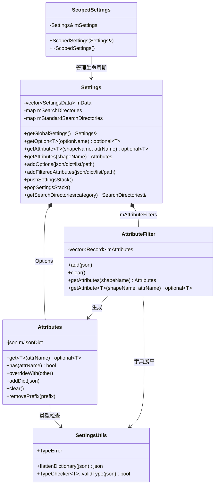

# Settings (设置) 模块

## 功能概述

Settings 模块提供了 Falcor 渲染框架的全局配置与属性管理系统。该模块实现了一套基于 JSON 的分层设置架构，支持以下核心功能：

- **全局选项管理**：通过 `Settings` 单例管理框架级别的全局配置项，支持从 JSON 文件、Python 字典和列表加载选项。
- **属性过滤系统**：通过正则表达式匹配形状名称，对不同对象应用不同的属性集，实现精细化的配置控制。
- **搜索路径管理**：按类别组织搜索目录，支持标准搜索路径与自定义搜索路径的分层查找。
- **设置栈**：通过 `pushSettingsStack` / `popSettingsStack` 实现设置的作用域隔离，配合 `ScopedSettings` RAII 类自动管理生命周期。
- **类型安全访问**：利用模板化的 JSON 类型检查器保证属性类型安全，支持算术类型、字符串和 `std::array` 的校验。

## 架构图

## 文件清单

| 文件名 | 类型 | 说明 |
|--------|------|------|
| `Settings.h` | 头文件 | 核心类 `Settings` 和 `ScopedSettings` 的声明，管理全局选项、属性过滤器和搜索路径 |
| `Settings.cpp` | 实现 | `Settings` 类的实现，包含 JSON/Python 选项解析、属性过滤及搜索路径更新逻辑 |
| `Attributes.h` | 头文件 | `settings::Attributes` 类，基于 JSON 字典的键值属性容器，支持模板化类型安全读取 |
| `AttributeFilters.h` | 头文件 | `settings::AttributeFilter` 类，基于正则表达式的属性过滤器，按匹配顺序叠加属性 |
| `AttributeFilters.cpp` | 实现 | 属性过滤器的 JSON 解析实现，处理字典、数组及已弃用的 `.filter` 语法 |
| `SettingsUtils.h` | 头文件 | 工具函数与类型检查器：`flattenDictionary` 将嵌套 JSON 展平为冒号分隔键名，`TypeChecker` 验证 JSON 值类型 |

## 依赖关系

### 内部依赖
- `Core/Macros.h` -- 导出宏 `FALCOR_API`、断言宏 `FALCOR_ASSERT`
- `Core/Error.h` -- 错误处理与异常宏
- `Utils/Logger.h` -- 日志记录（`AttributeFilters` 中使用）

### 外部依赖
- **nlohmann/json** -- JSON 解析与操作库，作为所有设置数据的底层存储格式
- **pybind11** -- Python 绑定支持，允许通过 Python 字典/列表设置选项和属性
- **fmt** -- 字符串格式化（`SettingsUtils` 中用于构建冒号分隔键名）
- **std::regex** -- 正则表达式匹配（`AttributeFilter` 中用于形状名称过滤）

## 关键类与接口

### `Settings`
全局设置管理器，采用单例模式（`getGlobalSettings()`）。核心职责：
- `addOptions()` / `getOption<T>()` -- 全局选项的增删查
- `addFilteredAttributes()` / `getAttribute<T>()` -- 基于正则的属性过滤与查询
- `pushSettingsStack()` / `popSettingsStack()` -- 设置栈，支持临时覆盖

### `ScopedSettings`
RAII 辅助类，构造时 push 设置栈，析构时自动 pop，确保设置变更的作用域安全。

### `settings::Attributes`
基于 `nlohmann::json` 的扁平键值属性集合。支持：
- 模板化 `get<T>()` 查询，包含 `bool`/算术类型的隐式转换
- `overrideWith()` 合并属性
- `removePrefix()` / `removeExact()` 删除属性

### `settings::AttributeFilter`
有序属性过滤器列表。每条记录包含名称、正则表达式和属性字典。`getAttributes(shapeName)` 按添加顺序依次匹配正则，后匹配的属性覆盖先匹配的。

### `settings::detail::TypeChecker<T>`
编译期/运行时类型检查器，验证 JSON 值是否与请求的 C++ 类型匹配，支持算术类型、`std::string` 和 `std::array<U, N>` 的特化。
