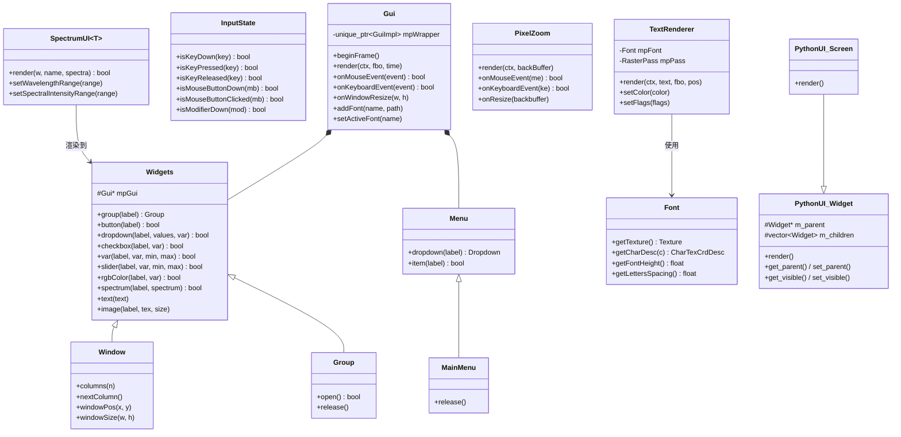

# UI (用户界面) 模块

## 功能概述

UI 模块为 Falcor 渲染框架提供完整的用户界面与输入处理基础设施，基于 ImGui 构建。该模块的核心功能包括：

- **GUI 系统**：`Gui` 类封装 ImGui，提供窗口（Window）、分组（Group）、菜单（Menu/MainMenu）等容器以及按钮、滑块、下拉框、颜色选择器、图表等丰富的控件集合。
- **输入事件**：`InputTypes.h` 定义鼠标事件、键盘事件、手柄事件的结构体及键值/按钮/修饰键枚举。
- **输入状态**：`InputState` 追踪当前帧与上一帧的键鼠状态，提供 `isKeyDown/Pressed/Released` 等查询接口。
- **文本渲染**：`TextRenderer` 通过 GPU 光栅化渲染等宽字体文本，使用 `Font` 类管理字体纹理与字符描述。
- **像素放大镜**：`PixelZoom` 在按下 Ctrl+Alt 时放大鼠标周围的屏幕区域，辅助像素级检查。
- **Python UI**：`python_ui::Widget` 和 `python_ui::Screen` 提供可从 Python 脚本操作的 UI 控件树。
- **光谱编辑器**：`SpectrumUI` 提供交互式光谱曲线编辑界面，支持色彩匹配函数可视化和光谱条显示。
- **ImGui 配置**：`ImGuiConfig.h` 定义 ImVec2/3/4 与 Falcor float2/3/4 的隐式转换。

## 架构图

## 文件清单

| 文件名 | 类型 | 说明 |
|--------|------|------|
| `Gui.h` | 头文件 | 核心 GUI 类，封装 ImGui，定义 Widgets/Window/Group/Menu/MainMenu 等控件层次 |
| `Gui.cpp` | 实现 | GUI 控件实现、ImGui 事件处理与渲染逻辑 |
| `Gui.slang` | Slang 着色器 | GUI 渲染的 GPU 着色器 |
| `Font.h` | 头文件 | 等宽字体类，管理字符纹理图集和字符位置描述 |
| `Font.cpp` | 实现 | 字体文件加载与纹理构建 |
| `InputTypes.h` | 头文件 | 输入类型定义：`Key`/`MouseButton`/`Modifier` 枚举，`MouseEvent`/`KeyboardEvent`/`GamepadEvent` 结构体 |
| `InputState.h` | 头文件 | 输入状态追踪类，记录当前帧/上一帧的键鼠按键状态 |
| `InputState.cpp` | 实现 | 事件处理与帧状态更新逻辑 |
| `ImGuiConfig.h` | 头文件 | ImGui 配置，定义 ImVec2/3/4 与 Falcor float2/3/4 之间的隐式转换 |
| `PixelZoom.h` | 头文件 | 像素放大镜工具，Ctrl+Alt 触发局部放大 |
| `PixelZoom.cpp` | 实现 | Blit 放大渲染逻辑 |
| `TextRenderer.h` | 头文件 | GPU 文本渲染器，支持阴影效果，使用旋转 VAO 避免 GPU 停顿 |
| `TextRenderer.cpp` | 实现 | 文本顶点生成与光栅化 Pass 执行 |
| `TextRenderer.3d.slang` | Slang 着色器 | 文本渲染的 3D 着色器 |
| `PythonUI.h` | 头文件 | Python 可控 UI 控件树：`Widget` 基类与 `Screen` 根控件 |
| `PythonUI.cpp` | 实现 | Python UI 控件（Window、Button 等）的具体实现 |
| `SpectrumUI.h` | 头文件 | 模板化光谱编辑器界面，支持曲线绘制、控制点拖拽与色彩匹配函数 |
| `SpectrumUI.cpp` | 实现 | 光谱 UI 渲染与交互逻辑 |

## 依赖关系

### 内部依赖
- `Core/Macros.h` -- 导出宏、枚举运算符宏
- `Core/Enum.h` -- 枚举信息（`dropdown` 模板使用）
- `Core/Object.h` -- 引用计数基类（`PythonUI` 使用）
- `Core/API/Texture.h` -- 纹理资源（`Font`、`Gui::image` 使用）
- `Core/API/FBO.h` -- 帧缓冲对象（`PixelZoom`、`TextRenderer` 使用）
- `Core/API/Buffer.h` -- GPU 缓冲区（`TextRenderer` 使用）
- `Core/Pass/RasterPass.h` -- 光栅化 Pass（`TextRenderer` 使用）
- `Utils/Math/Vector.h` -- 向量类型
- `Utils/Color/SampledSpectrum.h` -- 光谱数据类型（`SpectrumUI` 使用）

### 外部依赖
- **ImGui** -- 即时模式 GUI 库，`Gui` 的底层实现基础
- **pybind11** -- 隐含通过 `PythonUI` 暴露给 Python

## 关键类与接口

### `Gui`
ImGui 的 Falcor 封装层。生命周期：`beginFrame()` -> 创建 Window/Menu 控件 -> `render()`。支持字体管理、鼠标/键盘事件转发。

### `Gui::Widgets`
控件基类，提供所有交互控件方法：`dropdown()`、`button()`、`checkbox()`、`var()`、`slider()`、`rgbColor()`、`spectrum()`、`text()`、`image()` 等。返回 `bool` 表示值是否变化。

### `Gui::Window` / `Gui::Group`
`Widgets` 的派生类，分别创建独立窗口和可折叠分组。构造时打开，析构或 `release()` 时关闭。

### `InputState`
输入状态快照，维护双缓冲键鼠状态（当前帧 + 上一帧），支持：
- `isKeyDown()` -- 持续按下
- `isKeyPressed()` -- 刚按下（边缘检测）
- `isKeyReleased()` -- 刚释放（边缘检测）

### `TextRenderer`
GPU 加速的文本渲染器，使用 3 个旋转 VAO 避免 GPU 停顿。通过 `Font` 加载等宽字体纹理图集，支持阴影文字效果。

### `PixelZoom`
调试辅助工具，按住 Ctrl+Alt 时将鼠标附近 5x5 像素区域放大到 200x200 像素窗口。

### `SpectrumUI<T>`
交互式光谱编辑器模板类，支持：
- 光谱曲线绘制与控制点拖拽
- 波长/光谱强度坐标轴与网格
- 色彩匹配函数叠加显示
- 光谱条颜色预览
