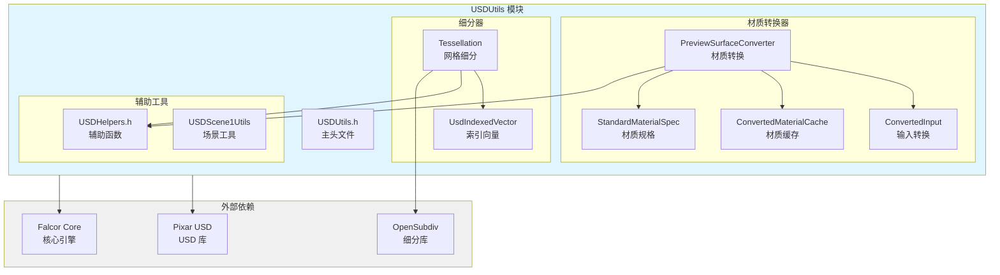

# USDUtils - USD 工具模块

## 功能概述

USDUtils 是 Falcor 中用于处理 USD (Universal Scene Description) 格式的工具模块。该模块提供了 USD 场景导入、材质转换、网格细分等功能，是 USDImporter 插件的核心依赖。

## 主要功能

- **USD 场景解析**: 读取和解析 USD 场景文件
- **PreviewSurface 转换**: 将 UsdPreviewSurface 材质转换为 Falcor 材质
- **网格细分**: 支持 Catmull-Clark 等细分算法
- **材质缓存**: 避免重复创建相同材质
- **纹理转换**: 处理 USD 纹理到 Falcor 纹理的转换
- **坐标变换**: USD 和 Falcor 坐标系统转换

## 架构图



## 文件清单

### 核心文件
- `USDUtils.h` / `USDUtils.cpp` - 主模块接口
- `USDHelpers.h` - USD 辅助函数和类型转换
- `USDScene1Utils.h` / `USDScene1Utils.cpp` - 场景处理工具

### 材质转换
- `ConvertedInput.h` / `ConvertedInput.cpp` - 材质输入转换
- `ConvertedMaterialCache.h` / `ConvertedMaterialCache.cpp` - 材质缓存管理

### PreviewSurface 转换器
- `PreviewSurfaceConverter/PreviewSurfaceConverter.h` - 转换器主类
- `PreviewSurfaceConverter/PreviewSurfaceConverter.cpp` - 转换器实现
- `PreviewSurfaceConverter/StandardMaterialSpec.h` - 标准材质规格
- `PreviewSurfaceConverter/CreateSpecularTexture.cs.slang` - 创建高光纹理着色器
- `PreviewSurfaceConverter/CreateSpecularTransmissionTexture.cs.slang` - 创建透射纹理着色器
- `PreviewSurfaceConverter/PackBaseColorAlpha.cs.slang` - 打包基色和 Alpha 着色器
- `PreviewSurfaceConverter/SampleTexture.slang` - 纹理采样着色器

### 细分器
- `Tessellator/Tessellation.h` / `Tessellation.cpp` - 网格细分实现
- `Tessellator/UsdIndexedVector.h` - 索引向量容器

### 构建配置
- `CMakeLists.txt` - 模块构建配置

## 依赖关系

### 外部库依赖
- **nv-usd**: NVIDIA 的 USD 库
- **opensubdiv**: Pixar 的细分曲面库
- **Falcor**: Falcor 核心引擎

### 内部模块依赖
- Core API (Device, Texture, Sampler)
- Scene (Material, StandardMaterial)
- Utils (Math, Transform)

## 关键类与接口

### 1. USDHelpers

提供 USD 和 Falcor 之间的类型转换和辅助函数。

#### 主要功能

```cpp
// 类型转换
float3 toFalcor(const GfVec3f& v);
float4x4 toFalcor(const GfMatrix4d& m);

// 属性获取
template<class T>
T getAttribute(const UsdAttribute& attrib, const T& def);

// 哈希和比较
struct UsdObjHash;
struct Float3Hash;

// 诊断委托
class DiagDelegate : public TfDiagnosticMgr::Delegate;
```

#### 坐标系统转换

USD 使用行向量和行主矩阵（v * M），Falcor 使用列向量和行主矩阵（M * v），因此需要转置矩阵。

### 2. PreviewSurfaceConverter

将 UsdPreviewSurface 材质转换为 Falcor StandardMaterial。

#### 主要接口

```cpp
class PreviewSurfaceConverter
{
public:
    PreviewSurfaceConverter(ref<Device> pDevice);

    // 转换 USD 材质为 Falcor 材质
    ref<Material> convert(
        const pxr::UsdShadeMaterial& material,
        RenderContext* pRenderContext
    );

private:
    // 创建材质规格
    StandardMaterialSpec createSpec(
        const std::string& name,
        const UsdShadeShader& shader
    ) const;

    // 纹理处理
    ref<Texture> loadTexture(const ConvertedInput& ci);
    ref<Texture> createSpecularTexture(...);
    ref<Texture> packBaseColorAlpha(...);
    ref<Texture> createSpecularTransmissionTexture(...);
};
```

#### 支持的材质属性

- `diffuseColor` - 漫反射颜色
- `emissiveColor` - 自发光颜色
- `metallic` - 金属度
- `roughness` - 粗糙度
- `opacity` - 不透明度
- `normal` - 法线贴图
- `ior` - 折射率
- `specularColor` - 高光颜色

#### 扩展属性

Falcor 扩展了 UsdPreviewSurface，支持额外属性：
- `volumeAbsorption` - 体积吸收系数
- `volumeScattering` - 体积散射系数
- `normal2` - 2 通道法线贴图

### 3. ConvertedInput

表示转换后的材质输入（纹理或常量值）。

#### 结构定义

```cpp
struct ConvertedInput
{
    enum class TextureEncoding : uint8_t
    {
        Unknown = 0,
        Linear,
        Srgb,
        Normal
    };

    float4 uniformValue;                    // 常量值
    std::string texturePath;                // 纹理路径
    Transform texTransform;                 // 纹理变换
    float4 textureScale;                    // 纹理缩放
    TextureChannelFlags channels;           // 纹理通道
    bool loadSRGB;                          // 是否加载为 sRGB

    // 转换方法
    static ConvertedInput convertTexture(...);
    static ConvertedInput convertFloat(...);
    static ConvertedInput convertColor(...);
};
```

### 4. ConvertedMaterialCache

线程安全的材质缓存，避免重复创建相同材质。

#### 模板定义

```cpp
template<typename T, typename S, typename H>
class ConvertedMaterialCache
{
public:
    // 按 USD Shader 获取材质
    ref<T> get(const pxr::UsdShadeShader& shader);

    // 按材质规格获取材质
    ref<T> get(const S& spec, const std::string& shaderName);

    // 添加材质到缓存
    void add(const UsdShadeShader& shader, const S& spec, ref<T> pMaterial);
};
```

#### 缓存策略

- 按 UsdShadeShader 缓存（避免重复规格创建）
- 按材质规格缓存（避免创建相同材质）
- 线程安全（使用互斥锁和条件变量）

### 5. Tessellation

网格细分功能，支持 Catmull-Clark 等细分算法。

#### 主要接口

```cpp
struct MeshTopology
{
    pxr::TfToken scheme;         // 细分方案
    pxr::TfToken orient;         // 方向
    pxr::VtIntArray faceCounts;  // 每面顶点数
    pxr::VtIntArray faceIndices; // 面顶点索引
    pxr::VtIntArray holeIndices; // 孔面索引
};

struct UsdMeshData
{
    MeshTopology topology;       // 拓扑结构
    pxr::VtVec3fArray points;    // 顶点位置
    pxr::VtVec3fArray normals;   // 法线
    pxr::VtVec2fArray uvs;       // 纹理坐标
    pxr::TfToken normalInterp;   // 法线插值模式
    pxr::TfToken uvInterp;       // UV 插值模式
};

// 细分网格
UsdMeshData tessellate(
    const pxr::UsdGeomMesh& geomMesh,
    const UsdMeshData& baseMesh,
    uint32_t maxRefinementLevel,
    pxr::VtIntArray& coarseFaceIndices
);
```

#### 支持的细分方案

- `none` - 无细分（三角化）
- `catmullClark` - Catmull-Clark 细分
- `loop` - Loop 细分
- `bilinear` - 双线性细分

## 使用示例

### 转换 USD 材质

```cpp
// 创建转换器
auto converter = std::make_unique<PreviewSurfaceConverter>(pDevice);

// 获取 USD 材质
UsdShadeMaterial usdMaterial = ...;

// 转换为 Falcor 材质
ref<Material> pMaterial = converter->convert(usdMaterial, pRenderContext);
```

### 细分网格

```cpp
// 准备基础网格数据
UsdMeshData baseMesh;
baseMesh.topology = ...;
baseMesh.points = ...;
baseMesh.normals = ...;

// 细分
pxr::VtIntArray coarseFaceIndices;
UsdMeshData tessellatedMesh = tessellate(
    geomMesh,
    baseMesh,
    2,  // 细分级别
    coarseFaceIndices
);
```

### 类型转换

```cpp
// USD 向量转 Falcor
GfVec3f usdVec(1.0f, 2.0f, 3.0f);
float3 falcorVec = toFalcor(usdVec);

// USD 矩阵转 Falcor（自动转置）
GfMatrix4d usdMat = ...;
float4x4 falcorMat = toFalcor(usdMat);
```

## 纹理处理

### 纹理转换流程

1. **加载 USD 纹理**: 从 USD 材质读取纹理路径
2. **格式转换**: 转换为 Falcor 支持的格式
3. **通道处理**:
   - 单通道 → 复制到需要的通道
   - 多通道 → 提取或打包
4. **特殊处理**:
   - 法线贴图：2 通道 → 3 通道（重建 Z）
   - 高光纹理：粗糙度 + 金属度 → ORM 纹理
   - 透明度：不透明度 → 透射

### 计算着色器

模块包含多个计算着色器用于纹理处理：

- **CreateSpecularTexture**: 创建 ORM (Occlusion-Roughness-Metallic) 纹理
- **CreateSpecularTransmissionTexture**: 将不透明度转换为透射
- **PackBaseColorAlpha**: 将分离的 RGB 和 Alpha 打包为 RGBA

## 坐标系统

### USD 坐标系统
- 右手坐标系
- Y 轴向上
- 行向量（v * M）
- 行主矩阵存储

### Falcor 坐标系统
- 右手坐标系
- Y 轴向上
- 列向量（M * v）
- 行主矩阵存储

### 转换规则
矩阵需要转置：`Falcor_M = transpose(USD_M)`

## 性能考虑

### 材质缓存
- 使用哈希表缓存材质，避免重复创建
- 线程安全，支持并行导入

### 纹理处理
- 延迟加载纹理
- 缓存转换后的纹理
- 使用计算着色器加速纹理处理

### 细分
- 细分级别越高，顶点数指数增长
- 建议最大细分级别 ≤ 3
- 可以在运行时动态调整

## 限制和注意事项

1. **纹理变换**: USD 支持每个纹理独立变换，Falcor 假设所有纹理共享一个变换
2. **材质类型**: 仅支持 UsdPreviewSurface，不支持其他 USD 材质类型
3. **细分**: 仅支持三角形和四边形面，不支持 N 边形（N > 4）
4. **动画**: 当前版本对动画支持有限

## 相关文档

- [USDImporter 文档](../../plugins/importers/README.md)
- [Pixar USD 文档](https://graphics.pixar.com/usd/docs/index.html)
- [OpenSubdiv 文档](https://graphics.pixar.com/opensubdiv/docs/intro.html)
- [Falcor 材质系统](../../Scene/Material/README.md)
