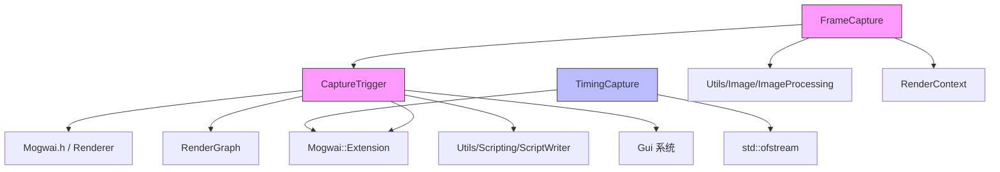

# Mogwai Extensions - Mogwai 扩展模块

## 功能概述

本目录包含 Mogwai 渲染应用程序的扩展模块。扩展模块通过继承 `Extension` 基类为 Mogwai 添加额外功能，在渲染循环的帧开始/帧结束阶段注入自定义逻辑。当前包含两个子模块：

### Capture（捕获）
提供帧捕获功能，用于将渲染图（RenderGraph）的输出保存为图像文件：

- **CaptureTrigger**：捕获触发器基类，管理帧范围（起始帧和帧数）、输出目录、基础文件名，支持针对不同渲染图设置独立的捕获范围。提供 UI 窗口控制和 Python 脚本绑定。
- **FrameCapture**：帧捕获实现，继承自 `CaptureTrigger`，负责在指定帧将渲染图输出捕获为图像文件。支持捕获所有输出或指定输出，使用 `ImageProcessing` 工具进行图像处理。

### Profiler（性能分析）
提供帧时间记录功能：

- **TimingCapture**：帧时间捕获工具，将每帧的渲染时间记录到文件中，用于性能分析和基准测试。支持通过 Python 脚本控制开始/停止记录。

## 文件清单

| 文件名 | 路径 | 类型 | 说明 |
|--------|------|------|------|
| `CaptureTrigger.h` | Capture/ | 头文件 | 捕获触发器基类，定义帧范围管理、UI 渲染、脚本绑定接口 |
| `CaptureTrigger.cpp` | Capture/ | 源文件 | 捕获触发器基类实现，包括帧循环钩子和范围管理逻辑 |
| `FrameCapture.h` | Capture/ | 头文件 | 帧捕获类声明，继承自 `CaptureTrigger`，添加图像输出功能 |
| `FrameCapture.cpp` | Capture/ | 源文件 | 帧捕获实现，包括渲染图输出捕获和图像保存 |
| `TimingCapture.h` | Profiler/ | 头文件 | 帧时间捕获类声明，继承自 `Extension` |
| `TimingCapture.cpp` | Profiler/ | 源文件 | 帧时间捕获实现，记录帧时间到文件 |

## 依赖关系

### 内部依赖
- `Mogwai.h` - Mogwai 应用主头文件（提供 `Extension` 基类和 `Renderer` 引用）
- `Falcor.h` - Falcor 框架主头文件
- `Utils/Scripting/ScriptWriter` - Python 脚本生成工具
- `Utils/Image/ImageProcessing` - 图像处理工具（用于帧捕获输出）
- `RenderGraph` - 渲染图系统
- `RenderContext` - 渲染上下文
- `Gui` - UI 系统
- `pybind11` - Python 绑定（用于脚本接口注册）
