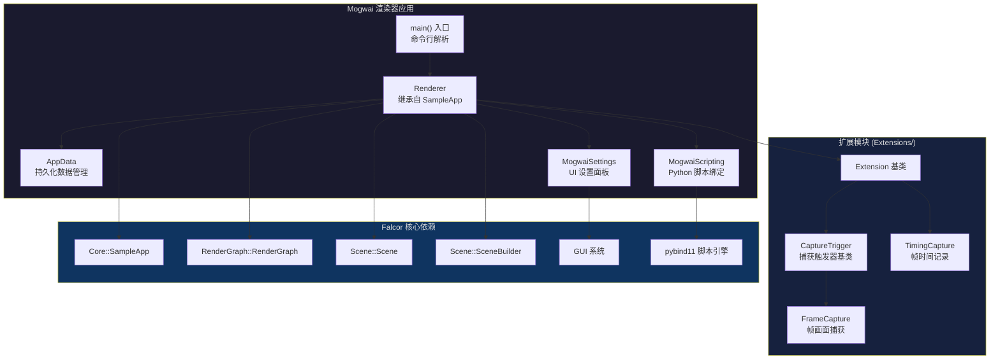

# Mogwai -- Falcor 主渲染器应用

> 源码路径: `Source/Mogwai/`

## 功能概述

Mogwai 是基于 Falcor 框架构建的主渲染器 (Renderer) 应用。它作为 Falcor 渲染管线的前端入口，提供以下核心能力:

- **渲染图管理**: 加载、切换、编辑和移除多个 `RenderGraph`，支持通过 RenderGraphEditor 进行可视化图编辑
- **场景加载**: 支持通过对话框或命令行参数加载 `.pyscene` 等格式的三维场景，内部使用 `SceneBuilder` 构建场景数据
- **Python 脚本驱动**: 集成 pybind11 实现完整的 Python 脚本绑定，可通过脚本控制渲染器行为、图配置、场景加载等一切操作
- **扩展 (Extension) 机制**: 提供插件式扩展架构，内置 `FrameCapture`（帧捕获）、`TimingCapture`（帧时间记录）和 `MogwaiSettings`（设置面板）三个扩展
- **GUI 交互**: 基于 Falcor 的 GUI 系统，提供主菜单、渲染图输出选择、调试窗口、FPS 显示、时钟控制、窗口尺寸调整等 UI 功能
- **命令行接口**: 支持丰富的 CLI 参数，包括 GPU 选择、设备类型 (D3D12/Vulkan)、headless 模式、shader 缓存、日志级别等
- **应用持久化数据**: 通过 `AppData` 管理最近使用的脚本和场景文件列表，存储在用户 AppData 目录的 JSON 文件中
- **管道化输出**: 支持将帧缓冲区数据通过管道传输到外部进程（如 FFmpeg），用于实时视频编码

## 架构图

## 核心类说明

### Renderer (继承 SampleApp)

渲染器主类，管理整个应用生命周期:

| 方法 | 说明 |
|------|------|
| `onLoad()` | 初始化：加载插件、创建扩展、注册脚本绑定、加载命令行指定的脚本/场景 |
| `onFrameRender()` | 每帧渲染：编译渲染图、更新场景、执行渲染图、将输出 blit 到帧缓冲区 |
| `addGraph()` / `removeGraph()` | 添加或移除渲染图，支持同名替换 |
| `loadScene()` / `unloadScene()` | 加载或卸载三维场景 |
| `loadScript()` | 执行 Python 配置脚本 |
| `saveConfig()` | 将当前渲染图、场景、窗口和时钟配置导出为 Python 脚本 |
| `extend()` | 静态方法，注册扩展模块的工厂函数 |
| `openEditor()` | 启动外部 RenderGraphEditor 进程进行渲染图编辑 |

### Extension 基类

扩展插件接口，提供生命周期回调:

- `beginFrame()` / `endFrame()` -- 帧渲染前后回调
- `renderUI()` -- GUI 渲染
- `mouseEvent()` / `keyboardEvent()` / `gamepadEvent()` -- 输入事件
- `registerScriptBindings()` -- Python 绑定注册
- `addGraph()` / `removeGraph()` / `activeGraphChanged()` -- 渲染图变更通知

通过 `MOGWAI_EXTENSION(Name)` 宏实现扩展自动注册。

### AppData

持久化应用数据管理器，使用 JSON 格式存储在 `%APPDATA%/NVIDIA/Falcor/Mogwai.json`:

- 最近使用的脚本文件列表（最多 25 项）
- 最近使用的场景文件列表（最多 25 项）
- 自动清理不存在的路径

### MogwaiSettings

继承自 `Extension`，提供完整的 UI 设置面板:

- 主菜单栏: File（加载/保存脚本和场景）、View（UI 面板切换）、Help
- 渲染图面板: 图选择、输出选择、调试窗口、场景设置、框架统计
- FPS 叠加层、时钟设置、窗口尺寸调整
- 键盘快捷键: F1(帮助), F6(图UI), F7(叠加UI), F9(时间), F10(FPS), F11(自动隐藏菜单)

## Extensions/ 扩展子目录

### Capture/ -- 捕获功能

| 类 | 说明 |
|----|------|
| `CaptureTrigger` | 捕获触发器抽象基类。管理帧范围 (Range)、输出目录、文件名前缀，在 `beginFrame`/`endFrame` 中检测是否到达触发帧 |
| `FrameCapture` | 帧画面捕获扩展。将渲染图的输出纹理保存为图片文件，支持按通道 (R/G/B/A/RGB/RGBA) 分别导出，可一次捕获所有输出 |

### Profiler/ -- 性能分析

| 类 | 说明 |
|----|------|
| `TimingCapture` | 帧时间记录扩展。将每帧的渲染时间写入指定文件，用于性能分析和基准测试 |

## 文件清单

| 文件 | 说明 |
|------|------|
| `Mogwai.h` | 渲染器主头文件，定义 `Extension` 基类、`Renderer` 类及 `MOGWAI_EXTENSION` 宏 |
| `Mogwai.cpp` | 渲染器实现：应用生命周期、渲染图管理、场景管理、输出管理、编辑器集成、`main()` 入口 |
| `MogwaiSettings.h` | 设置面板扩展头文件 |
| `MogwaiSettings.cpp` | 设置面板实现：主菜单、图 UI、FPS 显示、时间设置、窗口尺寸、键盘快捷键 |
| `MogwaiScripting.cpp` | Python 脚本绑定注册：`Renderer` 类的 pybind11 绑定、配置保存脚本生成 |
| `AppData.h` | 持久化数据管理器头文件 |
| `AppData.cpp` | 持久化数据实现：JSON 读写、最近文件列表维护 |
| `CMakeLists.txt` | CMake 构建配置 |
| `Extensions/Capture/CaptureTrigger.h` | 捕获触发器基类头文件 |
| `Extensions/Capture/CaptureTrigger.cpp` | 捕获触发器实现：帧范围管理、脚本绑定 |
| `Extensions/Capture/FrameCapture.h` | 帧捕获扩展头文件 |
| `Extensions/Capture/FrameCapture.cpp` | 帧捕获实现：纹理导出、通道拆分、脚本绑定 |
| `Extensions/Profiler/TimingCapture.h` | 帧时间记录扩展头文件 |
| `Extensions/Profiler/TimingCapture.cpp` | 帧时间记录实现：文件写入、脚本绑定 |

## 依赖关系

### Falcor 框架内部依赖

| 依赖模块 | 用途 |
|----------|------|
| `Core/SampleApp` | 应用基类，提供窗口、设备、帧循环、GUI 等基础设施 |
| `RenderGraph/RenderGraph` | 渲染图核心，管理渲染 Pass 的执行拓扑 |
| `RenderGraph/RenderGraphImportExport` | 渲染图的序列化与反序列化 |
| `RenderGraph/RenderGraphIR` | 渲染图中间表示，用于脚本生成 |
| `Scene/Scene` | 三维场景对象 |
| `Scene/SceneBuilder` | 场景构建器，从文件加载场景 |
| `Scene/Importer` | 场景导入器 |
| `Utils/Scripting/Scripting` | Python 脚本执行引擎 |
| `Utils/Scripting/ScriptWriter` | 脚本代码生成工具 |
| `Utils/Scripting/Console` | 交互式 Python 控制台 |
| `Utils/Settings/Settings` | 应用设置管理 |
| `Utils/Timing/TimeReport` | 时间性能报告 |
| `Utils/Image/ImageProcessing` | 图像处理工具（帧捕获中的通道拆分） |
| `Core/AssetResolver` | 资源路径解析 |
| `Core/Program/ProgramManager` | Shader 程序编译管理 |

### 外部依赖

| 依赖 | 用途 |
|------|------|
| `pybind11` | C++/Python 互操作绑定 |
| `nlohmann/json` | JSON 解析与序列化（AppData） |
| `args.hxx` | 命令行参数解析库 |
| D3D12 Agility SDK | DirectX 12 运行时 |
