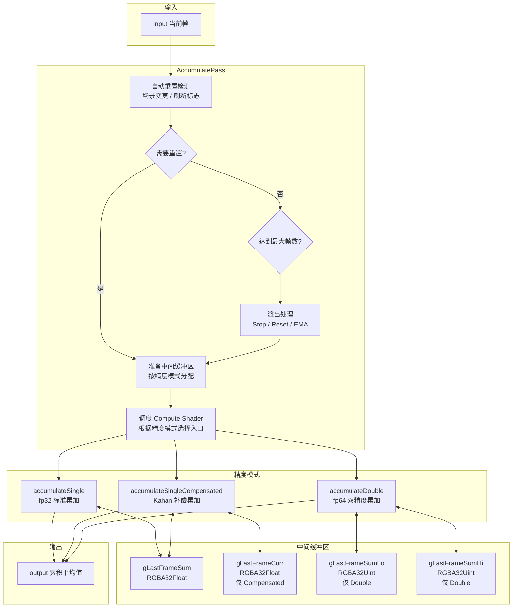

# AccumulatePass - 帧累积渲染通道

## 功能概述

AccumulatePass 是 Falcor 中的时间帧累积渲染通道，用于将多帧渲染结果进行时间平均，以获得收敛的高质量图像。该通道通常用于蒙特卡洛渲染器的降噪和 Ground Truth 参考图生成。

主要功能包括：

- **三种精度模式**：
  - `Single` - 单精度 (fp32) 标准累加
  - `SingleCompensated` - 单精度 Kahan 补偿累加（减少浮点误差累积）
  - `Double` - 双精度 (fp64) 标准累加（最高精度）
- **帧计数限制与溢出处理**：
  - `Stop` - 达到最大帧数后停止累积
  - `Reset` - 达到最大帧数后重置
  - `EMA` - 达到最大帧数后切换为指数移动平均
- **自动重置**：场景变更（相机移动、几何变化等）时自动重置累积
- **多种输入格式**：支持 Float、Uint、Sint 格式的输入纹理
- **热重载支持**：着色器热重载时自动重置累积
- **输出尺寸控制**：支持默认、固定尺寸等输出模式

### 输入/输出通道

| 方向 | 名称 | 说明 |
|------|------|------|
| 输入 | `input` | 当前帧渲染结果 |
| 输出 | `output` | 时间累积后的平均结果 (RGBA32Float) |

## 架构图



## 文件清单

| 文件名 | 类型 | 说明 |
|--------|------|------|
| `AccumulatePass.h` | C++ 头文件 | AccumulatePass 类声明，包含精度模式和溢出模式枚举 |
| `AccumulatePass.cpp` | C++ 实现 | 渲染通道主逻辑：自动重置、缓冲区管理、着色器调度 |
| `Accumulate.cs.slang` | Compute Shader | 三种精度模式的累积着色器入口 |
| `CMakeLists.txt` | 构建文件 | CMake 插件构建配置 |

## 依赖关系

```
AccumulatePass
├── Falcor 核心框架
│   ├── Falcor.h
│   ├── RenderGraph/RenderPass.h
│   ├── RenderGraph/RenderPassHelpers.h
│   └── RenderGraph/RenderPassStandardFlags.h
├── Python 脚本绑定 (pybind11)
└── GPU 资源
    ├── ComputeState / ProgramVars
    ├── Program (每种精度模式一个)
    └── Texture (中间累积缓冲区，按模式不同)
```

## 关键类与接口

### `AccumulatePass` (继承自 `RenderPass`)

渲染通道主类，注册名为 `"AccumulatePass"`。

| 方法 | 说明 |
|------|------|
| `AccumulatePass(ref<Device>, const Properties&)` | 构造函数，解析配置属性 |
| `reflect(const CompileData&)` | 声明 `input`/`output` 通道，输出默认 RGBA32Float |
| `execute(RenderContext*, const RenderData&)` | 自动重置检测 -> 溢出检查 -> 调度累积着色器 |
| `setScene(RenderContext*, const ref<Scene>&)` | 设置场景并重置累积 |
| `renderUI(Gui::Widgets&)` | 精度模式、最大帧数、溢出模式、启用/重置等 UI |
| `onHotReload(HotReloadFlags)` | 着色器热重载时重置累积 |

### Python 脚本接口

| 属性/方法 | 说明 |
|-----------|------|
| `enabled` | 启用/禁用累积 |
| `reset()` | 手动重置累积帧计数 |

### 枚举类型

#### `Precision` (精度模式)

| 值 | 说明 |
|----|------|
| `Double` | 双精度标准累加，使用两个 RGBA32Uint 存储 double 的低/高位 |
| `Single` | 单精度标准累加 |
| `SingleCompensated` | 单精度 Kahan 补偿累加，需要精确浮点模式编译 |

#### `OverflowMode` (溢出处理)

| 值 | 说明 |
|----|------|
| `Stop` | 停止累积，保留已累积图像 |
| `Reset` | 重置累积重新开始 |
| `EMA` | 切换为指数移动平均模式 |

### 配置属性

| 属性 | 默认值 | 说明 |
|------|--------|------|
| `enabled` | `true` | 是否启用累积 |
| `autoReset` | `true` | 场景变更时自动重置 |
| `precisionMode` | `Single` | 精度模式 |
| `maxFrameCount` | `0` | 最大累积帧数 (0 = 无限) |
| `overflowMode` | `Stop` | 溢出处理方式 |
| `outputFormat` | `Unknown` | 输出格式 (Unknown 使用默认 RGBA32Float) |
| `outputSize` | `Default` | 输出尺寸模式 |

### Shader 入口点 (`Accumulate.cs.slang`)

| 入口 | 线程组 | 说明 |
|------|--------|------|
| `accumulateSingle` | 16x16 | fp32 标准累加：`sum += curColor; output = sum / (N+1)` |
| `accumulateSingleCompensated` | 16x16 | Kahan 补偿累加：维护误差补偿项 `c`，减少 fp32 精度损失 |
| `accumulateDouble` | 16x16 | fp64 累加：将 double 拆分为两个 uint 存储于纹理中 |

所有入口均支持指数移动平均模式 (`gMovingAverageMode`)，在达到最大帧数后以恒定权重混合新帧。
